# Gallery

## All plot types at a glance

60 plot types, one figure — generated by running `cargo run --example all_plots_simple` and `cargo run --example all_plots_complex`.

**Simple overview** (compact, minimal data):

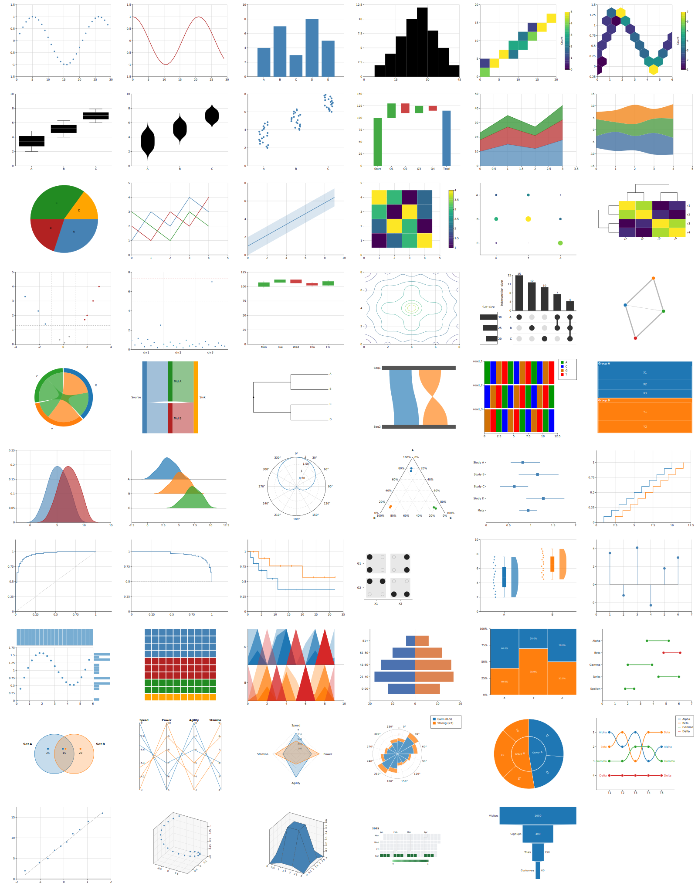

**Full-featured** (larger datasets, titles, axis labels, legends):

---

## Individual plot types

Click any image to go to the full documentation page.

<a href="./plots/scatter.html">
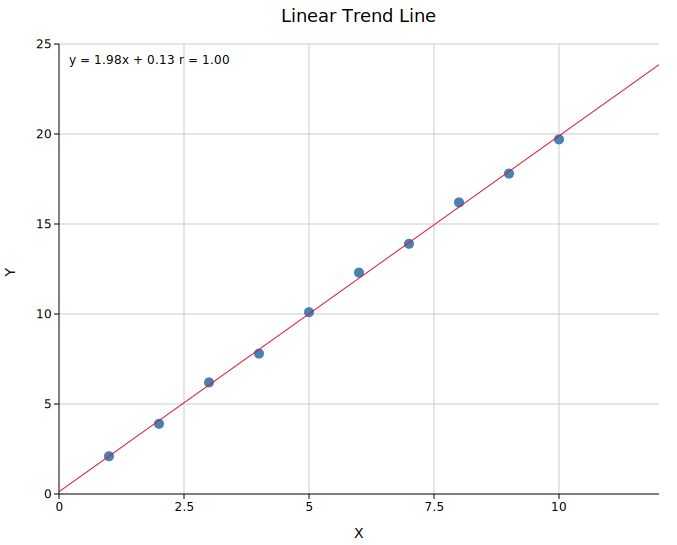

Scatter Plot

x/y points with optional trend line, error bars, and variable size.

</a>

<a href="./plots/line.html">
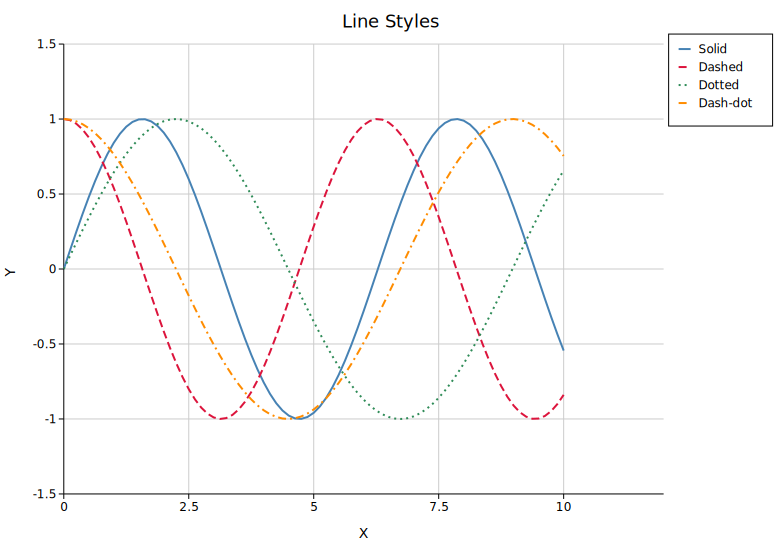

Line Plot

Connected series with solid, dashed, dotted, and dash-dot styles.

</a>

<a href="./plots/bar.html">

Bar Chart

Categorical bars — grouped, stacked, and single-series.

</a>

<a href="./plots/histogram.html">
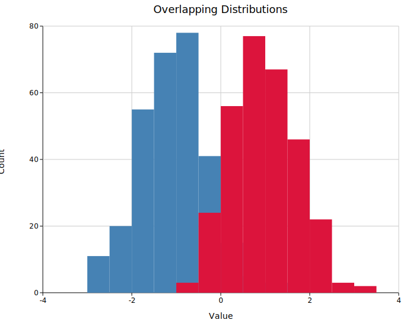

Histogram

Distribution of a numeric column with configurable bins and normalisation.

</a>

<a href="./plots/density.html">
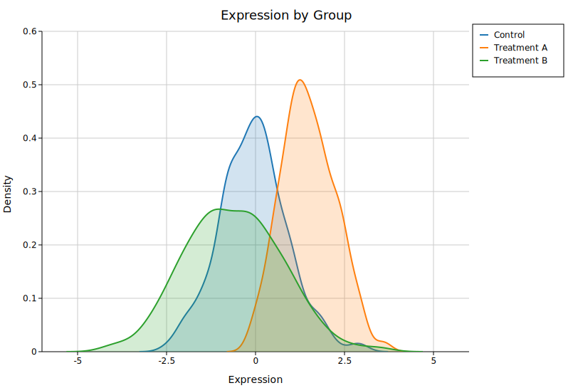

Density Plot

KDE-smoothed probability density curve — single or multi-group with optional fill.

</a>

<a href="./plots/ridgeline.html">

Ridgeline Plot

Stacked KDE density curves per group — the classic joyplot for comparing distributions.

</a>

<a href="./plots/histogram2d.html">

2D Histogram

Joint density of two numeric columns with colourmap and optional correlation.

</a>

<a href="./plots/boxplot.html">
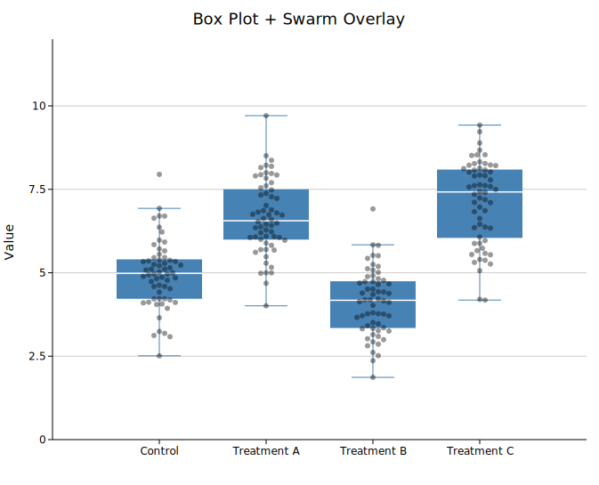

Box Plot

Median, IQR, and whiskers per group — with optional strip or swarm overlay.

</a>

<a href="./plots/violin.html">
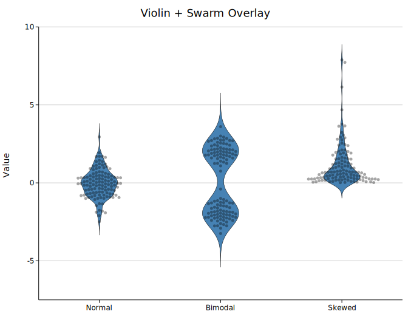

Violin Plot

KDE density mirrored per group, with configurable bandwidth and swarm overlay.

</a>

<a href="./plots/strip.html">
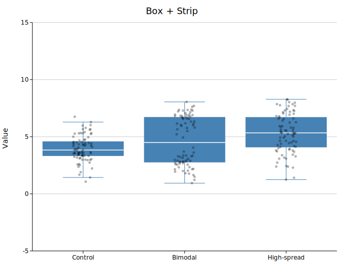

Strip Plot

Individual points jittered or swarmed by group; composes with box/violin.

</a>

<a href="./plots/pie.html">
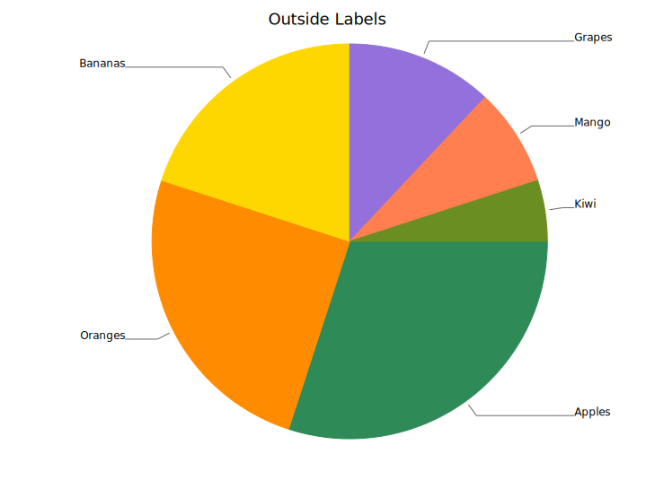

Pie Chart

Pie or donut chart with inside, outside, or legend-only labels.

</a>

<a href="./plots/heatmap.html">

Heatmap

Matrix of values with colourmap, optional cell labels, and row/col clustering.

</a>

<a href="./plots/dotplot.html">
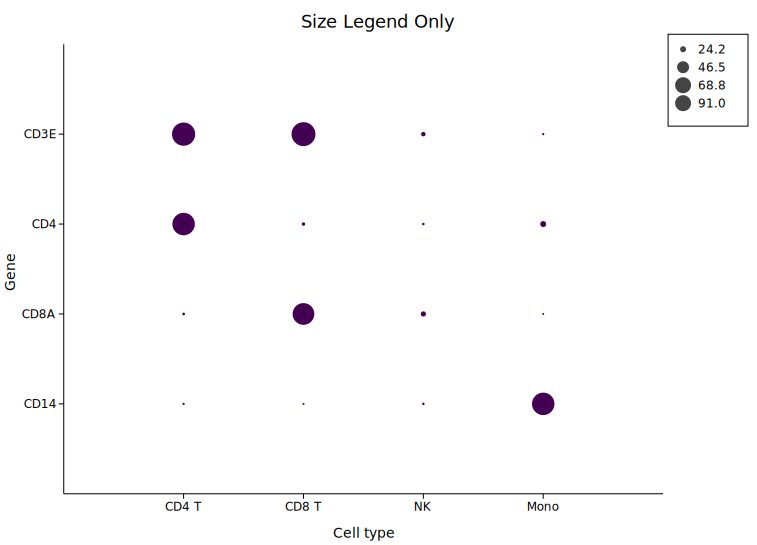

Dot Plot

Size and colour encoding on a categorical grid — common in single-cell analysis.

</a>

<a href="./plots/diceplot.html">

Dice Plot

Die-face dot layout per grid cell — multivariate categorical and continuous data (port of ggdiceplot).

</a>

<a href="./plots/contour.html">
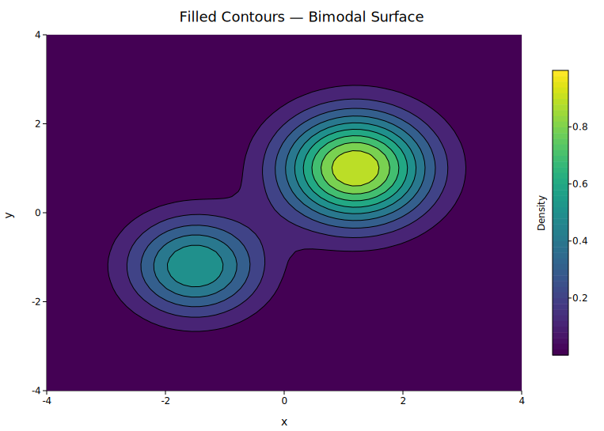

Contour Plot

Filled or line contours from gridded or scattered x/y/z data via IDW interpolation.

</a>

<a href="./plots/stacked_area.html">
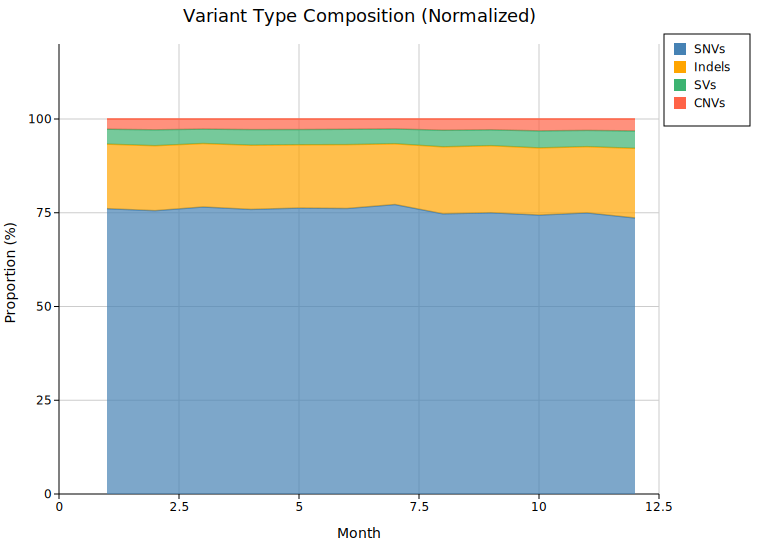

Stacked Area Plot

Stacked time-series with absolute or 100%-normalised mode.

</a>

<a href="./plots/waterfall.html">
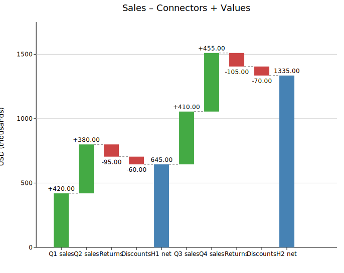

Waterfall Chart

Running total with positive/negative deltas, connectors, and value labels.

</a>

<a href="./plots/candlestick.html">
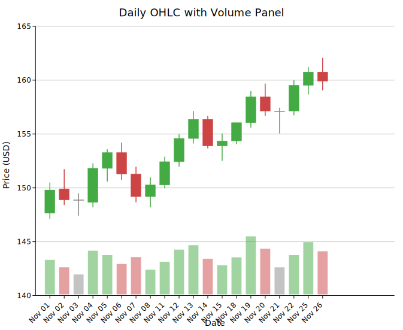

Candlestick Chart

OHLC bars with optional volume panel and datetime axis.

</a>

<a href="./plots/volcano.html">
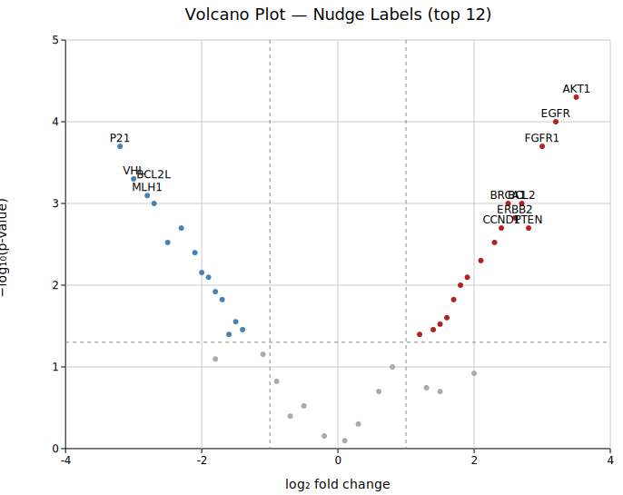

Volcano Plot

log₂FC vs −log₁₀(p) with threshold lines and top-N gene labels.

</a>

<a href="./plots/manhattan.html">
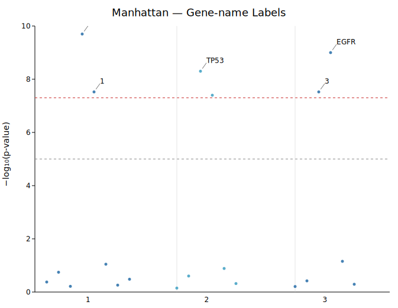

Manhattan Plot

GWAS p-values across chromosomes with genome-wide threshold and gene labels.

</a>

<a href="./plots/upset.html">
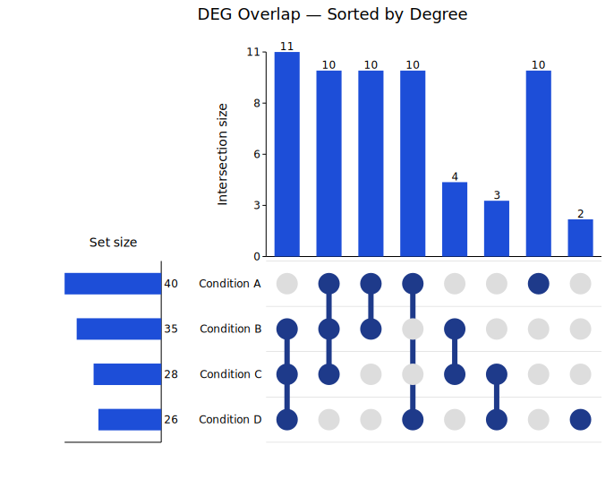

UpSet Plot

Set intersection sizes as a bar chart with a membership matrix below.

</a>

<a href="./plots/chord.html">
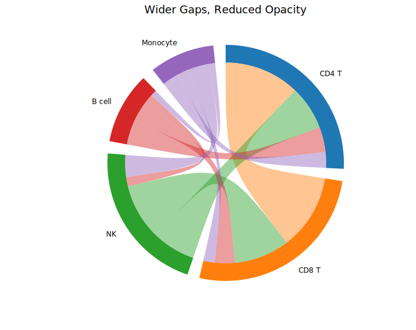

Chord Diagram

Pairwise flows between N groups as arc segments and Bézier ribbons.

</a>

<a href="./plots/network.html">

Network Plot

Node-edge graph with force-directed or circular layout, directed arrows, and weighted edges.

</a>

<a href="./plots/sankey.html">

Sankey Diagram

Multi-stage flow with tapered Bézier links and source/gradient colouring.

</a>

<a href="./plots/phylo.html">
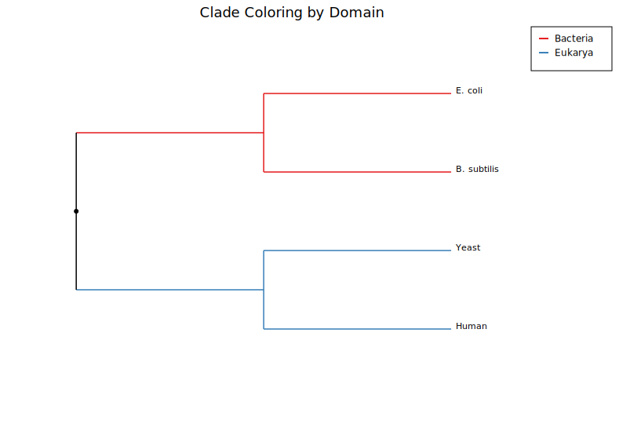

Phylogenetic Tree

Newick, edge-list, distance-matrix, or linkage input; rectangular, slanted, or circular layout.

</a>

<a href="./plots/synteny.html">
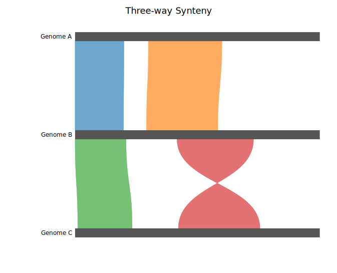

Synteny Plot

Genome synteny ribbons between sequences with forward and inverted blocks.

</a>

<a href="./plots/forest.html">

Forest Plot

Point estimates with confidence intervals for meta-analysis studies.

</a>

<a href="./plots/band.html">
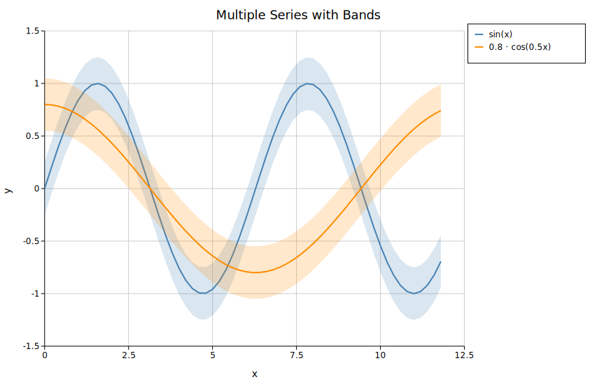

Band Plot

Shaded confidence or credible interval bands, standalone or attached to a line/scatter.

</a>

<a href="./plots/series.html">
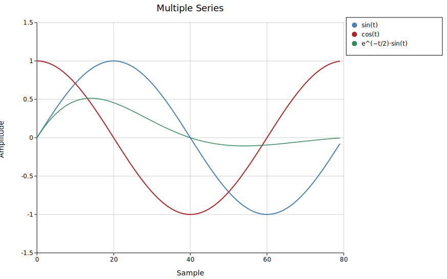

Series Plot

Multiple named data series on one canvas with per-series line and marker styles.

</a>

<a href="./plots/brick.html">

Brick Plot

Read-level alignment bricks with per-base colouring and STRIGAR string support.

</a>

<a href="./plots/polar.html">

Polar Plot

Polar coordinate scatter/line with configurable radial and angular grid.

</a>

<a href="./plots/ternary.html">
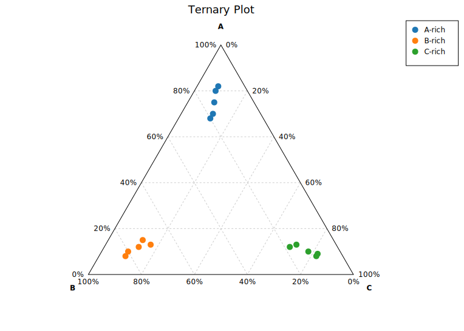

Ternary Plot

Simplex scatter with barycentric coordinates and equilateral triangle geometry.

</a>

<a href="./plots/scatter3d.html">

3D Scatter Plot

Orthographic 3D scatter with depth sorting, z-colormap, and open-box wireframe.

</a>

<a href="./plots/surface3d.html">

3D Surface Plot

Depth-sorted quadrilateral mesh with z-colormap, wireframe edges, and alpha transparency.

</a>

<a href="./plots/ecdf.html">

ECDF Plot

Empirical cumulative distribution function with optional confidence bands.

</a>

<a href="./plots/qq.html">

Q-Q Plot

Quantile-quantile plot for normality assessment and genomic inflation checks.

</a>

<a href="./plots/hexbin.html">

Hexbin Plot

Hexagonal bin density for large scatter datasets with colormap and colorbar support.

</a>

<a href="./plots/treemap.html">

Treemap

Squarified treemap for hierarchical data — flat or two-level with grouped headers.

</a>

<a href="./plots/sunburst.html">

Sunburst Chart

Radial hierarchical chart with concentric rings; optional donut cut-out.

</a>

<a href="./plots/bump.html">
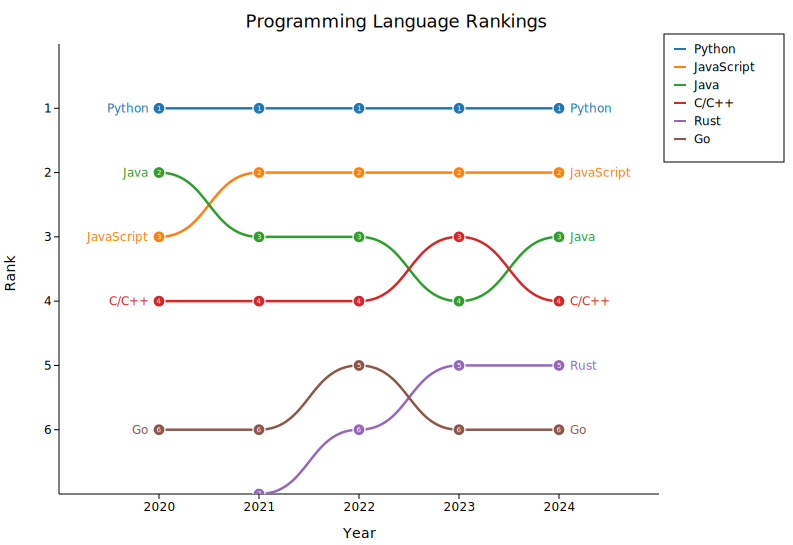

Bump Chart

Rank change over time with smooth sigmoid curves and end-of-line series labels.

</a>

<a href="./plots/funnel.html">
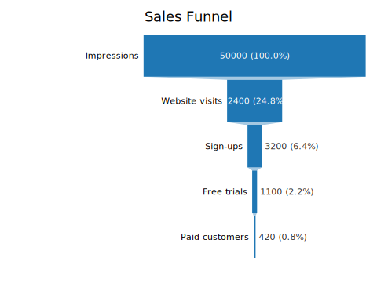

Funnel Chart

Stage-by-stage attrition with trapezoidal connectors; mirror mode for side-by-side comparison.

</a>

<a href="./plots/rose.html">
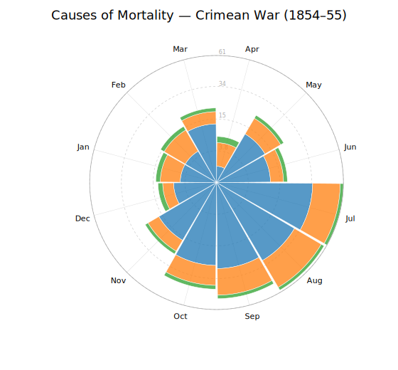

Nightingale Rose

Polar bar chart where sector area encodes value; stacked, grouped, and wind-rose modes.

</a>

<a href="./plots/calendar.html">
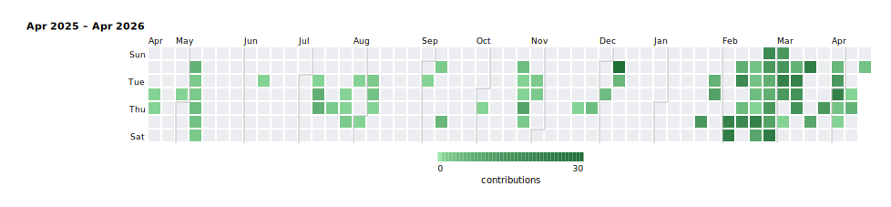

Calendar Heatmap

GitHub-style contribution graph for daily data across one or more years.

</a>

<a href="./plots/gantt.html">
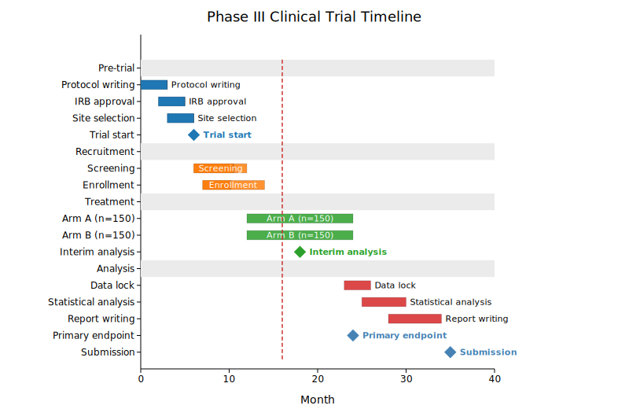

Gantt Chart

Task bars with group phases, progress fills, milestone diamonds, and a now line.

</a>

<a href="./plots/roc.html">

ROC Curve

Receiver operating characteristic with AUC annotation and diagonal reference line.

</a>

<a href="./plots/pr.html">

Precision-Recall Curve

Precision-recall with AUC annotation and no-skill baseline.

</a>

<a href="./plots/survival.html">
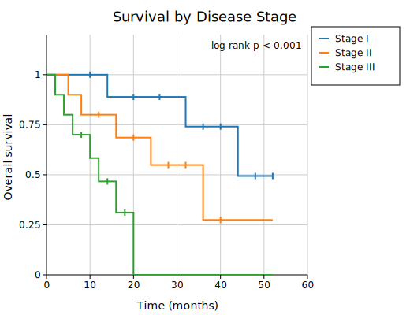

Kaplan-Meier Curve

Step-function survival curves with optional confidence intervals and censoring marks.

</a>

<a href="./plots/slope.html">

Slope Chart

Before-after comparisons with labeled endpoints; also functions as a dumbbell plot.

</a>

<a href="./plots/lollipop.html">
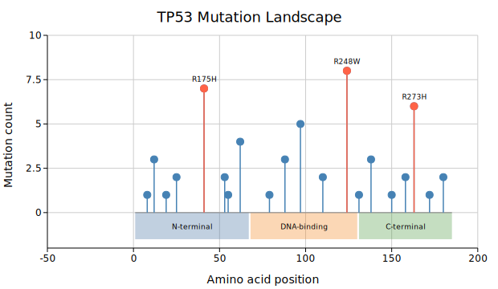

Lollipop Chart

Dot-on-a-stick for ranked categorical values; horizontal or vertical orientation.

</a>

<a href="./plots/venn.html">

Venn Diagram

2-, 3-, and 4-set Venn diagrams with overlap labels and proportional sizing.

</a>

<a href="./plots/mosaic.html">
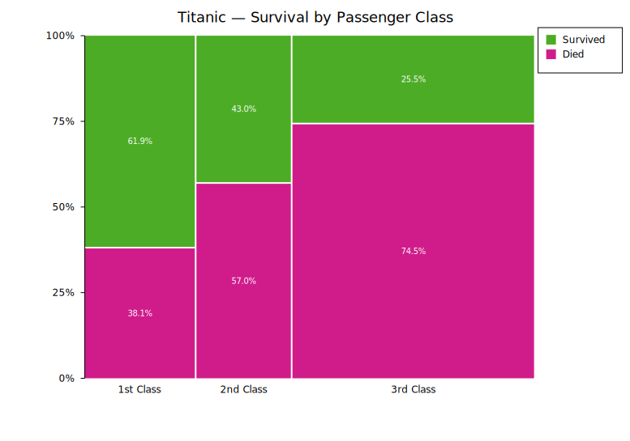

Mosaic Plot

Proportional area tiles for two-way categorical contingency tables.

</a>

<a href="./plots/parallel.html">
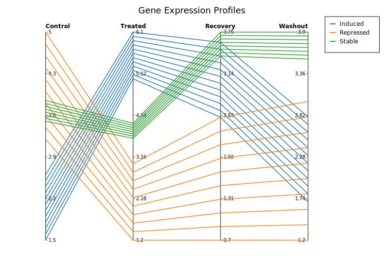

Parallel Coordinates

Multi-dimensional lines across parallel axes; colored by group or continuous value.

</a>

<a href="./plots/pyramid.html">

Population Pyramid

Back-to-back horizontal bars for demographic comparison; single or multi-series.

</a>

<a href="./plots/waffle.html">

Waffle Chart

Grid of unit squares for part-to-whole proportions with optional per-cell icons.

</a>

<a href="./plots/horizon.html">

Horizon Chart

Folded area chart for dense time-series comparison across many series.

</a>

<a href="./plots/radar.html">

Radar / Spider Chart

Multivariate polygon chart with configurable spoke count and optional fill.

</a>

<a href="./plots/twin_y.html">
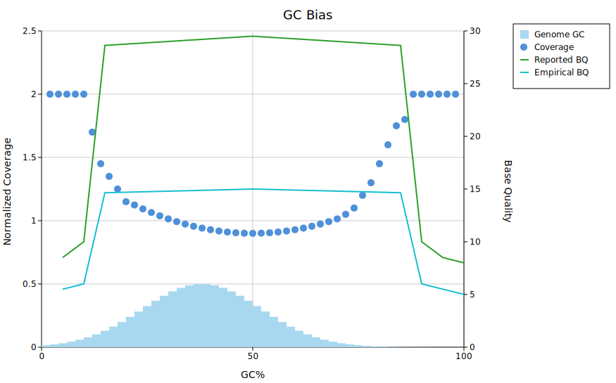

Twin-Y Plot

Two independent y-axes sharing one x-axis for dual-scale comparisons.

</a>

<a href="./plots/streamgraph.html">

Streamgraph

Flowing stacked area centered at zero for showing compositional change over time.

</a>

<a href="./plots/clustermap.html">
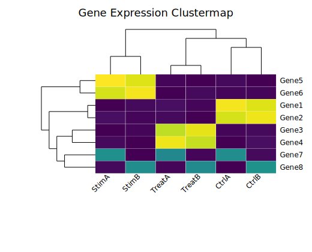

Clustermap

Hierarchically clustered heatmap with row and column dendrograms.

</a>

<a href="./plots/jointplot.html">

Joint Plot

Scatter with marginal histograms or KDE density panels on the top and right.

</a>

<a href="./plots/raincloud.html">
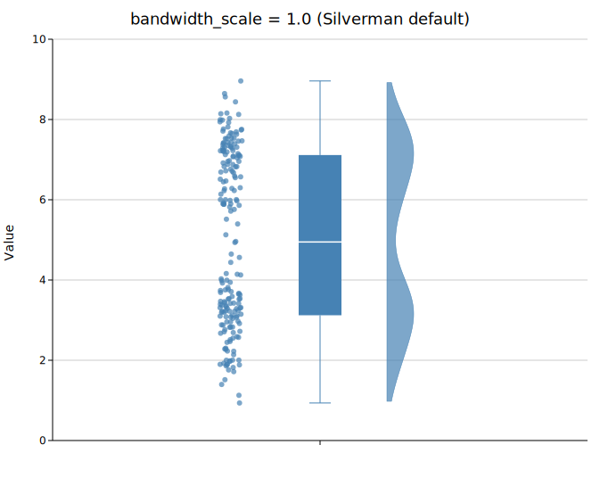

Raincloud Plot

KDE half-violin, box, and jittered strip combined for full distributional detail.

</a>

