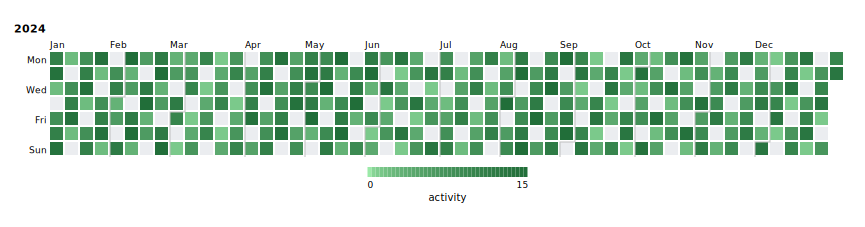
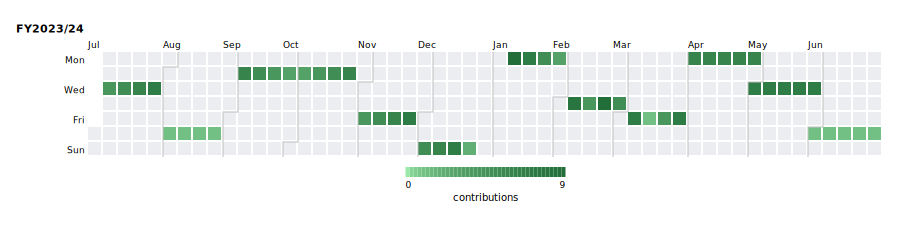
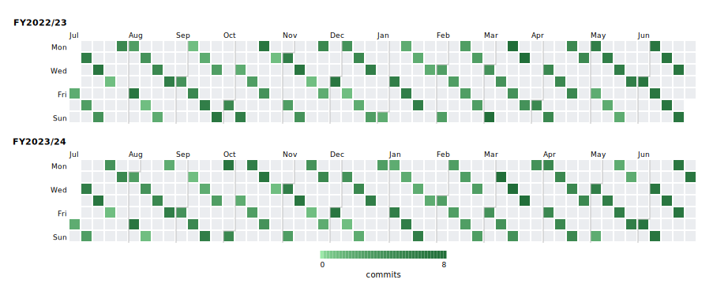

# Calendar Heatmap

A **calendar heatmap** (GitHub contribution graph style) displays daily data values in a grid of week columns × 7 day rows.  Multiple years or arbitrary date ranges can be stacked vertically.  Cell color encodes the aggregated value for that day.

## Basic usage — contribution graph

```rust,no_run
use kuva::plot::calendar::{CalendarPlot, CalendarAgg, WeekStart};
use kuva::render::{plots::Plot, layout::Layout, render::render_calendar};
use kuva::backend::svg::SvgBackend;

let data: &[(&str, f64)] = &[
    ("2025-04-16",  1.0), ("2025-04-17",  1.0), ("2025-04-30",  1.0),
    ("2025-05-05",  6.0), ("2025-05-06",  2.0), ("2025-05-07",  2.0),
    ("2025-05-08",  4.0), ("2025-05-09",  3.0), ("2025-05-10",  2.0),
    ("2025-06-10",  1.0), ("2025-07-08",  1.0), ("2025-07-09",  7.0),
    ("2025-07-10",  7.0), ("2025-07-17",  2.0), ("2025-07-23",  1.0),
    ("2025-07-24",  1.0), ("2025-07-25",  2.0), ("2025-07-29",  1.0),
    ("2025-08-01",  1.0), ("2025-08-05",  2.0), ("2025-08-06",  3.0),
    ("2025-08-07",  1.0), ("2025-09-02",  1.0), ("2025-09-08",  2.0),
    ("2025-09-12",  5.0), ("2025-10-02",  1.0), ("2025-10-20",  4.0),
    ("2025-10-21",  1.0), ("2025-10-22",  1.0), ("2025-10-23", 10.0),
    ("2025-10-24",  2.0), ("2025-10-28",  2.0), ("2025-10-29",  2.0),
    ("2025-11-20",  1.0), ("2025-11-27",  4.0), ("2025-12-03",  4.0),
    ("2025-12-08", 30.0), ("2025-12-09",  5.0), ("2026-01-23", 13.0),
    ("2026-01-27",  6.0), ("2026-01-28", 10.0), ("2026-02-06", 21.0),
    ("2026-02-07", 23.0), ("2026-02-09",  7.0), ("2026-02-10", 18.0),
    ("2026-02-12",  4.0), ("2026-02-13", 18.0), ("2026-02-16",  3.0),
    ("2026-02-17",  3.0), ("2026-02-18",  4.0), ("2026-02-19",  1.0),
    ("2026-02-20", 22.0), ("2026-02-21",  9.0), ("2026-02-22", 18.0),
    ("2026-02-23", 13.0), ("2026-02-24",  7.0), ("2026-02-25",  7.0),
    ("2026-02-26", 13.0), ("2026-02-27", 10.0), ("2026-02-28", 24.0),
    ("2026-03-01", 13.0), ("2026-03-02", 14.0), ("2026-03-03", 22.0),
    ("2026-03-04", 13.0), ("2026-03-06",  1.0), ("2026-03-09",  6.0),
    ("2026-03-10", 21.0), ("2026-03-11", 15.0), ("2026-03-12", 15.0),
    ("2026-03-16", 23.0), ("2026-03-20",  9.0), ("2026-03-26", 13.0),
    ("2026-03-30",  5.0), ("2026-03-31", 13.0), ("2026-04-01", 22.0),
    ("2026-04-02",  3.0), ("2026-04-03",  1.0), ("2026-04-08",  1.0),
    ("2026-04-09",  6.0), ("2026-04-13",  3.0),
];

let plot = CalendarPlot::new()
    .with_data(data.iter().map(|&(d, v)| (d, v)))
    .with_aggregation(CalendarAgg::Sum)
    .with_period("Apr 2025 \u{2013} Apr 2026", "2025-04-13", "2026-04-13")
    .with_week_start(WeekStart::Sunday)
    .with_legend_label("contributions");

let layout = Layout::auto_from_plots(&[Plot::Calendar(plot.clone())]);
let svg = SvgBackend.render_scene(&render_calendar(plot, layout));
std::fs::write("calendar.svg", svg).unwrap();
```


## Numeric data — full year with varied values

```rust,no_run
use kuva::plot::calendar::{CalendarPlot, CalendarAgg};
use kuva::render::{plots::Plot, layout::Layout, render::render_calendar};
use kuva::backend::svg::SvgBackend;

// Generate a full year of data, skipping ~20% of days
let mut data = Vec::new();
let days_per_month = [31u32, 29, 31, 30, 31, 30, 31, 31, 30, 31, 30, 31];
for (mi, &days) in days_per_month.iter().enumerate() {
    let m = mi as u32 + 1;
    for d in 1..=days {
        if (m + d) % 5 == 0 { continue; }
        let val = ((m * 7 + d * 3) % 15 + 1) as f64;
        data.push((format!("2024-{m:02}-{d:02}"), val));
    }
}

let plot = CalendarPlot::new()
    .with_data(data)
    .with_aggregation(CalendarAgg::Sum)
    .with_year(2024)
    .with_legend_label("activity");

let layout = Layout::auto_from_plots(&[Plot::Calendar(plot.clone())]);
let svg = SvgBackend.render_scene(&render_calendar(plot, layout));
std::fs::write("calendar.svg", svg).unwrap();
```



## Multiple years

```rust,no_run
use kuva::plot::calendar::CalendarPlot;

let plot = CalendarPlot::new()
    .with_data(data)          // data spans 2023–2024
    .with_years([2023, 2024]) // one row per year; auto-detected if omitted
    .with_legend_label("downloads");
```

If neither `with_year` nor `with_years` is called, years are **auto-detected** from the data dates.

## Custom date ranges (financial year, rolling window, …)

### Single named period

```rust,no_run
use kuva::plot::calendar::{CalendarPlot, CalendarAgg};
use kuva::render::{plots::Plot, layout::Layout, render::render_calendar};
use kuva::backend::svg::SvgBackend;

let mut data = Vec::new();
// Q1 Jul–Sep 2023
for m in 7u32..=9  { for d in [5, 12, 19, 26] { data.push((format!("2023-{m:02}-{d:02}"), (m * d) as f64 % 8.0 + 1.0)); } }
// Q2 Oct–Dec 2023
for m in 10u32..=12 { for d in [3, 10, 17, 24] { data.push((format!("2023-{m:02}-{d:02}"), (m + d) as f64 % 6.0 + 2.0)); } }
// Q3 Jan–Mar 2024
for m in 1u32..=3  { for d in [8, 15, 22, 29] { data.push((format!("2024-{m:02}-{d:02}"), (m * d) as f64 % 9.0 + 1.0)); } }
// Q4 Apr–Jun 2024
for m in 4u32..=6  { for d in [1u32, 8, 15, 22, 29] { if d <= 30 { data.push((format!("2024-{m:02}-{d:02}"), (m + d) as f64 % 7.0 + 1.0)); } } }

let plot = CalendarPlot::new()
    .with_data(data)
    .with_aggregation(CalendarAgg::Sum)
    .with_period("FY2023/24", "2023-07-01", "2024-06-30")
    .with_legend_label("contributions");

let layout = Layout::auto_from_plots(&[Plot::Calendar(plot.clone())]);
let svg = SvgBackend.render_scene(&render_calendar(plot, layout));
std::fs::write("calendar.svg", svg).unwrap();
```



### Multiple named periods

```rust,no_run
use kuva::plot::calendar::{CalendarPlot, CalendarAgg};
use kuva::render::{plots::Plot, layout::Layout, render::render_calendar};
use kuva::backend::svg::SvgBackend;

fn fy_data(cal_year: i32, next_cal_year: i32) -> Vec<(String, f64)> {
    let mut v = Vec::new();
    for m in 7u32..=12 {
        for d in (1u32..=28).step_by(4) {
            v.push((format!("{cal_year}-{m:02}-{d:02}"), (m + d) as f64 % 7.0 + 1.0));
        }
    }
    for m in 1u32..=6 {
        for d in (1u32..=28).step_by(4) {
            v.push((format!("{next_cal_year}-{m:02}-{d:02}"), (m * d) as f64 % 8.0 + 1.0));
        }
    }
    v
}

let mut data = fy_data(2022, 2023);
data.extend(fy_data(2023, 2024));

let plot = CalendarPlot::new()
    .with_data(data)
    .with_aggregation(CalendarAgg::Sum)
    .with_periods([
        ("FY2022/23", "2022-07-01", "2023-06-30"),
        ("FY2023/24", "2023-07-01", "2024-06-30"),
    ])
    .with_legend_label("commits");

let layout = Layout::auto_from_plots(&[Plot::Calendar(plot.clone())]);
let svg = SvgBackend.render_scene(&render_calendar(plot, layout));
std::fs::write("calendar.svg", svg).unwrap();
```



A period can also span more than a year — each period becomes one calendar row.

## Aggregation modes

| Variant | Behaviour |
|---------|-----------|
| `Count` (default) | Number of data points on each day |
| `Sum` | Sum of all values for each day |
| `Mean` | Average of all values for each day |
| `Max` | Maximum value for each day |

```rust,no_run
use kuva::plot::calendar::{CalendarPlot, CalendarAgg};

let plot = CalendarPlot::new()
    .with_aggregation(CalendarAgg::Mean);
```

## Week start

```rust,no_run
use kuva::plot::calendar::{CalendarPlot, WeekStart};

// GitHub-style: Sunday at the top
let plot = CalendarPlot::new()
    .with_week_start(WeekStart::Sunday);

// ISO default: Monday at the top
let plot = CalendarPlot::new()
    .with_week_start(WeekStart::Monday);
```

## Color customization

### Changing the color map

The default colormap is a light-green → dark-green gradient with sqrt-gamma that mimics GitHub's contribution graph.  Any [`ColorMap`](../reference/colormap.md) variant can be used instead:

```rust,no_run
use kuva::plot::calendar::CalendarPlot;
use kuva::plot::ColorMap;

// Viridis
let plot = CalendarPlot::new()
    .with_color_map(ColorMap::Viridis);

// YellowOrangeRed (ColorBrewer)
let plot = CalendarPlot::new()
    .with_color_map(ColorMap::YellowOrangeRed);
```

### Custom color function

```rust,no_run
use std::sync::Arc;
use kuva::plot::calendar::CalendarPlot;
use kuva::plot::ColorMap;

let plot = CalendarPlot::new()
    .with_color_map(ColorMap::Custom(Arc::new(|t: f64| {
        // Ice-blue to red heat map
        let r = (t * 220.0) as u8;
        let b = ((1.0 - t) * 220.0) as u8;
        format!("rgb({r},30,{b})")
    })));
```

### Missing-day and zero-value colors

```rust,no_run
use kuva::plot::calendar::CalendarPlot;

let plot = CalendarPlot::new()
    .with_missing_color("#f0f0f0")   // days absent from the dataset
    .with_zero_color("#e8e8e8");     // days present with value == 0
                                     // (falls back to missing_color if unset)
```

### Explicit color scale range

```rust,no_run
use kuva::plot::calendar::CalendarPlot;

let plot = CalendarPlot::new()
    .with_value_range(0.0, 100.0);  // clamp scale regardless of data max
```

## Builder reference

| Method | Default | Description |
|--------|---------|-------------|
| `with_data(iter)` | — | Add `(date, value)` pairs; date format `"YYYY-MM-DD"` |
| `with_events(iter)` | — | Add bare date strings; each occurrence counts as 1.0 |
| `with_aggregation(agg)` | `Count` | `CalendarAgg::Count/Sum/Mean/Max` |
| `with_year(y)` | auto | Display a single full calendar year |
| `with_years(iter)` | auto | Display multiple full calendar years, one row each |
| `with_period(label, start, end)` | — | Display a single named date range |
| `with_periods(iter)` | — | Display multiple named date ranges |
| `with_date_range(start, end)` | — | Unnamed single date range (label from start year) |
| `with_week_start(ws)` | `Monday` | `WeekStart::Monday` (ISO) or `Sunday` (GitHub) |
| `with_color_map(cmap)` | GitHub green | [`ColorMap`] variant for the value → color mapping |
| `with_missing_color(color)` | `"#ebedf0"` | CSS color for days absent from the dataset |
| `with_zero_color(color)` | `None` | CSS color for days with value exactly 0; falls back to `missing_color` |
| `with_value_range(min, max)` | auto | Explicit color scale endpoints |
| `with_month_labels(bool)` | `true` | Show abbreviated month names above the grid |
| `with_day_labels(bool)` | `true` | Show Mon/Wed/Fri labels on the left |
| `with_cell_size(px)` | `13.0` | Size of each day cell in pixels |
| `with_cell_gap(px)` | `2.0` | Gap between cells in pixels |
| `with_legend(bool)` | `true` | Show the colorbar legend |
| `with_legend_label(label)` | `None` | Label beneath the colorbar |
