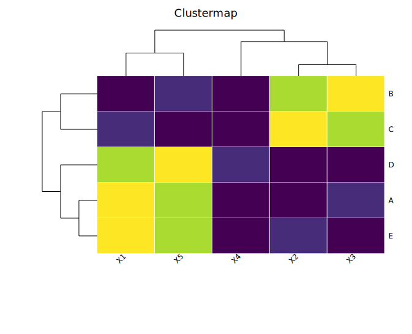

# Clustermap

A clustermap combines a heatmap with hierarchical clustering dendrograms for both rows and columns. Unlike composing a `Heatmap` and `PhyloTree` manually in a `Figure`, `Clustermap` computes both in the same renderer and guarantees **pixel-perfect alignment** between dendrogram leaves and heatmap cell centres.

Rows and columns are clustered automatically via UPGMA (Euclidean distance) unless clustering is disabled or a pre-built `PhyloTree` is supplied.

**Import path:** `kuva::plot::{Clustermap, ClustermapNorm, AnnotationTrack}`

---

## Basic usage

Pass a 2-D grid to `.with_data()`. The outer dimension is rows (top to bottom) and the inner dimension is columns (left to right). Row and column labels are set directly on the `Clustermap`, not via `Layout`.

```rust,no_run
use kuva::prelude::*;

let data = vec![
    vec![0.9, 0.1, 0.2, 0.8, 0.1],
    vec![0.8, 0.2, 0.1, 0.9, 0.2],
    vec![0.1, 0.9, 0.8, 0.2, 0.9],
    vec![0.2, 0.8, 0.9, 0.1, 0.8],
    vec![0.1, 0.7, 0.8, 0.3, 0.9],
];

let cm = Clustermap::new()
    .with_data(data)
    .with_row_labels(["A", "B", "C", "D", "E"])
    .with_col_labels(["X1", "X2", "X3", "X4", "X5"])
    .with_legend("Value");

let plots = vec![Plot::Clustermap(cm)];
let layout = Layout::auto_from_plots(&plots).with_title("Clustermap");

let svg = SvgBackend.render_scene(&render_multiple(plots, layout));
std::fs::write("clustermap.svg", svg).unwrap();
```



Both dendrograms are drawn automatically. Rows and columns are reordered so that similar profiles cluster together.

---

## Disabling clustering

Pass `false` to `.with_cluster_rows()` or `.with_cluster_cols()` to suppress a dendrogram and keep the original data order on that axis.

```rust,no_run
# use kuva::prelude::*;
// Cluster rows only — keep original column order
let cm = Clustermap::new()
    .with_data(data)
    .with_row_labels(["A", "B", "C", "D", "E"])
    .with_col_labels(["X1", "X2", "X3", "X4", "X5"])
    .with_cluster_cols(false);

// Or disable both for a plain labeled heatmap via the Clustermap API
let cm_plain = Clustermap::new()
    .with_data(data)
    .with_row_labels(["A", "B", "C", "D", "E"])
    .with_col_labels(["X1", "X2", "X3", "X4", "X5"])
    .with_cluster_rows(false)
    .with_cluster_cols(false);
```

When clustering is disabled on an axis, no dendrogram panel is drawn for that axis and the data is displayed in its original order.

---

## Normalization

`.with_normalization(ClustermapNorm)` applies a transform to the data before color mapping. This is useful for comparing expression profiles where absolute magnitudes differ across rows or columns.

| Variant | Description |
|---------|-------------|
| `ClustermapNorm::None` | No transform — raw values mapped to colors. **Default.** |
| `ClustermapNorm::RowZScore` | Each row is z-score normalized (mean 0, std 1). |
| `ClustermapNorm::ColZScore` | Each column is z-score normalized (mean 0, std 1). |

```rust,no_run
# use kuva::prelude::*;
let cm = Clustermap::new()
    .with_data(data)
    .with_row_labels(["GeneA", "GeneB", "GeneC", "GeneD", "GeneE"])
    .with_col_labels(["Ctrl", "T1", "T2", "T3", "T4"])
    .with_normalization(ClustermapNorm::RowZScore)
    .with_legend("Z-score");
```


The colorbar always reflects the **post-normalization** range. Use `RowZScore` when you want to compare relative expression patterns across samples; use `ColZScore` when comparing relative feature activity across samples.

---

## Color maps

The same `ColorMap` enum used by `Heatmap` applies here.

```rust,no_run
# use kuva::prelude::*;
# use kuva::plot::ColorMap;
let cm = Clustermap::new()
    .with_data(data)
    .with_color_map(ColorMap::Inferno);
```

| Variant | Notes |
|---------|-------|
| `Viridis` | Perceptually uniform; colorblind-safe. **Default.** |
| `Inferno` | High-contrast; works in greyscale print. |
| `Grayscale` | Clean publication style. |
| `Custom(Arc<Fn>)` | Full control — closure maps `[0.0, 1.0]` to a CSS color string. |

---

## Annotation tracks

`AnnotationTrack` adds a strip of colored cells alongside the heatmap body. Row annotation tracks appear between the row dendrogram and the heatmap. Column annotation tracks appear between the column dendrogram and the heatmap.

Provide one CSS color string per row (or column), **in the original data order** — the renderer reorders them to match the clustering automatically.

```rust,no_run
# use kuva::prelude::*;
// Sample-group colors in original column order
let sample_colors = vec!["#ff7f00", "#ff7f00", "#984ea3", "#984ea3", "#984ea3"];

let col_annot = AnnotationTrack::new(sample_colors)
    .with_label("Group");

// Treatment status in original row order
let row_annot = AnnotationTrack::new(vec![
    "#e41a1c", "#e41a1c", "#4daf4a", "#377eb8", "#377eb8",
])
.with_label("Sample");

let cm = Clustermap::new()
    .with_data(data)
    .with_row_labels(["A", "B", "C", "D", "E"])
    .with_col_labels(["X1", "X2", "X3", "X4", "X5"])
    .with_row_annotation(row_annot)
    .with_col_annotation(col_annot);
```


Multiple tracks can be stacked by calling `.with_row_annotation()` or `.with_col_annotation()` multiple times. Each track is independent and can have a different width.

### Track width

```rust,no_run
# use kuva::prelude::*;
let track = AnnotationTrack::new(colors)
    .with_label("Treatment")
    .with_width(20.0);   // pixels; default 15.0
```

---

## Pre-supplied trees

Supply a `PhyloTree` directly with `.with_row_tree()` or `.with_col_tree()` to use a custom topology instead of auto-clustering. The tree's leaf labels must match the row (or column) labels set via `.with_row_labels()` / `.with_col_labels()`.

```rust,no_run
# use kuva::prelude::*;
let labels = ["A", "B", "C", "D", "E"];
let dist = vec![
    vec![0.0, 0.1, 0.9, 0.9, 0.9],
    vec![0.1, 0.0, 0.9, 0.9, 0.9],
    vec![0.9, 0.9, 0.0, 0.1, 0.2],
    vec![0.9, 0.9, 0.1, 0.0, 0.2],
    vec![0.9, 0.9, 0.2, 0.2, 0.0],
];

// Build a tree externally (UPGMA, Newick parse, etc.)
let row_tree = PhyloTree::from_distance_matrix(&labels, &dist);

let cm = Clustermap::new()
    .with_data(data)
    .with_row_labels(labels)
    .with_row_tree(row_tree)  // use this topology; skip auto-clustering
    .with_cluster_cols(true); // auto-cluster columns as normal
```

This is useful when you want to impose a known phylogeny on the rows while still auto-clustering the columns.

---

## Value overlay

`.with_values()` prints each cell's raw (post-normalization) value inside the cell, formatted to two decimal places. Most useful for small grids.

```rust,no_run
# use kuva::prelude::*;
let cm = Clustermap::new()
    .with_data(vec![
        vec![1.0, 4.0, 7.0],
        vec![2.0, 5.0, 8.0],
        vec![3.0, 6.0, 9.0],
    ])
    .with_row_labels(["R1", "R2", "R3"])
    .with_col_labels(["C1", "C2", "C3"])
    .with_values();
```

---

## Dendrogram panel sizing

The row dendrogram panel is 100 px wide by default. The column dendrogram panel is 80 px tall. Adjust these if your labels or canvas size require more or less space.

```rust,no_run
# use kuva::prelude::*;
let cm = Clustermap::new()
    .with_data(data)
    .with_row_dendrogram_width(60.0)   // narrower row dendrogram
    .with_col_dendrogram_height(50.0); // shorter col dendrogram
```

---

## Comparison with `Figure`-based `PhyloTree + Heatmap`

The older approach for pairing a dendrogram with a heatmap uses `Figure::new(1, 2)` to place a `PhyloTree` and a `Heatmap` side by side, then manually aligns them via `leaf_labels_top_to_bottom()` and `with_y_categories()`. This works but has a limitation:

> The tree leaves and heatmap rows are each spaced independently within their own figure cells. At most canvas sizes the alignment looks correct, but is not guaranteed to be pixel-exact.

`Clustermap` solves this by computing both the dendrogram and the heatmap body in the same renderer, sharing an identical `cell_h = hm_h / n_rows` formula. Every leaf centre and every heatmap row centre are placed at `hm_y + (k + 0.5) * cell_h` — the same expression — so alignment is guaranteed regardless of canvas size or the number of rows.

Use `Clustermap` when:
- You need reliable dendrogram-to-heatmap alignment.
- You want UPGMA auto-clustering and just need a result.
- You need annotation tracks alongside the heatmap.
- You want row / column z-score normalization in the same call.

Use the `Figure + PhyloTree + Heatmap` approach when:
- You need full control over the tree (e.g. circular layout, clade coloring, branch lengths, support values).
- You want to show a phylogram (branch-length-accurate tree) alongside the heatmap.
- The tree and heatmap use different data sources and need to be laid out independently.

---

## API reference

### `Clustermap` builder methods

| Method | Description |
|--------|-------------|
| `Clustermap::new()` | Create a clustermap with defaults |
| `.with_data(rows)` | Set grid data; accepts any numeric iterable of iterables |
| `.with_row_labels(iter)` | Row labels in original data order |
| `.with_col_labels(iter)` | Column labels in original data order |
| `.with_cluster_rows(bool)` | Enable/disable row clustering (default `true`) |
| `.with_cluster_cols(bool)` | Enable/disable column clustering (default `true`) |
| `.with_row_tree(PhyloTree)` | Pre-built row tree; overrides auto-clustering |
| `.with_col_tree(PhyloTree)` | Pre-built column tree; overrides auto-clustering |
| `.with_color_map(ColorMap)` | Color encoding (default `Viridis`) |
| `.with_values()` | Overlay raw cell values as text |
| `.with_normalization(ClustermapNorm)` | Normalization before color mapping (default `None`) |
| `.with_branch_color(s)` | Branch line color for both dendrograms (default `"black"`) |
| `.with_row_dendrogram_width(f64)` | Pixel width of the row dendrogram panel (default `100.0`) |
| `.with_col_dendrogram_height(f64)` | Pixel height of the column dendrogram panel (default `80.0`) |
| `.with_row_annotation(AnnotationTrack)` | Add a row annotation strip |
| `.with_col_annotation(AnnotationTrack)` | Add a column annotation strip |
| `.with_legend(s)` | Set the colorbar legend label |
| `.with_tooltips()` | Enable SVG tooltip overlays on hover |

### `AnnotationTrack` builder methods

| Method | Description |
|--------|-------------|
| `AnnotationTrack::new(colors)` | Create a track from an iterable of CSS color strings, in original data order |
| `.with_label(s)` | Set a label displayed at the bottom of the strip |
| `.with_width(f64)` | Strip width (row tracks) or height (col tracks) in pixels (default `15.0`) |

### `ClustermapNorm` variants

| Variant | Effect |
|---------|--------|
| `None` | No normalization (default) |
| `RowZScore` | Each row normalized to mean 0, std 1 |
| `ColZScore` | Each column normalized to mean 0, std 1 |
