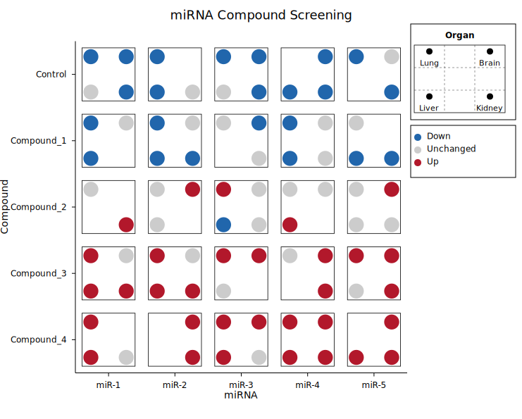
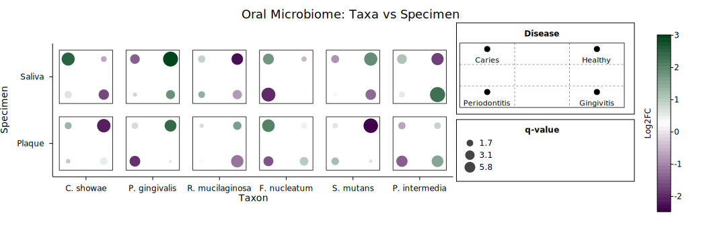
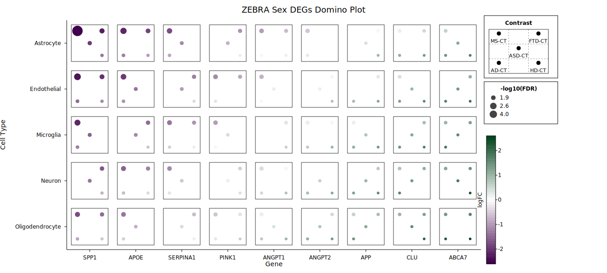

# Dice Plot

A dice plot places up to 6 dots in a die-face layout at each intersection of two categorical axes. Each dot position represents a third categorical variable, while dot colour and size can independently encode continuous values. This makes it ideal for compact visualisation of multivariate data across a grid — the canonical use case is displaying differential expression across multiple contrasts, tissues, or conditions in a single figure.

Ported from the [ggdiceplot](https://github.com/maflot/ggdiceplot) R package (v1.2.0).

**Import path:** `kuva::plot::DicePlot`

---

## Categorical mode

Each input record is one observation: `(x_cat, y_cat, dot_category, css_color)`. Dot positions are assigned by matching `dot_category` against the category labels. Absent positions are not drawn; tile backgrounds are white with a black border.

```rust,no_run
use kuva::plot::diceplot::DicePlot;
use kuva::backend::svg::SvgBackend;
use kuva::render::render::render_multiple;
use kuva::render::layout::Layout;
use kuva::render::plots::Plot;

let organs = vec!["Lung".into(), "Liver".into(), "Brain".into(), "Kidney".into()];
let data = vec![
    ("miR-1", "Control",    "Lung",   "#2166ac"),
    ("miR-1", "Control",    "Liver",  "#2166ac"),
    ("miR-1", "Control",    "Brain",  "#cccccc"),
    ("miR-1", "Control",    "Kidney", "#2166ac"),
    ("miR-1", "Compound_1", "Lung",   "#2166ac"),
    ("miR-1", "Compound_1", "Liver",  "#cccccc"),
    // ...
];

let dice = DicePlot::new(4)
    .with_category_labels(organs)
    .with_records(data)
    .with_dot_legend(vec![
        ("Down",      "#2166ac"),
        ("Unchanged", "#cccccc"),
        ("Up",        "#b2182b"),
    ])
    .with_position_legend("Organ");

let plots = vec![Plot::DicePlot(dice)];
let layout = Layout::auto_from_plots(&plots)
    .with_title("miRNA Compound Screening")
    .with_x_label("miRNA")
    .with_y_label("Compound");

let scene = render_multiple(plots, layout);
let svg = SvgBackend.render_scene(&scene);
std::fs::write("mirna_compound.svg", svg).unwrap();
```



Five miRNAs across five compound treatments. Each cell shows four organ dot positions; colour encodes expression direction (down/unchanged/up). The position legend shows which dot position maps to which organ.

---

## Per-dot continuous mode

Each record is one dot: `(x_cat, y_cat, dot_index, fill, size)`. Each dot gets its own colourmap fill and proportional radius. This is the mode used for ZEBRA-style domino plots where fill encodes log fold change and size encodes significance.

```rust,no_run
use std::sync::Arc;
use kuva::plot::diceplot::DicePlot;
use kuva::plot::heatmap::ColorMap;
# use kuva::render::plots::Plot;

let diseases = vec![
    "Caries".into(), "Periodontitis".into(), "Healthy".into(), "Gingivitis".into(),
];

let data = vec![
    ("C. showae", "Saliva", 0_usize, Some(2.55), Some(4.82)),
    ("C. showae", "Saliva", 1,       Some(-0.67), Some(1.30)),
    // ...
];

// ggdiceplot's purple-white-green diverging scale
let cmap = ColorMap::Custom(Arc::new(|t: f64| {
    let (r, g, b) = if t < 0.5 {
        let s = t * 2.0;
        (0x40 as f64 + s * (255.0 - 0x40 as f64),
         s * 255.0,
         0x4B as f64 + s * (255.0 - 0x4B as f64))
    } else {
        let s = (t - 0.5) * 2.0;
        (255.0 * (1.0 - s),
         255.0 + s * (0x44 as f64 - 255.0),
         255.0 + s * (0x1B as f64 - 255.0))
    };
    format!("rgb({},{},{})", r as u8, g as u8, b as u8)
}));

let dice = DicePlot::new(4)
    .with_category_labels(diseases)
    .with_dot_data(data)
    .with_color_map(cmap)
    .with_fill_legend("Log2FC")
    .with_size_legend("q-value")
    .with_position_legend("Disease");
```



Six oral bacteria across two specimen types. Each dot represents a disease condition; purple-to-green fill encodes log fold change, dot size encodes statistical significance.

---

## ZEBRA domino plot

The per-dot continuous mode scales to larger grids. This example reproduces the ZEBRA sex DEGs domino plot: 9 genes across 5 cell types with 5 disease contrasts per cell.



Each die face shows five contrasts (MS-CT, AD-CT, ASD-CT, FTD-CT, HD-CT). Fill encodes logFC (purple = down, green = up), size encodes -log10(FDR). Missing dots indicate non-significant results for that contrast.

---

## Continuous tile mode

One record per grid cell via `with_points(iter of (x, y, present_vec, fill, size))`. The tile background is coloured via the colour map; dot radius encodes a second continuous variable. Present dots are filled black; absent positions show as small hollow outlines.

```rust,no_run
# use kuva::plot::diceplot::DicePlot;
let data = vec![
    ("Gene_A", "Sample_1", vec![0, 1, 2, 3], Some(0.8), Some(5.0)),
    ("Gene_A", "Sample_2", vec![0, 2],       Some(0.3), Some(2.0)),
    // ...
];

let dice = DicePlot::new(4)
    .with_points(data)
    .with_fill_legend("Expression")
    .with_size_legend("Significance");
```

---

## Legends

DicePlot supports three independent legend sections, stacked vertically in the right margin:

1. **Position legend** (`.with_position_legend("Title")`) — mini die faces showing which dot position maps to which category
2. **Colour legend** (`.with_dot_legend(entries)`) — colour swatches for categorical mode
3. **Size legend** (`.with_size_legend("Title")`) — representative circles at 25%, 50%, 100% of max radius

A **colorbar** is added via `.with_fill_legend("Label")` for continuous fill modes.

---

## Pip sizing

Pip (dot) radius is computed using the ggdiceplot 1.2.0 tight-packing algorithm:

1. Compute minimum inter-pip distance and maximum offset from tile center
2. Find the scale factor (`s_tight`) where pips simultaneously touch each other and tile borders
3. Maximum pip radius = `min(border_clearance, inter_pip_gap / 2)`
4. Default `pip_scale = 0.75` — pips fill 75% of available space
5. When pips would overflow, their positions are shifted toward the tile center

Override with `.with_dot_radius(px)` for a fixed radius.

---

## API reference

| Method | Description |
|--------|-------------|
| `DicePlot::new(ndots)` | Create with 1–6 dot positions per cell |
| `.with_records(iter)` | Categorical input: `(x, y, dot_category, css_color)` |
| `.with_points(iter)` | Continuous tile input: `(x, y, present_vec, fill, size)` |
| `.with_dot_data(iter)` | Per-dot continuous input: `(x, y, dot_idx, fill, size)` |
| `.with_category_labels(vec)` | Set legend labels for each dot position |
| `.with_x_categories(vec)` | Override x-axis category order |
| `.with_y_categories(vec)` | Override y-axis category order |
| `.with_color_map(map)` | Colour encoding: `Viridis`, `Inferno`, `Grayscale`, `Custom` |
| `.with_fill_range(min, max)` | Clamp fill values before normalising |
| `.with_size_range(min, max)` | Clamp size values before normalising |
| `.with_fill_legend(label)` | Add a colorbar in the right margin |
| `.with_size_legend(label)` | Add a size legend in the right margin |
| `.with_dot_legend(entries)` | Categorical colour legend: `[(label, css_color)]` |
| `.with_position_legend(title)` | Spatial-position legend with mini die faces |
| `.with_dot_radius(px)` | Fixed dot radius (`0.0` = auto) |
| `.with_cell_size(w, h)` | Tile size as fraction of cell (default `0.8, 0.8`) |
| `.with_pad(pad)` | Intra-tile padding fraction (default `0.1`) |
