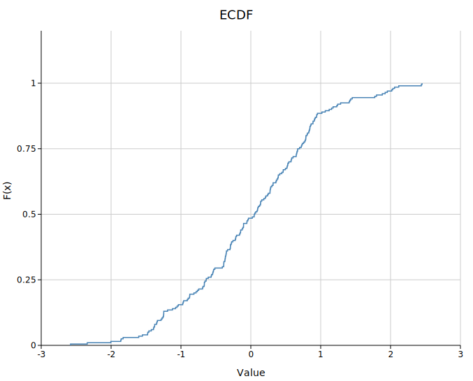
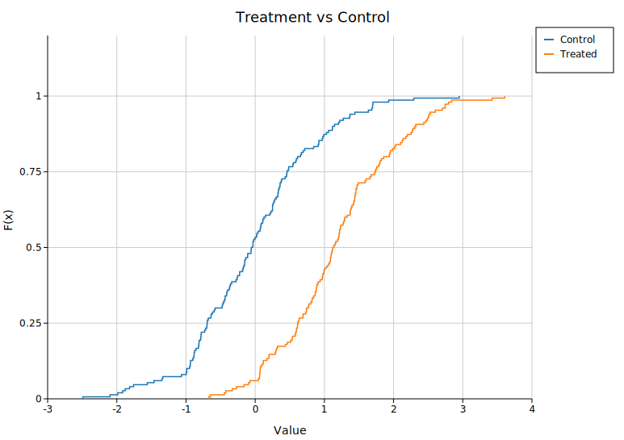
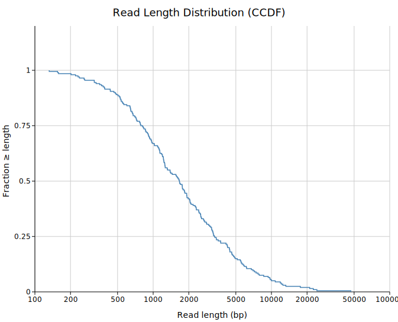
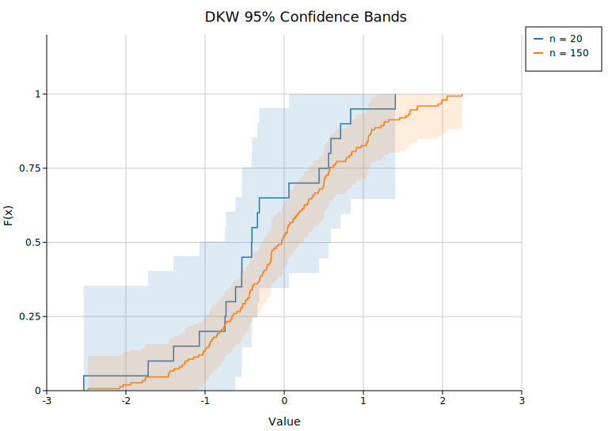
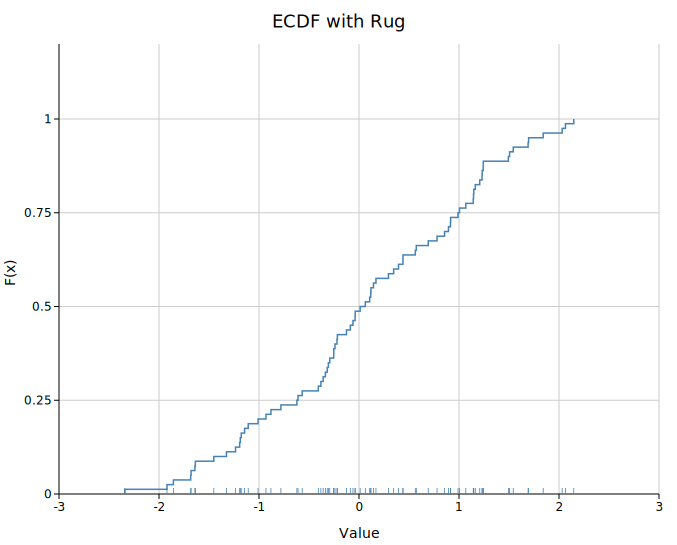
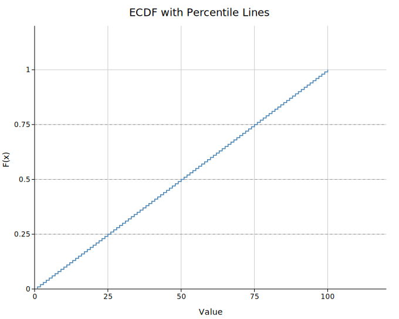
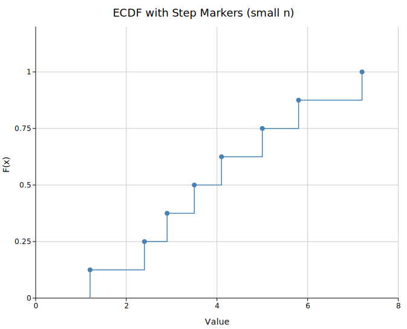
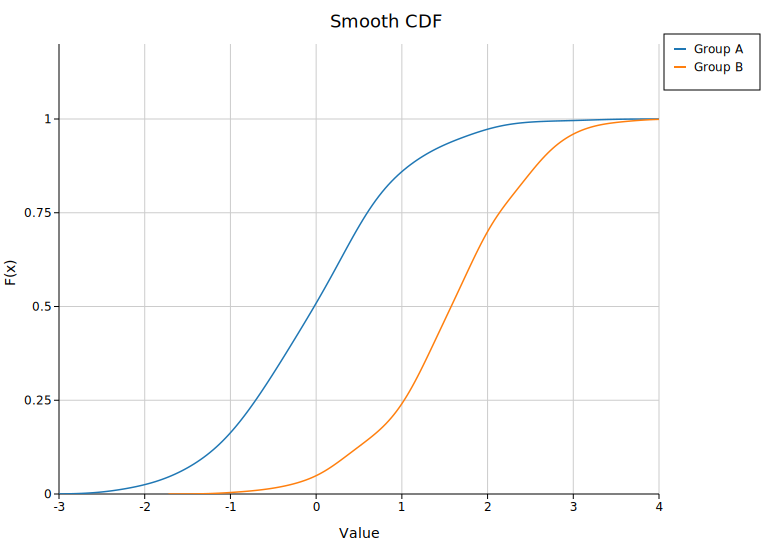

# ECDF Plot

An Empirical Cumulative Distribution Function plot shows `F(x) = P(X ≤ x)` as a right-continuous step function. It is one of the most informative single-distribution diagnostics — no binning, no bandwidth choice, and the full distribution is visible. Multiple groups can be overlaid for direct comparison.

**Import path:** `kuva::plot::EcdfPlot`

---

## Basic usage

```rust,no_run
use kuva::plot::EcdfPlot;
use kuva::backend::svg::SvgBackend;
use kuva::render::render::render_multiple;
use kuva::render::layout::Layout;
use kuva::render::plots::Plot;

let data: Vec<f64> = vec![1.2, 3.4, 2.1, 5.6, 4.0, 0.8, 3.3, 2.7, 4.5, 1.9];

let plot = EcdfPlot::new()
    .with_data("Sample", data)
    .with_color("steelblue");

let plots = vec![Plot::Ecdf(plot)];
let layout = Layout::auto_from_plots(&plots)
    .with_title("ECDF")
    .with_x_label("Value")
    .with_y_label("F(x)");

let svg = SvgBackend.render_scene(&render_multiple(plots, layout));
std::fs::write("ecdf.svg", svg).unwrap();
```



---

## Multi-group comparison

Add multiple groups to overlay ECDFs on the same axes. Call `.with_legend("")` to enable the legend — an empty string shows group labels without a separate title.

```rust,no_run
# use kuva::plot::EcdfPlot;
# use kuva::render::plots::Plot;
# use kuva::render::layout::Layout;
# use kuva::render::render::render_multiple;
# use kuva::backend::svg::SvgBackend;
let plot = EcdfPlot::new()
    .with_data("Control", vec![1.0, 1.5, 2.0, 2.5, 3.0, 3.5, 4.0])
    .with_data("Treated", vec![2.0, 2.5, 3.0, 3.5, 4.0, 4.5, 5.0])
    .with_legend("");

let plots = vec![Plot::Ecdf(plot)];
let layout = Layout::auto_from_plots(&plots)
    .with_title("Treatment vs Control");

let svg = SvgBackend.render_scene(&render_multiple(plots, layout));
```



---

## Complementary CDF (CCDF)

`.with_complementary()` flips the y-axis to `1 - F(x)`, which is the survival function / exceedance probability. This is the standard view for:

- Sequencing read length distributions (what fraction of reads are ≥ N bp?)
- Coverage distributions (what fraction of positions have ≥ N× depth?)
- Heavy-tailed data where you care about the tail rather than the bulk

```rust,no_run
# use kuva::plot::EcdfPlot;
# use kuva::render::plots::Plot;
let plot = EcdfPlot::new()
    .with_data("Nanopore run", vec![500.0, 1200.0, 3500.0, 8000.0, 15000.0])
    .with_color("steelblue")
    .with_complementary();
```

Combine with a log x-axis via `Layout::with_log_x()` for read-length distributions:

```rust,no_run
# use kuva::plot::EcdfPlot;
# use kuva::render::plots::Plot;
# use kuva::render::layout::Layout;
# let plot = EcdfPlot::new().with_data("", vec![1.0]);
# let plots = vec![Plot::Ecdf(plot)];
let layout = Layout::auto_from_plots(&plots).with_log_x();
```



---

## DKW confidence bands

`.with_confidence_band()` adds a shaded DKW 95% confidence band around each curve. The band width is `ε = √(ln(40) / (2n))` — wider for small n, tight for large n. This is the key diagnostic for whether two curves are statistically distinguishable:

```rust,no_run
# use kuva::plot::EcdfPlot;
let plot = EcdfPlot::new()
    .with_data("n=20", (0..20).map(|i| i as f64))
    .with_data("n=100", (0..100).map(|i| i as f64))
    .with_confidence_band()
    .with_legend("");
```

Adjust the band opacity with `.with_band_alpha(f)` (default `0.15`).



---

## Rug plot

`.with_rug()` draws small tick marks at the bottom of the plot area at each data point's location. This shows the density and distribution of raw observations — useful for spotting clusters, gaps, and outliers that the step function alone can obscure.

```rust,no_run
# use kuva::plot::EcdfPlot;
let plot = EcdfPlot::new()
    .with_data("Sample", vec![1.0, 1.1, 1.2, 3.0, 5.0, 5.1, 7.5])
    .with_color("steelblue")
    .with_rug();
```

For multi-group plots, each group's rug is offset vertically so they don't fully overlap.



---

## Percentile reference lines

`.with_percentile_lines(vec![0.25, 0.5, 0.75])` draws horizontal dashed reference lines at Q1, median, and Q3 (or any levels you specify). Labels are placed at the right edge.

```rust,no_run
# use kuva::plot::EcdfPlot;
let plot = EcdfPlot::new()
    .with_data("", (1..=100).map(|i| i as f64))
    .with_color("steelblue")
    .with_percentile_lines(vec![0.25, 0.5, 0.75]);
```



---

## Step markers

`.with_markers()` places a circle at each step endpoint, making the discrete nature of the ECDF explicit. Most useful for small samples (n < ~30):

```rust,no_run
# use kuva::plot::EcdfPlot;
let plot = EcdfPlot::new()
    .with_data("n=8", vec![1.2, 2.4, 2.9, 3.5, 4.1, 5.0, 5.8, 7.2])
    .with_color("steelblue")
    .with_markers()
    .with_marker_size(4.0);
```



---

## Smooth CDF

`.with_smooth()` replaces the step function with a KDE-integrated smooth CDF (bandwidth chosen by Silverman's rule):

```rust,no_run
# use kuva::plot::EcdfPlot;
let plot = EcdfPlot::new()
    .with_data("Sample", (0..200).map(|i| (i as f64) * 0.05))
    .with_color("steelblue")
    .with_smooth();
```



---

## Builder reference

| Method | Default | Description |
|--------|---------|-------------|
| `.with_data(label, iter)` | — | Add a group of values |
| `.with_data_colored(label, iter, color)` | — | Add a group with an explicit color |
| `.with_groups(iter of (label, iter))` | — | Add multiple groups at once |
| `.with_complementary()` | off | Plot `1 - F(x)` instead of `F(x)` |
| `.with_confidence_band()` | off | DKW 95% confidence band |
| `.with_band_alpha(f)` | `0.15` | Band fill opacity |
| `.with_rug()` | off | Tick marks at the bottom of the plot area |
| `.with_rug_height(px)` | `6.0` | Rug tick height in pixels |
| `.with_percentile_lines(vec)` | — | Dashed horizontal lines at these F values (0–1) |
| `.with_markers()` | off | Circle at each step endpoint |
| `.with_marker_size(px)` | `3.0` | Marker radius |
| `.with_smooth()` | off | KDE-integrated smooth CDF |
| `.with_smooth_samples(n)` | `200` | Grid points for smooth CDF |
| `.with_stroke_width(f)` | `1.5` | Line stroke width |
| `.with_color(css)` | `"steelblue"` | Uniform color (single-group) |
| `.with_legend(title)` | — | Enable legend; use `""` for no title |
| `.with_line_dash(s)` | — | SVG `stroke-dasharray` (e.g. `"6,3"`) |

---

## CLI

```bash
# Basic ECDF
kuva ecdf data.tsv --value score --x-label "Score" --y-label "F(x)" --title "ECDF"

# Multi-group comparison
kuva ecdf data.tsv --value expression --color-by group --confidence-band

# Complementary CDF with log x-axis (read lengths)
kuva ecdf reads.tsv --value length --complementary --rug --log-x \
    --x-label "Read length (bp)" --y-label "Fraction ≥ length"

# Percentile markers + rug
kuva ecdf data.tsv --value score --percentile-lines 0.25,0.5,0.75 --markers --rug

# Smooth CDF
kuva ecdf data.tsv --value score --color-by group --smooth
```

### CLI flags

| Flag | Default | Description |
|------|---------|-------------|
| `--value <COL>` | `0` | Column of numeric values |
| `--color-by <COL>` | — | Group by column; one curve per unique value |
| `--complementary` | off | Plot `1 - F(x)` |
| `--confidence-band` | off | DKW 95% confidence band |
| `--rug` | off | Rug tick marks at plot bottom |
| `--percentile-lines <LIST>` | — | Comma-separated levels, e.g. `0.25,0.5,0.75` |
| `--markers` | off | Dots at each step |
| `--smooth` | off | Smooth KDE-integrated CDF |
| `--stroke-width <F>` | `1.5` | Line stroke width |
| `--x-label <S>` | — | X-axis label |
| `--y-label <S>` | — | Y-axis label |
| `--log-x` | off | Log scale on x-axis |
| `--log-y` | off | Log scale on y-axis |
