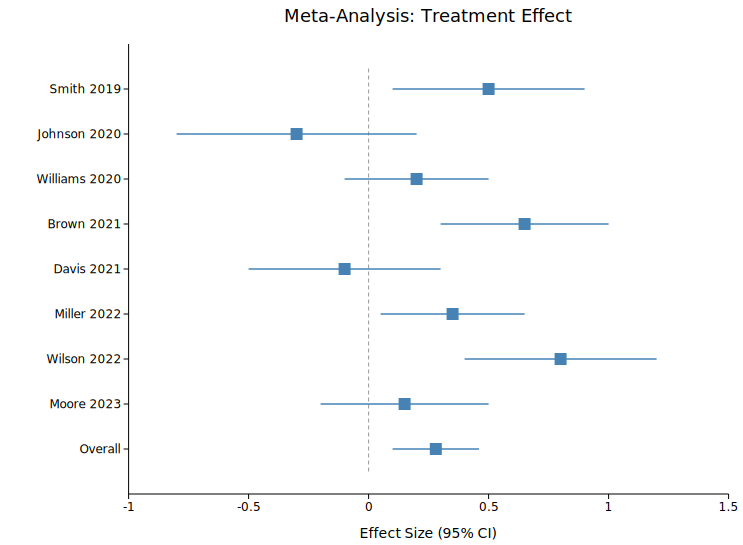
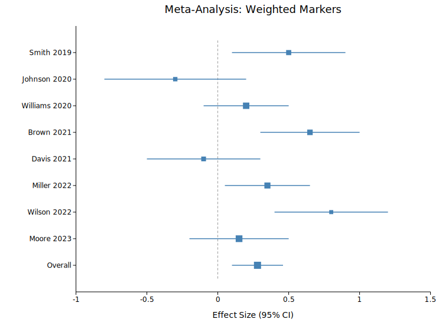

# Forest Plot

A forest plot displays effect sizes and confidence intervals from multiple studies in a meta-analysis. Each row shows a study label on the Y-axis, a horizontal CI whisker, and a filled square at the point estimate on the X-axis. A vertical dashed reference line marks the null effect.

**Import path:** `kuva::plot::ForestPlot`

---

## Basic usage

Add one row per study with `.with_row(label, estimate, ci_lower, ci_upper)`. Rows are rendered top-to-bottom in the order they are added.

```rust,no_run
use kuva::plot::ForestPlot;
use kuva::backend::svg::SvgBackend;
use kuva::render::render::render_multiple;
use kuva::render::layout::Layout;
use kuva::render::plots::Plot;

let forest = ForestPlot::new()
    .with_row("Smith 2019",    0.50,  0.10, 0.90)
    .with_row("Johnson 2020", -0.30, -0.80, 0.20)
    .with_row("Williams 2020", 0.20, -0.10, 0.50)
    .with_row("Overall",       0.28,  0.10, 0.46)
    .with_null_value(0.0);

let plots = vec![Plot::Forest(forest)];
let layout = Layout::auto_from_plots(&plots)
    .with_title("Meta-Analysis: Treatment Effect")
    .with_x_label("Effect Size (95% CI)");

let scene = render_multiple(plots, layout);
let svg = SvgBackend.render_scene(&scene);
std::fs::write("forest.svg", svg).unwrap();
```



---

## Weighted markers

Use `.with_weighted_row(label, estimate, ci_lower, ci_upper, weight)` to scale marker radius by study weight. Radius scales as `base_size * sqrt(weight / max_weight)`.

```rust,no_run
# use kuva::plot::ForestPlot;
let forest = ForestPlot::new()
    .with_weighted_row("Smith 2019", 0.50, 0.10, 0.90, 5.2)
    .with_weighted_row("Johnson 2020", -0.30, -0.80, 0.20, 3.8)
    .with_marker_size(6.0);
```



---

## Builder reference

| Method | Default | Description |
|---|---|---|
| `.with_row(label, est, lo, hi)` | — | Add a study row |
| `.with_weighted_row(label, est, lo, hi, w)` | — | Add a weighted study row |
| `.with_color(css)` | `"steelblue"` | Point and whisker color |
| `.with_marker_size(px)` | `6.0` | Base marker half-width |
| `.with_whisker_width(px)` | `1.5` | CI line stroke width |
| `.with_null_value(f64)` | `0.0` | Null-effect reference value |
| `.with_show_null_line(bool)` | `true` | Toggle the dashed null line |
| `.with_cap_size(px)` | `0.0` | Whisker end-cap half-height (0 = no caps) |
| `.with_legend(label)` | — | Legend label |

---

## CLI

```bash
kuva forest data.tsv \
    --label-col study --estimate-col estimate \
    --ci-lower-col lower --ci-upper-col upper

kuva forest data.tsv \
    --label-col study --estimate-col estimate \
    --ci-lower-col lower --ci-upper-col upper \
    --weight-col weight --marker-size 6
```
