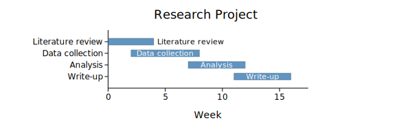
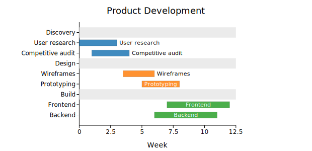
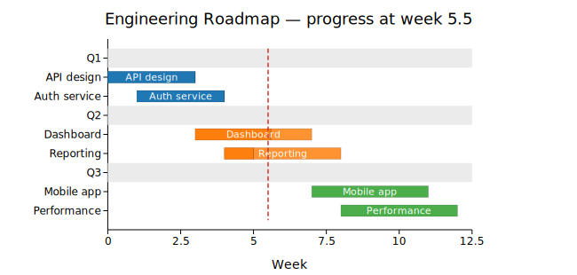
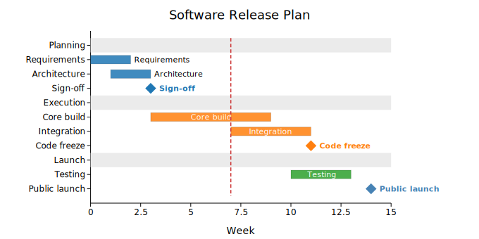

# Gantt Chart

A Gantt chart displays tasks as horizontal bars spanning a time range, making it easy to see schedule, duration, sequence, and overlap at a glance. Tasks can be organized into named phases or groups, which receive colored header rows and distinct bar colors drawn from the category10 palette.

kuva's `GanttPlot` adds three features beyond basic scheduling:

- **Progress fill** — a darker inner region shows completion fraction; tasks not yet started are shown at full opacity without a progress fill.
- **Milestone diamonds** — single-point events (deadlines, sign-offs, launches) render as ◆ markers rather than bars.
- **Now line** — a dashed vertical reference line marks the current date or time.

**Import path:** `kuva::plot::GanttPlot`

---

## Basic usage

Add tasks with `.with_task(label, start, end)`. Without groups, all bars share the default color and appear in insertion order.

```rust,no_run
use kuva::plot::GanttPlot;
use kuva::backend::svg::SvgBackend;
use kuva::render::render::render_multiple;
use kuva::render::layout::Layout;
use kuva::render::plots::Plot;

let gantt = GanttPlot::new()
    .with_task("Literature review", 0.0,  4.0)
    .with_task("Data collection",   2.0,  8.0)
    .with_task("Analysis",          7.0, 12.0)
    .with_task("Write-up",         11.0, 16.0);

let plots = vec![Plot::Gantt(gantt)];
let layout = Layout::auto_from_plots(&plots)
    .with_title("Research Project")
    .with_x_label("Week");

let svg = SvgBackend.render_scene(&render_multiple(plots, layout));
std::fs::write("gantt.svg", svg).unwrap();
```



Labels are drawn inside the bar when there is enough room; otherwise they appear to the right of the bar. The right margin is automatically expanded so outside labels are never clipped.

---

## Groups and phases

Use `.with_task_group(group, label, start, end)` to assign tasks to named groups. Each group gets a shaded header row and a distinct bar color from the category10 palette. Tasks within a group appear in insertion order immediately below their header.

```rust,no_run
use kuva::plot::GanttPlot;
use kuva::render::plots::Plot;
# use kuva::backend::svg::SvgBackend;
# use kuva::render::render::render_multiple;
# use kuva::render::layout::Layout;

let gantt = GanttPlot::new()
    .with_task_group("Discovery", "User research",    0.0,  3.0)
    .with_task_group("Discovery", "Competitive audit",1.0,  4.0)
    .with_task_group("Design",    "Wireframes",       3.5,  6.0)
    .with_task_group("Design",    "Prototyping",      5.0,  8.0)
    .with_task_group("Build",     "Frontend",         7.0, 12.0)
    .with_task_group("Build",     "Backend",          6.0, 11.0);

let plots = vec![Plot::Gantt(gantt)];
let layout = Layout::auto_from_plots(&plots)
    .with_title("Product Development")
    .with_x_label("Week");
```



Use `.with_group_order(groups)` to control phase order explicitly. Groups not listed follow in insertion order.

```rust,no_run
# use kuva::plot::GanttPlot;
# use kuva::render::plots::Plot;
let gantt = GanttPlot::new()
    .with_group_order(["Build", "Discovery", "Design"])  // Build appears first
    .with_task_group("Discovery", "Research",   0.0, 3.0)
    .with_task_group("Design",    "Wireframes", 2.0, 5.0)
    .with_task_group("Build",     "Dev",        4.0, 9.0);
```

---

## Progress fills and the now line

`.with_task_group_progress(group, label, start, end, fraction)` draws a darker inner fill showing how much of the task is complete. The fraction is clamped to `[0.0, 1.0]`.

`.with_now_line(value)` draws a dashed red vertical reference line at the given x position — useful for marking today's date.

```rust,no_run
use kuva::plot::GanttPlot;
use kuva::render::plots::Plot;
# use kuva::backend::svg::SvgBackend;
# use kuva::render::render::render_multiple;
# use kuva::render::layout::Layout;

let gantt = GanttPlot::new()
    .with_task_group_progress("Q1", "API design",   0.0,  3.0, 1.0)   // done
    .with_task_group_progress("Q1", "Auth service", 1.0,  4.0, 1.0)   // done
    .with_task_group_progress("Q2", "Dashboard",    3.0,  7.0, 0.65)  // in progress
    .with_task_group_progress("Q2", "Reporting",    4.0,  8.0, 0.25)  // early
    .with_task_group("Q3", "Mobile app",            7.0, 11.0)        // not started
    .with_task_group("Q3", "Performance",           8.0, 12.0)
    .with_now_line(5.5);

let plots = vec![Plot::Gantt(gantt)];
let layout = Layout::auto_from_plots(&plots)
    .with_title("Engineering Roadmap — progress at week 5.5")
    .with_x_label("Week");
```



---

## Milestones

`.with_milestone(label, at)` and `.with_milestone_group(group, label, at)` add diamond markers at a single point in time. Milestone labels are always drawn to the right of the diamond in bold, and the right margin is automatically widened to fit them.

```rust,no_run
use kuva::plot::GanttPlot;
use kuva::render::plots::Plot;
# use kuva::backend::svg::SvgBackend;
# use kuva::render::render::render_multiple;
# use kuva::render::layout::Layout;

let gantt = GanttPlot::new()
    .with_task_group("Planning",  "Requirements",  0.0,  2.0)
    .with_task_group("Planning",  "Architecture",  1.0,  3.0)
    .with_milestone_group("Planning", "Sign-off",  3.0)
    .with_task_group("Execution", "Core build",    3.0,  9.0)
    .with_task_group("Execution", "Integration",   7.0, 11.0)
    .with_milestone_group("Execution", "Code freeze", 11.0)
    .with_task_group("Launch",    "Testing",      10.0, 13.0)
    .with_milestone("Public launch", 14.0)
    .with_now_line(7.0);

let plots = vec![Plot::Gantt(gantt)];
let layout = Layout::auto_from_plots(&plots)
    .with_title("Software Release Plan")
    .with_x_label("Week");
```



---

## Showcase — clinical trial timeline

The example below uses every major feature: explicit `group_order`, progress fills on pre-trial tasks, in-progress recruitment bars, ungrouped treatment arms, per-group and free-floating milestones, and a now line marking the current month.

```rust,no_run
use kuva::plot::GanttPlot;
use kuva::render::plots::Plot;
use kuva::backend::svg::SvgBackend;
use kuva::render::render::render_multiple;
use kuva::render::layout::Layout;

let gantt = GanttPlot::new()
    .with_group_order(["Pre-trial", "Recruitment", "Treatment", "Analysis"])
    .with_task_group_progress("Pre-trial",   "Protocol writing",     0.0,  3.0, 1.0)
    .with_task_group_progress("Pre-trial",   "IRB approval",         2.0,  5.0, 1.0)
    .with_task_group_progress("Pre-trial",   "Site selection",       3.0,  6.0, 1.0)
    .with_milestone_group("Pre-trial",       "Trial start",          6.0)
    .with_task_group_progress("Recruitment", "Screening",            6.0, 12.0, 0.75)
    .with_task_group_progress("Recruitment", "Enrollment",           7.0, 14.0, 0.45)
    .with_task_group("Treatment",            "Arm A (n=150)",       12.0, 24.0)
    .with_task_group("Treatment",            "Arm B (n=150)",       12.0, 24.0)
    .with_milestone_group("Treatment",       "Interim analysis",    18.0)
    .with_task_group("Analysis",             "Data lock",           23.0, 26.0)
    .with_task_group("Analysis",             "Statistical analysis",25.0, 30.0)
    .with_task_group("Analysis",             "Report writing",      28.0, 34.0)
    .with_milestone("Primary endpoint", 24.0)
    .with_milestone("Submission",       35.0)
    .with_now_line(16.0)
    .with_bar_height(0.55);

let plots = vec![Plot::Gantt(gantt)];
let layout = Layout::auto_from_plots(&plots)
    .with_title("Phase III Clinical Trial Timeline")
    .with_x_label("Month")
    .with_width(800.0)
    .with_height(520.0);

let svg = SvgBackend.render_scene(&render_multiple(plots, layout));
std::fs::write("trial.svg", svg).unwrap();
```


---

## GanttPlot API reference

### Task builders

| Method | Description |
|--------|-------------|
| `.with_task(label, start, end)` | Ungrouped task bar |
| `.with_task_group(group, label, start, end)` | Task assigned to a named group/phase |
| `.with_task_progress(label, start, end, frac)` | Ungrouped task with progress fill (`0.0`–`1.0`) |
| `.with_task_group_progress(group, label, start, end, frac)` | Grouped task with progress fill |
| `.with_colored_task(label, start, end, color)` | Task with a per-task CSS color override |
| `.with_milestone(label, at)` | Ungrouped milestone diamond at position `at` |
| `.with_milestone_group(group, label, at)` | Grouped milestone diamond |

### Display builders

| Method | Default | Description |
|--------|---------|-------------|
| `GanttPlot::new()` | — | Create a Gantt chart with defaults |
| `.with_group_order(groups)` | insertion order | Explicit display order for groups; unlisted groups follow in insertion order |
| `.with_now_line(value)` | none | Dashed red vertical line at `value` (the current time) |
| `.with_bar_height(frac)` | `0.6` | Bar height as fraction of row height |
| `.with_milestone_size(px)` | `7.0` | Diamond half-size in pixels |
| `.with_show_labels(bool)` | `true` | Draw task and milestone labels |
| `.with_color(css)` | `"steelblue"` | Default bar color when no groups are present |
| `.with_group_bg(css)` | `"#ebebeb"` | Background color for group header rows |
| `.with_legend(label)` | none | Add a legend entry |
