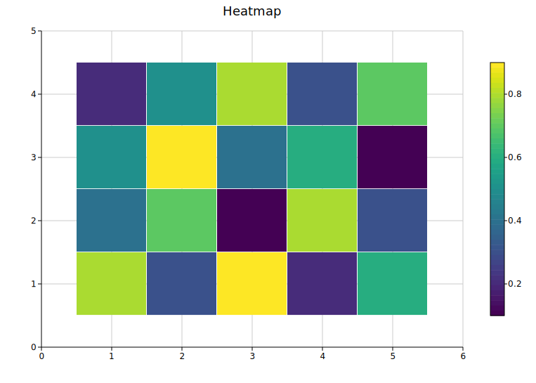
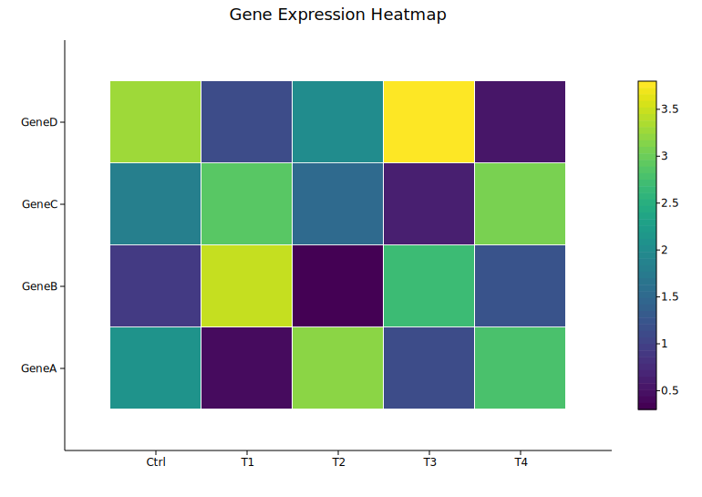
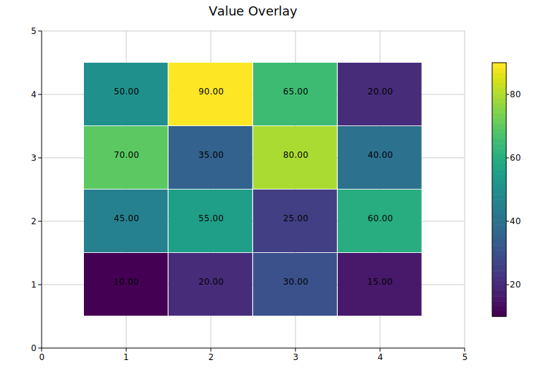
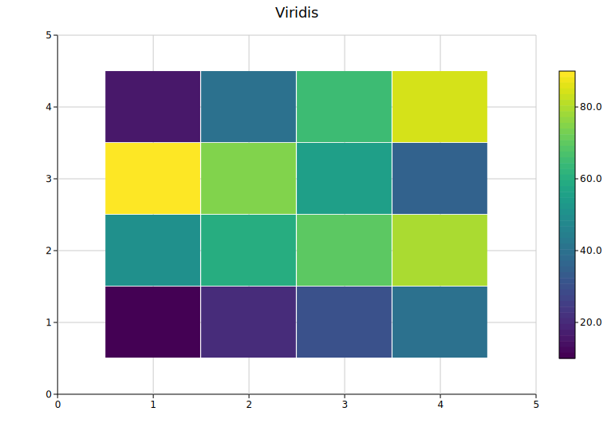
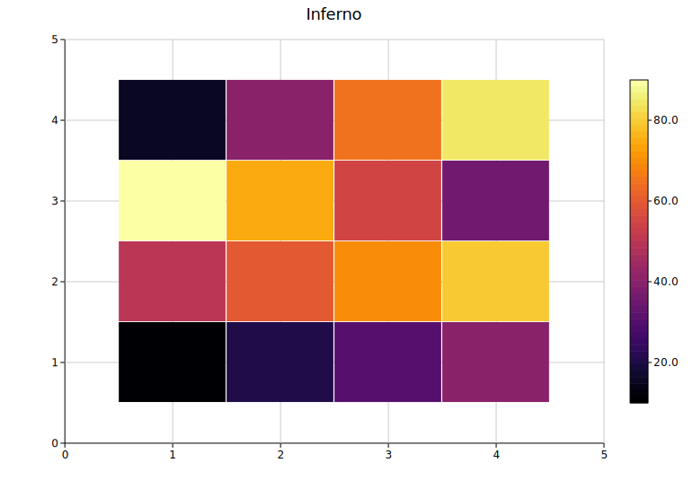
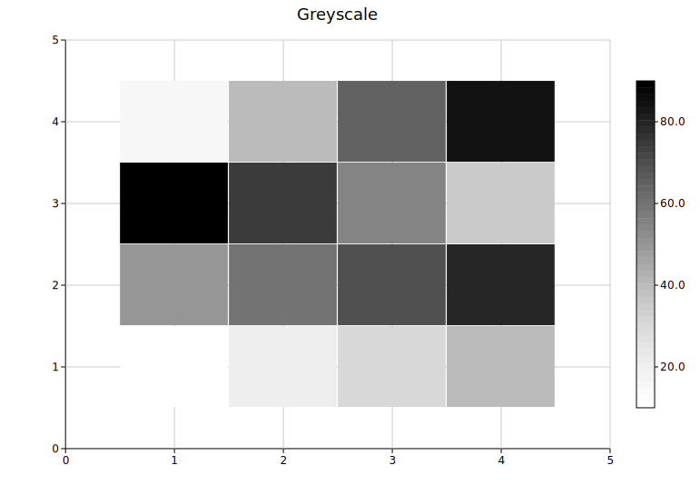
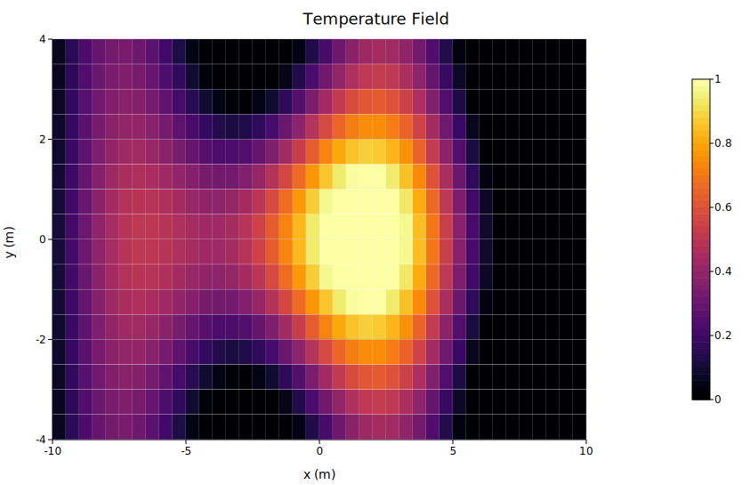

# Heatmap

A heatmap renders a two-dimensional grid where each cell's color encodes a numeric value. Values are normalized to the data range and passed through a color map. A colorbar is always shown in the right margin.

**Import path:** `kuva::plot::Heatmap`

---

## Basic usage

Pass a 2-D array to `.with_data()`. The outer dimension is rows (top to bottom) and the inner dimension is columns (left to right).

```rust,no_run
use kuva::plot::Heatmap;
use kuva::backend::svg::SvgBackend;
use kuva::render::render::render_multiple;
use kuva::render::layout::Layout;
use kuva::render::plots::Plot;

let data = vec![
    vec![0.8, 0.3, 0.9, 0.2, 0.6],
    vec![0.4, 0.7, 0.1, 0.8, 0.3],
    vec![0.5, 0.9, 0.4, 0.6, 0.1],
    vec![0.2, 0.5, 0.8, 0.3, 0.7],
];

let heatmap = Heatmap::new().with_data(data);

let plots = vec![Plot::Heatmap(heatmap)];
let layout = Layout::auto_from_plots(&plots).with_title("Heatmap");

let scene = render_multiple(plots, layout);
let svg = SvgBackend.render_scene(&scene);
std::fs::write("heatmap.svg", svg).unwrap();
```



`.with_data()` accepts any iterable of iterables of numeric values — `Vec<Vec<f64>>`, slices, or any type implementing `Into<f64>`.

---

## Axis labels

Axis labels are set on the `Layout`, not on the `Heatmap` struct. Pass column labels to `.with_x_categories()` and row labels to `.with_y_categories()`.

```rust,no_run
use kuva::plot::Heatmap;
use kuva::backend::svg::SvgBackend;
use kuva::render::render::render_multiple;
use kuva::render::layout::Layout;
use kuva::render::plots::Plot;

let data = vec![
    vec![2.1, 0.4, 3.2, 1.1, 2.8],
    vec![0.9, 3.5, 0.3, 2.7, 1.2],
    vec![1.8, 2.9, 1.5, 0.6, 3.1],
    vec![3.3, 1.1, 2.0, 3.8, 0.5],
];

let col_labels = vec!["Ctrl", "T1", "T2", "T3", "T4"]
    .into_iter().map(String::from).collect::<Vec<_>>();
let row_labels = vec!["GeneA", "GeneB", "GeneC", "GeneD"]
    .into_iter().map(String::from).collect::<Vec<_>>();

let heatmap = Heatmap::new().with_data(data);
let plots = vec![Plot::Heatmap(heatmap)];
let layout = Layout::auto_from_plots(&plots)
    .with_title("Gene Expression Heatmap")
    .with_x_categories(col_labels)   // column labels on x-axis
    .with_y_categories(row_labels);  // row labels on y-axis

let svg = SvgBackend.render_scene(&render_multiple(plots, layout));
```



---

## Value overlay

`.with_values()` prints each cell's raw numeric value (formatted to two decimal places) centered inside the cell. Most useful for small grids where the text remains legible.

```rust,no_run
# use kuva::plot::Heatmap;
let heatmap = Heatmap::new()
    .with_data(vec![
        vec![10.0, 20.0, 30.0, 15.0],
        vec![45.0, 55.0, 25.0, 60.0],
        vec![70.0, 35.0, 80.0, 40.0],
        vec![50.0, 90.0, 65.0, 20.0],
    ])
    .with_values();
```



---

## Color maps

`.with_color_map(ColorMap)` selects the color encoding. The default is `Viridis`.

| Variant | Scale | Notes |
|---------|-------|-------|
| `Viridis` | Blue → green → yellow | Perceptually uniform; colorblind-safe. **Default.** |
| `Inferno` | Black → purple → yellow | High-contrast; works in greyscale print |
| `Grayscale` | Black → white | Clean publication style |
| `Custom(Arc<Fn>)` | User-defined | Full control |

```rust,no_run
use kuva::plot::{Heatmap, ColorMap};
# use kuva::render::plots::Plot;

let heatmap = Heatmap::new()
    .with_data(vec![vec![1.0, 2.0], vec![3.0, 4.0]])
    .with_color_map(ColorMap::Inferno);
```

<table>
<tr>
<td></td>
<td></td>
<td></td>
</tr>
<tr>
<td align="center"><code>Viridis</code></td>
<td align="center"><code>Inferno</code></td>
<td align="center"><code>Grayscale</code></td>
</tr>
</table>

### Custom color map

For diverging scales or other custom encodings, use `ColorMap::Custom` with a closure that maps a normalized `[0.0, 1.0]` value to a CSS color string.

```rust,no_run
use std::sync::Arc;
use kuva::plot::{Heatmap, ColorMap};

// Blue-to-red diverging scale
let cmap = ColorMap::Custom(Arc::new(|t: f64| {
    let r = (t * 255.0) as u8;
    let b = ((1.0 - t) * 255.0) as u8;
    format!("rgb({r},0,{b})")
}));

let heatmap = Heatmap::new()
    .with_data(vec![vec![1.0, 2.0, 3.0], vec![4.0, 5.0, 6.0]])
    .with_color_map(cmap);
```

---

## Custom axis bounds — scalar fields

By default the heatmap maps columns to `[0.5, cols + 0.5]` and rows to `[0.5, rows + 0.5]` so that integer tick values land on cell centres. Use `.with_x_range()` and `.with_y_range()` when the grid represents a physical domain and you want real-world coordinates on the axes.

```rust,no_run
use kuva::plot::{Heatmap, ColorMap};
use kuva::render::layout::Layout;
use kuva::render::plots::Plot;

// 2D Gaussian temperature field over x ∈ [-10, 10], y ∈ [-4, 4]
let data: Vec<Vec<f64>> = (0..16)
    .map(|i| {
        let y = 4.0 - (i as f64 + 0.5) * 8.0 / 16.0;
        (0..40).map(|j| {
            let x = -10.0 + (j as f64 + 0.5) * 20.0 / 40.0;
            let r2 = x * x / 16.0 + y * y / 4.0;
            (-r2 / 2.0).exp()
        }).collect()
    })
    .collect();

let hm = Heatmap::new()
    .with_data(data)
    .with_color_map(ColorMap::Inferno)
    .with_x_range(-10.0, 10.0)
    .with_y_range(-4.0, 4.0);

let plots = vec![Plot::Heatmap(hm)];
let layout = Layout::auto_from_plots(&plots)
    .with_title("Temperature Field")
    .with_x_label("x (m)")
    .with_y_label("y (m)");
```



Both methods accept any numeric type via `impl Into<f64>`. Either range can be set independently — you can fix only the x-axis and leave the y-axis on its default integer scale, or vice versa.

---

## Row reordering — phylogenetic alignment

When composing a heatmap alongside a `PhyloTree`, use `with_labels` + `with_y_categories` to reorder the heatmap rows so they match the tree's leaf order top-to-bottom.

**Key points:**
- `with_y_categories(order)` treats `order` as **top-to-bottom** — the first label ends up at the top of the rendered heatmap.
- After the call, `heatmap.row_labels` is stored in **bottom-to-top** order (matching the y-axis convention). Pass it directly to `Layout::with_y_categories`.
- Use `Figure::new(1, 2)` to place the tree and heatmap side by side.

```rust,no_run
use kuva::plot::{Heatmap, PhyloTree};
use kuva::render::figure::Figure;
use kuva::render::layout::Layout;
use kuva::render::plots::Plot;
use kuva::backend::svg::SvgBackend;

let labels_str = ["Wolf", "Cat", "Whale", "Human"];
let labels: Vec<String> = labels_str.iter().map(|s| s.to_string()).collect();

// Distance matrix — rows correspond to labels_str in order
let dist = vec![
    vec![0.0, 0.5, 0.9, 0.8],  // Wolf
    vec![0.5, 0.0, 0.9, 0.8],  // Cat
    vec![0.9, 0.9, 0.0, 0.7],  // Whale
    vec![0.8, 0.8, 0.7, 0.0],  // Human
];

let tree = PhyloTree::from_distance_matrix(&labels_str, &dist).with_phylogram();

// leaf_labels_top_to_bottom() returns the leaf render order, top-to-bottom
let leaf_order = tree.leaf_labels_top_to_bottom();

let heatmap = Heatmap::new()
    .with_data(dist)
    .with_labels(labels, vec![])     // associate rows with names
    .with_y_categories(leaf_order);  // first leaf → top of heatmap

// row_labels is now stored bottom-to-top — pass directly to Layout
let layout_cats = heatmap.row_labels.clone().unwrap();

let tree_plots = vec![Plot::PhyloTree(tree)];
let heatmap_plots = vec![Plot::Heatmap(heatmap)];

let tree_layout = Layout::auto_from_plots(&tree_plots).with_title("UPGMA Tree");
let heatmap_layout = Layout::auto_from_plots(&heatmap_plots)
    .with_title("Distance Matrix")
    .with_y_categories(layout_cats);

// 1 row × 2 columns: tree on left, heatmap on right
let figure = Figure::new(1, 2)
    .with_plots(vec![tree_plots, heatmap_plots])
    .with_layouts(vec![tree_layout, heatmap_layout]);

let svg = SvgBackend.render_scene(&figure.render());
std::fs::write("phylo_heatmap.svg", svg).unwrap();
```

> **Note:** `Layout::with_y_categories()` alone only changes the axis tick *labels* — it does not reorder the data matrix. Always call `Heatmap::with_y_categories()` first to permute the rows, then pass `row_labels` to the layout.

Column reordering works the same way via `with_x_categories`. Unlike `with_y_categories`, column order is not reversed internally — pass the desired left-to-right order directly to both `Heatmap::with_x_categories` and `Layout::with_x_categories`.

---

## API reference

| Method | Description |
|--------|-------------|
| `Heatmap::new()` | Create a heatmap with defaults |
| `.with_data(rows)` | Set grid data; accepts any numeric iterable of iterables |
| `.with_color_map(map)` | Color encoding: `Viridis`, `Inferno`, `Grayscale`, or `Custom` (default `Viridis`) |
| `.with_values()` | Print each cell's value as text inside the cell |
| `.with_labels(rows, cols)` | Associate rows and columns with label strings; required before calling `with_y_categories` / `with_x_categories` |
| `.with_y_categories(order)` | Reorder rows so `order[0]` is at the top; stores `row_labels` bottom-to-top for `Layout::with_y_categories` |
| `.with_x_categories(order)` | Reorder columns to match `order` (left-to-right); stores `col_labels` in the same order |
| `.with_x_range(lo, hi)` | Set custom x-axis extent (default `[0.5, cols + 0.5]`) |
| `.with_y_range(lo, hi)` | Set custom y-axis extent (default `[0.5, rows + 0.5]`) |
| `.with_cell_size(factor)` | Cell fill fraction `[0.5, 1.0]`. Default `0.99` leaves a thin gap between cells. Pass `1.0` for flush cells with no visible boundary — useful for large grids. |
| `.with_legend(s)` | Attach a legend label |

**Layout methods used with heatmaps:**

| Method | Description |
|--------|-------------|
| `Layout::with_x_categories(labels)` | Column labels on the x-axis (left-to-right) |
| `Layout::with_y_categories(labels)` | Row labels on the y-axis (bottom-to-top; pass `heatmap.row_labels` directly after `with_y_categories`) |
