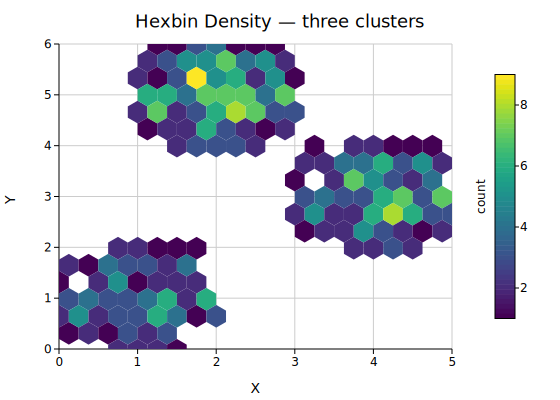
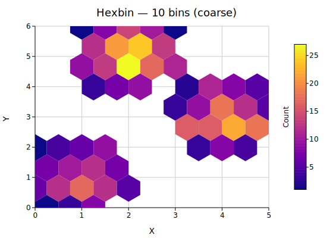
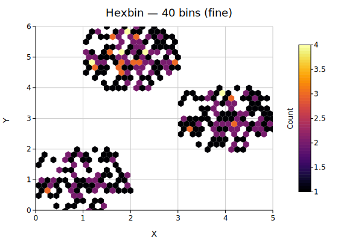

# Hexbin Plot

A hexbin plot bins scatter points `(x, y)` into a regular hexagonal grid and colors each cell by its point count — or by an aggregated third variable `z`. Hexagonal bins tile the plane without gaps and are equidistant from all six neighbors, giving a more visually uniform density estimate than rectangular bins. A colorbar labeled **"Count"** (or the chosen aggregation) is added to the right margin automatically.

**Import path:** `kuva::plot::hexbin::HexbinPlot`, `kuva::plot::hexbin::ZReduce`, `kuva::plot::ColorMap`

---

## Basic usage

Pass `(x, y)` scatter points to `.with_data()`. The plot divides the pixel canvas into hexagonal bins, counts the points in each, and applies the Viridis colormap.

```rust,no_run
use kuva::plot::hexbin::HexbinPlot;
use kuva::backend::svg::SvgBackend;
use kuva::render::render::render_multiple;
use kuva::render::layout::Layout;
use kuva::render::plots::Plot;

let x: Vec<f64> = /* your data */ vec![];
let y: Vec<f64> = /* your data */ vec![];

let plot = HexbinPlot::new().with_data(x, y);

let plots = vec![Plot::Hexbin(plot)];
let layout = Layout::auto_from_plots(&plots)
    .with_title("Hexbin Density")
    .with_x_label("X")
    .with_y_label("Y");

let svg = SvgBackend.render_scene(&render_multiple(plots, layout));
std::fs::write("hexbin.svg", svg).unwrap();
```



Three Gaussian clusters binned at the default resolution (20 bins across). The Viridis colorbar on the right maps bin counts from dark purple (sparse) to yellow (dense).

---

## Bin resolution

`.with_n_bins(n)` sets the number of hex columns across the x-axis. More bins reveal finer density structure at the cost of noisier estimates in sparse regions.

```rust,no_run
# use kuva::plot::hexbin::HexbinPlot;
# use kuva::render::plots::Plot;
// Coarse — large hexes, smooth shape
let plot = HexbinPlot::new().with_data(x.clone(), y.clone()).with_n_bins(10);

// Fine — small hexes, more detail
let plot = HexbinPlot::new().with_data(x, y).with_n_bins(40);
```



10 bins — the cluster shapes are obvious but internal density structure is lost.



40 bins — peaks within each cluster become visible; individual bins in the periphery are noisier.

---

## Log color scale

When a few bins dominate the count (dense core, sparse halo), the linear color scale saturates the colormap at the peak and hides structure elsewhere. `.with_log_color(true)` applies log₁₀(count + 1) before color mapping so both dense and sparse regions remain readable.

```rust,no_run
# use kuva::plot::hexbin::HexbinPlot;
# use kuva::render::plots::Plot;
let plot = HexbinPlot::new()
    .with_data(x, y)
    .with_log_color(true);
```


The colorbar tick marks show actual count values (1, 10, 100, …) while the color scale compresses high counts to reveal the low-density fringe.

---

## Third variable — Z aggregation

`.with_z(z, reduce)` replaces count-based coloring with an aggregated third variable. Each bin collects the `z` values of the points it contains and applies the chosen `ZReduce` function. The colorbar label updates automatically.

```rust,no_run
use kuva::plot::hexbin::{HexbinPlot, ZReduce};
# use kuva::render::plots::Plot;

// Color bins by the mean of a per-point measurement
let z: Vec<f64> = x.iter().zip(y.iter()).map(|(xi, yi)| xi + yi).collect();

let plot = HexbinPlot::new()
    .with_data(x, y)
    .with_z(z, ZReduce::Mean);
```


Bins colored by the mean of z = x + y. The gradient follows the diagonal, reflecting the additive structure of the z variable.

| `ZReduce` variant | Colorbar label | Description |
|-------------------|---------------|-------------|
| `Count` *(default)* | Count | Number of points in the bin |
| `Mean` | Mean | Arithmetic mean of z |
| `Sum` | Sum | Sum of z values |
| `Median` | Median | Median of z values |
| `Min` | Min | Minimum z value |
| `Max` | Max | Maximum z value |

When `z` values are absent, all `ZReduce` variants fall back to point count.

---

## Normalized density

`.with_normalize(true)` divides each bin's count by the total number of input points, expressing density as a fraction in [0, 1]. The colorbar label changes to **"Density"**.

```rust,no_run
# use kuva::plot::hexbin::HexbinPlot;
# use kuva::render::plots::Plot;
let plot = HexbinPlot::new()
    .with_data(x, y)
    .with_normalize(true)
    .with_colorbar_label("Density");  // optional: keep the default or override
```


Normalized density makes plots with different sample sizes comparable on the same scale.

---

## Min count filter

`.with_min_count(n)` suppresses bins that contain fewer than `n` points. This trims noise from the periphery of a distribution, leaving only regions with meaningful density.

```rust,no_run
# use kuva::plot::hexbin::HexbinPlot;
# use kuva::render::plots::Plot;
// Only render bins with at least 8 points
let plot = HexbinPlot::new()
    .with_data(x, y)
    .with_n_bins(10)
    .with_min_count(8);
```


min_count = 1 — all bins are shown; peripheral singletons are visible.


min_count = 8 — only the dense cluster cores remain.

---

## Flat-top orientation

By default hexes are **pointy-top** (a vertex at the top). `.with_flat_top(true)` rotates to **flat-top** orientation (a flat edge at the top), which can align better with certain data layouts or visual preferences.

```rust,no_run
# use kuva::plot::hexbin::HexbinPlot;
# use kuva::render::plots::Plot;
let plot = HexbinPlot::new()
    .with_data(x, y)
    .with_flat_top(true);
```


---

## Hex outline (stroke)

`.with_stroke(color)` draws a CSS-colored border around each hexagon. This distinguishes individual bins in dense regions and is useful for publication figures.

```rust,no_run
# use kuva::plot::hexbin::HexbinPlot;
# use kuva::render::plots::Plot;
let plot = HexbinPlot::new()
    .with_data(x, y)
    .with_stroke("#333333")
    .with_stroke_width(0.8);
```


A dark outline clearly separates adjacent bins at the cost of slightly more visual noise.

---

## Color range clamping

`.with_color_range(lo, hi)` pins the colormap to a fixed value interval, ignoring bins outside the range. Values below `lo` receive the lowest colormap color; values above `hi` receive the highest. Use this to compare multiple plots on the same scale or to highlight a specific density range.

```rust,no_run
# use kuva::plot::hexbin::HexbinPlot;
# use kuva::render::plots::Plot;
let plot = HexbinPlot::new()
    .with_data(x, y)
    .with_color_range(2.0, 8.0);
```


---

## Axis range clipping

`.with_x_range(lo, hi)` and `.with_y_range(lo, hi)` restrict binning to a sub-region of the data and fix the corresponding axis limits. Points outside the specified window are silently discarded.

```rust,no_run
# use kuva::plot::hexbin::HexbinPlot;
# use kuva::render::plots::Plot;
let plot = HexbinPlot::new()
    .with_data(x, y)
    .with_x_range(-0.5, 3.0)
    .with_y_range(-2.0, 4.0);
```


---

## Colormaps

`.with_color_map(map)` selects the colormap. The same `ColorMap` variants used by `Heatmap` and `Histogram2D` apply.

```rust,no_run
use kuva::plot::{hexbin::HexbinPlot, ColorMap};
# use kuva::render::plots::Plot;
let plot = HexbinPlot::new()
    .with_data(x, y)
    .with_color_map(ColorMap::Inferno);
```


| `ColorMap` variant | Description |
|--------------------|-------------|
| `ColorMap::Viridis` | Blue → green → yellow. Perceptually uniform, colorblind-safe. **(default)** |
| `ColorMap::Inferno` | Black → orange → yellow. High contrast. |
| `ColorMap::Grayscale` | White → black. Print-friendly. |
| `ColorMap::Turbo` | Blue → green → red. High contrast over a wide range. |
| `ColorMap::Custom(f)` | User-supplied `Arc<dyn Fn(f64) -> String>`. |

---

## Hiding the colorbar

`.with_colorbar(false)` suppresses the colorbar and reclaims the right margin.

```rust,no_run
# use kuva::plot::hexbin::HexbinPlot;
# use kuva::render::plots::Plot;
let plot = HexbinPlot::new()
    .with_data(x, y)
    .with_colorbar(false);
```

---

## API reference

| Method | Description |
|--------|-------------|
| `HexbinPlot::new()` | Create with defaults (20 bins, Viridis, Count, pointy-top, colorbar on) |
| `.with_data(x, y)` | Load scatter data; accepts any `Into<f64>` iterable |
| `.with_z(z, reduce)` | Attach a third variable and choose the `ZReduce` aggregation |
| `.with_n_bins(n)` | Number of hex columns across the x-axis (default `20`) |
| `.with_bin_size(s)` | Explicit hex circumradius in pixels — overrides `n_bins` |
| `.with_color_map(m)` | Colormap (default `Viridis`) |
| `.with_log_color(b)` | Log₁₀ color scale — compresses high-count peaks |
| `.with_min_count(n)` | Suppress bins with fewer than `n` points (default `1`) |
| `.with_normalize(b)` | Divide counts by total points; colorbar label → "Density" |
| `.with_colorbar(b)` | Show / hide the colorbar (default `true`) |
| `.with_colorbar_label(s)` | Override the auto-derived colorbar label |
| `.with_stroke(color)` | Hex outline color (CSS string) |
| `.with_stroke_width(w)` | Hex outline width in pixels (default `0.5`) |
| `.with_flat_top(b)` | Flat-top orientation (default `false` = pointy-top) |
| `.with_x_range(lo, hi)` | Clip data and fix x-axis extent |
| `.with_y_range(lo, hi)` | Clip data and fix y-axis extent |
| `.with_color_range(lo, hi)` | Clamp the colorbar scale to a fixed interval |
