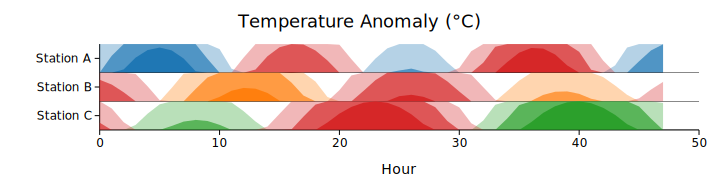
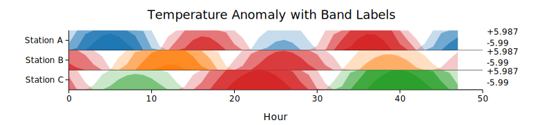

# Horizon Chart

A horizon chart is a compact multi-series time series visualization. Each series occupies a single row; the value range is divided into N equal-width bands that are folded onto that row with progressively darker shading. Positive deviations use one color; negative deviations use another. The result packs many series into a small vertical space while preserving the ability to compare relative magnitudes.

Horizon charts are ideal for monitoring dense time series panels — server metrics, temperature anomalies, financial returns, or physiological signals — where a conventional line chart would require excessive vertical space.

**Import path:** `kuva::plot::horizon::{HorizonPlot, HorizonSeries}`

---

## Basic usage

Add series with `.with_series()`, passing x and y vectors. Each series gets a distinct positive color from the category10 palette; negative values always render in red.

```rust,no_run
use kuva::plot::horizon::HorizonPlot;
use kuva::backend::svg::SvgBackend;
use kuva::render::render::render_multiple;
use kuva::render::layout::Layout;
use kuva::render::plots::Plot;

// Three daily temperature anomaly series
let hours: Vec<f64> = (0..48).map(|i| i as f64).collect();

let anomaly_a: Vec<f64> = hours.iter().map(|&t|  (t * 0.3).sin() * 4.0 + (t * 0.1).cos() * 2.0).collect();
let anomaly_b: Vec<f64> = hours.iter().map(|&t| -(t * 0.25).cos() * 3.5 + (t * 0.15).sin() * 1.5).collect();
let anomaly_c: Vec<f64> = hours.iter().map(|&t|  (t * 0.2).sin() * 5.0 - (t * 0.05).cos() * 2.5).collect();

let plot = HorizonPlot::new()
    .with_series("Station A", hours.clone(), anomaly_a)
    .with_series("Station B", hours.clone(), anomaly_b)
    .with_series("Station C", hours.clone(), anomaly_c)
    .with_n_bands(3)
    .with_row_height(40.0);

let plots = vec![Plot::Horizon(plot)];
let layout = Layout::auto_from_plots(&plots)
    .with_title("Temperature Anomaly (°C)")
    .with_x_label("Hour");

let svg = SvgBackend.render_scene(&render_multiple(plots, layout));
std::fs::write("horizon.svg", svg).unwrap();
```



---

## Number of bands

`.with_n_bands(n)` controls how many color layers are stacked per row. More bands reveal finer structure at the cost of darker overall appearance.

```rust,no_run
use kuva::plot::horizon::HorizonPlot;
use kuva::render::plots::Plot;
# use kuva::render::layout::Layout;
# use kuva::render::render::render_multiple;

let x: Vec<f64> = (0..60).map(|i| i as f64).collect();
let y: Vec<f64> = x.iter().map(|&t| (t * 0.18).sin() * 8.0 + (t * 0.05).cos() * 3.0).collect();

// 2 bands: coarser, more contrast
let plot_2 = HorizonPlot::new().with_series("2 bands", x.clone(), y.clone()).with_n_bands(2);
// 4 bands: finer resolution
let plot_4 = HorizonPlot::new().with_series("4 bands", x.clone(), y.clone()).with_n_bands(4);
```

The default of 3 bands is a good balance between contrast and resolution.

---

## Value labels

`.with_value_labels(true)` prints the full-scale value (what the darkest band represents) at the right end of each row — an essential guide for quantitative reading.

`.with_sign_colors(true)` additionally colorizes the `+` and `−` sign characters in the row annotation using the series' positive and negative colors.

```rust,no_run
use kuva::plot::horizon::HorizonPlot;
use kuva::render::plots::Plot;
use kuva::render::layout::Layout;
use kuva::render::render::render_multiple;
use kuva::backend::svg::SvgBackend;

let x: Vec<f64> = (0..72).map(|i| i as f64).collect();

let make_series = |amp: f64, phase: f64| -> Vec<f64> {
    x.iter().map(|&t| (t * 0.15 + phase).sin() * amp).collect()
};

let plot = HorizonPlot::new()
    .with_series("CPU 0", x.clone(), make_series(6.0, 0.0))
    .with_series("CPU 1", x.clone(), make_series(4.5, 1.1))
    .with_series("CPU 2", x.clone(), make_series(7.5, 2.2))
    .with_series("CPU 3", x.clone(), make_series(5.0, 3.3))
    .with_n_bands(3)
    .with_row_height(36.0)
    .with_value_labels(true)
    .with_sign_colors(true);

let plots = vec![Plot::Horizon(plot)];
let layout = Layout::auto_from_plots(&plots).with_title("CPU Usage Delta (%)");
let svg = SvgBackend.render_scene(&render_multiple(plots, layout));
```



---

## Custom colors

Use `.with_series_colored()` to set explicit positive and negative colors per series.

```rust,no_run
use kuva::plot::horizon::HorizonPlot;
use kuva::render::plots::Plot;
# use kuva::render::layout::Layout;
# use kuva::render::render::render_multiple;

let x: Vec<f64> = (0..48).map(|i| i as f64).collect();
let ret: Vec<f64> = x.iter().map(|&t| (t * 0.22).sin() * 5.0 - (t * 0.07).cos() * 2.0).collect();

let plot = HorizonPlot::new()
    .with_series_colored(
        "Returns",
        x.clone(),
        ret,
        "#2ca02c",  // green for gains
        "#d62728",  // red for losses
    )
    .with_n_bands(4)
    .with_row_height(50.0)
    .with_value_labels(true);

let plots = vec![Plot::Horizon(plot)];
```

---

## Shared scale (`with_value_max`)

By default each series is scaled independently. Use `.with_value_max()` to apply a shared scale so that shading depths are comparable across rows.

```rust,no_run
use kuva::plot::horizon::HorizonPlot;
use kuva::render::plots::Plot;
# use kuva::render::layout::Layout;
# use kuva::render::render::render_multiple;

let x: Vec<f64> = (0..48).map(|i| i as f64).collect();

// All three series share a ±10 scale — one band = 3.33 units
let plot = HorizonPlot::new()
    .with_series("Server A", x.clone(), x.iter().map(|&t|  (t * 0.2).sin() * 9.0).collect())
    .with_series("Server B", x.clone(), x.iter().map(|&t| -(t * 0.15).cos() * 4.0).collect())
    .with_series("Server C", x.clone(), x.iter().map(|&t|  (t * 0.25).sin() * 7.0).collect())
    .with_value_max(10.0)
    .with_n_bands(3)
    .with_row_height(38.0)
    .with_value_labels(true);

let plots = vec![Plot::Horizon(plot)];
```

---

## HorizonPlot API reference

### `HorizonPlot` builders

| Method | Default | Description |
|--------|---------|-------------|
| `HorizonPlot::new()` | — | Create a horizon chart with default settings |
| `.with_series(label, x, y)` | — | Add a series; auto-assigns positive color from palette |
| `.with_series_colored(label, x, y, pos, neg)` | — | Add a series with explicit positive and negative colors |
| `.with_n_bands(n)` | `3` | Number of stacked color bands per row |
| `.with_row_height(px)` | auto | Per-row pixel height; enables auto canvas sizing |
| `.with_baseline(v)` | `0.0` | Baseline value separating positive from negative |
| `.with_value_max(v)` | auto | Shared maximum absolute value for band scaling |
| `.with_value_labels(bool)` | `false` | Show the full-scale value at the right end of each row |
| `.with_sign_colors(bool)` | `false` | Colorize `+`/`−` signs in row annotations (requires `value_labels`) |
| `.with_legend(bool)` | `false` | Show a legend entry per series |
