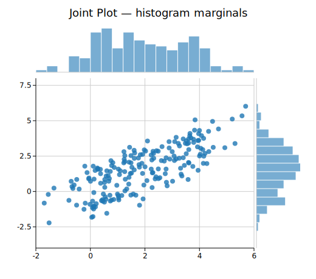
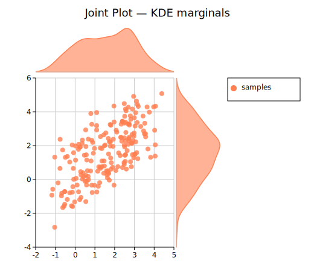
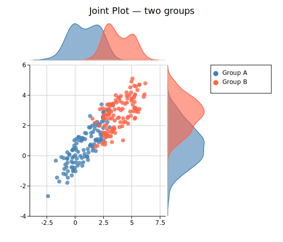

# Joint Plot

A joint plot combines a central scatter plot with marginal distribution panels on the top and right edges. Each marginal panel shows the univariate distribution of the corresponding axis — either as a histogram or a kernel density estimate (KDE). This makes it easy to see both the bivariate relationship and each variable's marginal distribution in a single figure.

`JointPlot` is a standalone composite renderer, not a `Plot` enum variant. Render it with `render_jointplot(jp, layout)` instead of `render_multiple`.

**Import path:** `kuva::prelude::*` (re-exports `JointPlot`, `JointGroup`, `MarginalType`, and `render_jointplot`)

---

## Basic usage

```rust,no_run
use kuva::prelude::*;

let x = vec![1.2, 2.4, 3.1, 4.8, 5.0, 2.1, 3.7, 4.2];
let y = vec![2.1, 3.8, 3.2, 5.1, 5.4, 2.8, 4.0, 4.6];

let jp = JointPlot::new()
    .with_xy(x, y)
    .with_x_label("Feature A")
    .with_y_label("Feature B");

let layout = Layout::new((0.0, 6.0), (1.5, 6.5))
    .with_title("Joint Plot");

let svg = SvgBackend.render_scene(&render_jointplot(jp, layout));
std::fs::write("jointplot.svg", svg).unwrap();
```



By default both the top (x-distribution) and right (y-distribution) marginal panels are shown as histograms with 20 bins.

---

## Marginal type

`.with_marginal_type(MarginalType)` switches between histogram bars and a filled KDE curve.

| Variant | Description |
|---------|-------------|
| `MarginalType::Histogram` | Histogram bars. **Default.** |
| `MarginalType::Density` | Filled kernel density estimate. |

```rust,no_run
# use kuva::prelude::*;
let jp = JointPlot::new()
    .with_xy(x, y)
    .with_marginal_type(MarginalType::Density)
    .with_x_label("log2 TPM")
    .with_y_label("log2 FC");
```



KDE bandwidth defaults to Silverman's rule of thumb. Override with `.with_bandwidth(f64)`.

---

## Showing / hiding marginal panels

Each panel can be toggled independently.

```rust,no_run
# use kuva::prelude::*;
// Top marginal only
let jp_top = JointPlot::new()
    .with_xy(x.clone(), y.clone())
    .with_right_marginal(false);

// Right marginal only
let jp_right = JointPlot::new()
    .with_xy(x.clone(), y.clone())
    .with_top_marginal(false);

// Scatter only — useful as a feature-parity path through the JointPlot API
let jp_scatter = JointPlot::new()
    .with_xy(x, y)
    .with_top_marginal(false)
    .with_right_marginal(false)
    .with_x_label("X")
    .with_y_label("Y");
```

---

## Multiple groups

Use `.with_group()` to add named, colored data groups. When two or more groups have labels the legend is rendered automatically to the right of the marginal panel.

```rust,no_run
# use kuva::prelude::*;
let jp = JointPlot::new()
    .with_group("Control", x_ctrl, y_ctrl, "#4e79a7")
    .with_group("Treated", x_trt,  y_trt,  "#f28e2b")
    .with_x_label("X")
    .with_y_label("Y");

let layout = Layout::new((-6.0, 9.0), (-6.0, 9.0))
    .with_title("Two Groups");
```



Each group's marginal bars or density fill use the group's marker color at 60 % opacity (controlled by `.with_marginal_alpha(f64)`).

> **Layout note:** When a legend is present alongside a right marginal panel, the total SVG width is automatically expanded so the legend appears to the right of the panel, with no white space between the data area and the panel.

---

## Trend lines

Build a `JointGroup` directly for access to all scatter-plot features, including trend lines and correlation annotations.

```rust,no_run
# use kuva::prelude::*;
# use kuva::plot::scatter::TrendLine;
let group = JointGroup::new(x, y)
    .with_color("#e15759")
    .with_trend(TrendLine::Linear)
    .with_trend_color("#333333")
    .with_correlation();          // adds "r = X.XX" annotation

let jp = JointPlot::new()
    .with_joint_group(group)
    .with_x_label("X")
    .with_y_label("Y");
```


---

## Error bars

```rust,no_run
# use kuva::prelude::*;
let x_err = vec![0.2; 30];
let y_err = vec![0.3; 30];

let group = JointGroup::new(x, y)
    .with_color("#76b7b2")
    .with_x_err(x_err)
    .with_y_err(y_err);

let jp = JointPlot::new()
    .with_joint_group(group)
    .with_x_label("Measurement")
    .with_y_label("Response");
```

Asymmetric error bars are also supported via `.with_x_err_asymmetric()` and `.with_y_err_asymmetric()`.

---

## Marker shape and size

```rust,no_run
# use kuva::prelude::*;
# use kuva::plot::scatter::MarkerShape;
let group = JointGroup::new(x, y)
    .with_color("#59a14f")
    .with_marker(MarkerShape::Square)
    .with_marker_size(5.0)
    .with_marker_stroke_width(1.0);

let jp = JointPlot::new()
    .with_joint_group(group)
    .with_marginal_type(MarginalType::Density);
```

Available marker shapes: `Circle` (default), `Square`, `Triangle`, `Diamond`, `Cross`, `Plus`.

---

## Per-point colors

```rust,no_run
# use kuva::prelude::*;
// Color each point by sign of x
let colors: Vec<String> = x.iter()
    .map(|&v| if v > 0.0 { "#4e79a7".into() } else { "#e15759".into() })
    .collect();

let group = JointGroup::new(x, y)
    .with_colors(colors);

let jp = JointPlot::new().with_joint_group(group);
```

The per-point colors apply only to the scatter markers; marginal bars use the group's uniform color.

---

## Tooltips

```rust,no_run
# use kuva::prelude::*;
let labels: Vec<String> = (0..40).map(|i| format!("Sample {i}")).collect();

let group = JointGroup::new(x, y)
    .with_color("#b07aa1")
    .with_tooltips()
    .with_tooltip_labels(labels);

let jp = JointPlot::new().with_joint_group(group);
```

Tooltip `<title>` elements are injected into the SVG and shown on hover in browsers. They are silently ignored by PNG/PDF/terminal backends.

---

## Panel sizing

```rust,no_run
# use kuva::prelude::*;
let jp = JointPlot::new()
    .with_xy(x, y)
    .with_marginal_size(120.0)   // panel height (top) / width (right), default 80.0
    .with_marginal_gap(8.0)      // gap between panel and scatter, default 4.0
    .with_bins(30)               // histogram bins, default 20
    .with_marginal_alpha(0.5);   // bar/fill opacity, default 0.6
```

---

## Canvas size

`JointPlot` uses `Layout::with_width()` and `Layout::with_height()` for total canvas dimensions (including marginal panels). A square canvas (e.g. 500 × 500) is natural for scatter data. Increase width or height if labels or legend need more room.

```rust,no_run
# use kuva::prelude::*;
let layout = Layout::new((-8.0, 8.0), (-5.0, 5.0))
    .with_title("Expression vs Fold Change")
    .with_width(520.0)
    .with_height(520.0);
```

---

## API reference

### `JointPlot` builder methods

| Method | Description |
|--------|-------------|
| `JointPlot::new()` | Create a joint plot with defaults |
| `.with_xy(x, y)` | Add a single unlabeled group |
| `.with_group(label, x, y, color)` | Add a named and colored group |
| `.with_joint_group(JointGroup)` | Add a fully configured `JointGroup` |
| `.with_marginal_type(MarginalType)` | Histogram or density (default `Histogram`) |
| `.with_top_marginal(bool)` | Show/hide top panel (default `true`) |
| `.with_right_marginal(bool)` | Show/hide right panel (default `true`) |
| `.with_marginal_size(f64)` | Panel height/width in px (default `80.0`) |
| `.with_marginal_gap(f64)` | Gap between panel and scatter in px (default `4.0`) |
| `.with_bins(usize)` | Number of histogram bins (default `20`) |
| `.with_bandwidth(f64)` | KDE bandwidth (default: Silverman's rule) |
| `.with_marginal_alpha(f64)` | Marginal bar/fill opacity (default `0.6`) |
| `.with_x_label(s)` | X-axis label |
| `.with_y_label(s)` | Y-axis label |
| `.with_marker_size(f64)` | Default scatter marker radius in px (default `4.0`) |
| `.with_marker_opacity(f64)` | Default scatter marker opacity (default `0.8`) |

### `JointGroup` builder methods

`JointGroup` wraps a `ScatterPlot` and forwards all scatter features.

| Method | Description |
|--------|-------------|
| `JointGroup::new(x, y)` | Create a group from x and y data |
| `JointGroup::from_scatter(ScatterPlot)` | Wrap a pre-built `ScatterPlot` |
| `.with_label(s)` | Group label (shown in legend) |
| `.with_color(s)` | Uniform marker color |
| `.with_colors(iter)` | Per-point colors |
| `.with_marker(MarkerShape)` | Marker shape |
| `.with_marker_size(f64)` | Marker radius in px |
| `.with_marker_opacity(f64)` | Marker fill opacity |
| `.with_marker_stroke_width(f64)` | Marker outline width |
| `.with_sizes(iter)` | Per-point radii (bubble plot) |
| `.with_x_err(iter)` | Symmetric X error bars |
| `.with_x_err_asymmetric(iter)` | Asymmetric X error bars `(neg, pos)` |
| `.with_y_err(iter)` | Symmetric Y error bars |
| `.with_y_err_asymmetric(iter)` | Asymmetric Y error bars `(neg, pos)` |
| `.with_trend(TrendLine)` | Overlay a trend line |
| `.with_trend_color(s)` | Trend line color |
| `.with_trend_width(f64)` | Trend line stroke width |
| `.with_equation()` | Show regression equation annotation |
| `.with_correlation()` | Show Pearson r annotation |
| `.with_band(y_lower, y_upper)` | Shaded confidence band |
| `.with_tooltips()` | Enable SVG hover tooltips |
| `.with_tooltip_labels(iter)` | Custom per-point tooltip labels |
