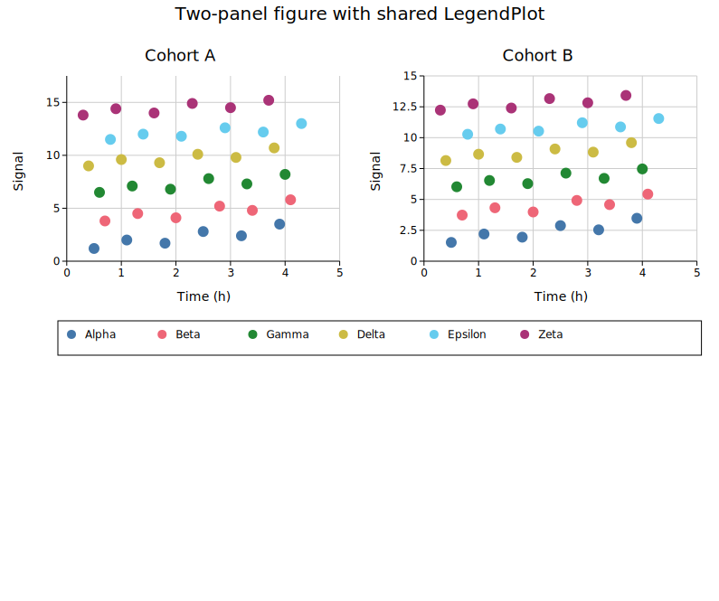
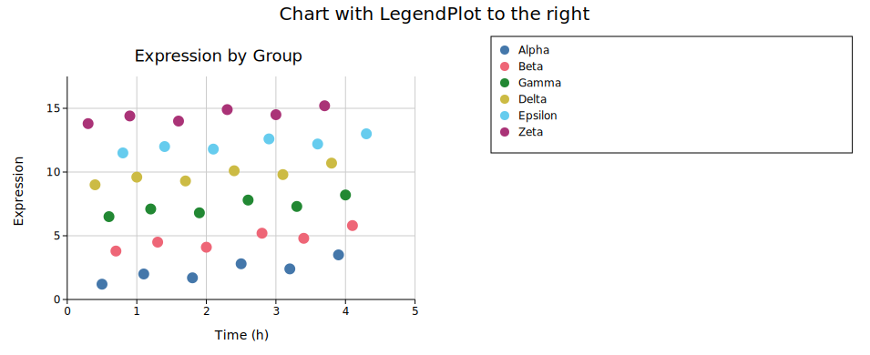
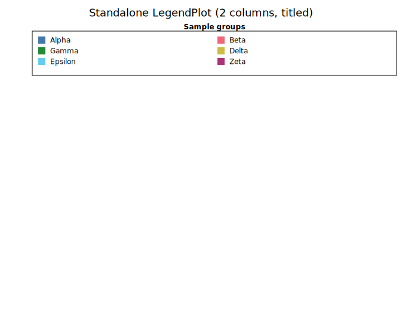
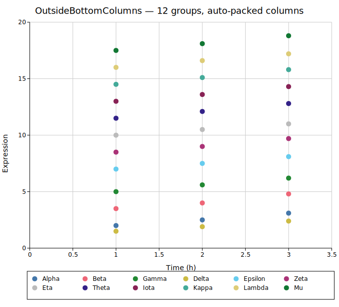

# Legend Plot

`LegendPlot` is a plot cell that renders a legend grid with no axes or data. It is designed for two situations:

1. **Shared legend in a Figure.** Place it in a dedicated cell so multiple data panels can share one legend without duplicating it.
2. **Standalone use.** Render a freestanding legend key to composite with an external image or annotate a layout.

Entries can be populated directly, or collected automatically from a set of plots using `collect_legend_entries`.

**Import path:** `kuva::plot::LegendPlot` (also re-exported from `kuva::prelude`)

---

## Shared legend below a figure

The most common use case: collect entries from your data plots and place them in a thin row beneath the chart.

```rust,no_run
use kuva::prelude::*;
use kuva::render::render::collect_legend_entries;

let scatter = ScatterPlot::new()
    .with_data(vec![(1.0_f64, 2.0), (2.0, 3.5), (3.0, 2.8)])
    .with_color("steelblue")
    .with_legend("Group A");

let data_plots: Vec<Plot> = vec![scatter.into()];
let entries = collect_legend_entries(&data_plots);

let legend_cell = LegendPlot::from_entries(entries);

let scene = Figure::new(2, 1)
    .with_cell_size(600.0, 400.0)
    .with_row_height(1, 60.0)                  // thin legend row
    .with_plots(vec![
        data_plots,
        vec![legend_cell.into()],
    ])
    .render();

let svg = SvgBackend.render_scene(&scene);
std::fs::write("legend_below.svg", svg).unwrap();
```



---

## Shared legend to the right

For a side legend, use `with_cols(1)` to force a single column and place the cell in an adjacent column.

```rust,no_run
use kuva::prelude::*;
use kuva::render::render::collect_legend_entries;

let data_plots: Vec<Plot> = vec![/* your plots */];
let entries = collect_legend_entries(&data_plots);

let legend_cell = LegendPlot::from_entries(entries).with_cols(1);

let scene = Figure::new(1, 2)
    .with_cell_size(500.0, 400.0)
    .with_col_width(1, 160.0)                  // narrow legend column
    .with_plots(vec![
        data_plots,
        vec![legend_cell.into()],
    ])
    .render();
```



---

## Standalone with title

```rust,no_run
use kuva::prelude::*;

let entries = vec![
    LegendEntry { label: "Treatment".into(), color: "#4477AA".into(),
                  shape: LegendShape::Rect, dasharray: None },
    LegendEntry { label: "Control".into(),   color: "#EE6677".into(),
                  shape: LegendShape::Rect, dasharray: None },
    LegendEntry { label: "Baseline".into(),  color: "#CCBB44".into(),
                  shape: LegendShape::Line, dasharray: None },
];

let lp = LegendPlot::from_entries(entries)
    .with_title("Groups")
    .with_cols(3);

let plots: Vec<Plot> = vec![lp.into()];
let layout = Layout::auto_from_plots(&plots);
let svg = SvgBackend.render_scene(&render_multiple(plots, layout));
```



---

## OutsideBottomColumns

`LegendPlot` is the backing renderer for the `OutsideBottomColumns` legend position. When you use that position on a regular `Layout`, kuva automatically packs all legend entries into a multi-column grid below the plot and extends the canvas height to fit.

```rust,no_run
use kuva::prelude::*;
use kuva::plot::legend::LegendPosition;

let layout = Layout::auto_from_plots(&plots)
    .with_legend_position(LegendPosition::OutsideBottomColumns);
```



---

## API reference

| Method | Description |
|--------|-------------|
| `LegendPlot::new()` | Empty plot; add entries with `.with_entry()` |
| `LegendPlot::from_entries(entries)` | Pre-populate from a `Vec<LegendEntry>` |
| `.with_entry(entry)` | Append a single `LegendEntry` |
| `.with_cols(n)` | Fix the number of columns; default is auto from cell width |
| `.with_title(s)` | Bold title row above the entries |
| `.without_box()` | Hide the background fill and border |

`collect_legend_entries(&plots)` — free function in `kuva::render::render` that walks a `Vec<Plot>` and returns all `LegendEntry` items that the renderers would normally draw automatically.
