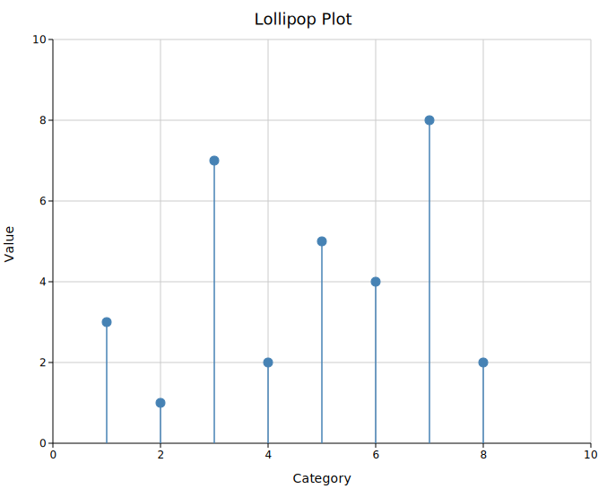

# Lollipop Chart

A lollipop chart displays discrete data points as vertical stems (lines) topped with filled circles. It conveys the same information as a bar chart while being less visually heavy — the empty space between stems makes it easier to compare the heights of nearby points.

A distinctive feature of lollipop charts is the optional domain annotation: colored rectangles drawn behind the stems along the x-axis. This makes them the standard format for mutation landscape plots in molecular biology, where each lollipop shows a mutation count and colored bands below the axis indicate protein functional domains.

**Import path:** `kuva::plot::lollipop::LollipopPlot`

---

## Basic usage

Add points with `.with_point(x, y)`. All stems originate from the baseline (`y = 0` by default).

```rust,no_run
use kuva::plot::lollipop::LollipopPlot;
use kuva::backend::svg::SvgBackend;
use kuva::render::render::render_multiple;
use kuva::render::layout::Layout;
use kuva::render::plots::Plot;

let plot = LollipopPlot::new()
    .with_point(1.0,  4.0)
    .with_point(3.0,  7.0)
    .with_point(5.0,  3.0)
    .with_point(7.0,  9.0)
    .with_point(9.0,  5.0)
    .with_point(11.0, 2.0)
    .with_point(13.0, 8.0)
    .with_color("steelblue");

let plots = vec![Plot::Lollipop(plot)];
let layout = Layout::auto_from_plots(&plots)
    .with_title("Gene Expression Rank")
    .with_x_label("Gene index")
    .with_y_label("Expression (log₂ TPM)");

let svg = SvgBackend.render_scene(&render_multiple(plots, layout));
std::fs::write("lollipop.svg", svg).unwrap();
```



---

## Labels and per-point colors

`.with_labeled_point()` places a text label above (or below, for negative values) the dot. `.with_colored_point()` and `.with_labeled_colored_point()` allow per-point color overrides for highlighting specific items.

```rust,no_run
use kuva::plot::lollipop::LollipopPlot;
use kuva::render::plots::Plot;
# use kuva::render::layout::Layout;
# use kuva::render::render::render_multiple;

let plot = LollipopPlot::new()
    .with_point(5.0, 2.0)
    .with_point(15.0, 3.0)
    .with_labeled_colored_point(28.0, 12.0, "TP53",  "#d62728")
    .with_point(35.0, 4.0)
    .with_labeled_colored_point(47.0,  9.0, "KRAS",  "#ff7f0e")
    .with_point(62.0, 2.0)
    .with_labeled_colored_point(75.0, 14.0, "BRCA1", "#9467bd")
    .with_point(88.0, 3.0)
    .with_dot_radius(5.5);

let plots = vec![Plot::Lollipop(plot)];
```


---

## Mutation landscape with domain annotations

`.with_domain()` draws a colored rectangle behind the stems, anchored below the baseline. This is the standard presentation for protein mutation landscapes, where domains (functional regions) are annotated along the sequence.

```rust,no_run
use kuva::plot::lollipop::LollipopPlot;
use kuva::backend::svg::SvgBackend;
use kuva::render::render::render_multiple;
use kuva::render::layout::Layout;
use kuva::render::plots::Plot;

let plot = LollipopPlot::new()
    // Missense mutations
    .with_labeled_colored_point( 12.0, 3.0, "R12H",   "#1f77b4")
    .with_labeled_colored_point( 35.0, 8.0, "G35V",   "#d62728")
    .with_labeled_colored_point( 67.0, 2.0, "K67R",   "#1f77b4")
    .with_labeled_colored_point( 94.0, 5.0, "P94L",   "#d62728")
    .with_labeled_colored_point(118.0, 11.0, "R118*", "#d62728")
    .with_labeled_colored_point(145.0, 4.0, "T145A",  "#1f77b4")
    .with_labeled_colored_point(173.0, 7.0, "D173N",  "#d62728")
    .with_labeled_colored_point(201.0, 3.0, "E201K",  "#1f77b4")
    // Domain annotations
    .with_domain(  1.0,  55.0, Some("N-term"),   "#4e79a7")
    .with_domain( 56.0, 130.0, Some("Kinase"),   "#f28e2b")
    .with_domain(131.0, 195.0, Some("SH2"),      "#59a14f")
    .with_domain(196.0, 240.0, Some("C-term"),   "#b07aa1")
    .with_domain_height(0.8)
    .with_stem_width(1.5)
    .with_dot_radius(5.0);

let plots = vec![Plot::Lollipop(plot)];
let layout = Layout::auto_from_plots(&plots)
    .with_title("TP53 Mutation Landscape")
    .with_x_label("Amino acid position")
    .with_y_label("Count");

let svg = SvgBackend.render_scene(&render_multiple(plots, layout));
```


---

## Negative values and custom baseline

The baseline defaults to `y = 0`. Set a different baseline with `.with_baseline()`. Points below the baseline have their stems drawn downward and labels placed below the dot.

```rust,no_run
use kuva::plot::lollipop::LollipopPlot;
use kuva::render::plots::Plot;
# use kuva::render::layout::Layout;
# use kuva::render::render::render_multiple;

// Log2 fold-change: positive = upregulated, negative = downregulated
let plot = LollipopPlot::new()
    .with_point( 1.0,  2.3)
    .with_point( 2.0, -1.8)
    .with_point( 3.0,  0.5)
    .with_point( 4.0, -3.1)
    .with_point( 5.0,  1.9)
    .with_point( 6.0, -0.7)
    .with_point( 7.0,  4.2)
    .with_baseline(0.0)
    .with_baseline_dash("4 3");

let plots = vec![Plot::Lollipop(plot)];
```

---

## LollipopPlot API reference

### `LollipopPlot` builders

| Method | Default | Description |
|--------|---------|-------------|
| `LollipopPlot::new()` | — | Create a lollipop chart with default settings |
| `.with_point(x, y)` | — | Add a point with no label |
| `.with_labeled_point(x, y, label)` | — | Add a point with a text label |
| `.with_colored_point(x, y, color)` | — | Add a point with a per-point color override |
| `.with_labeled_colored_point(x, y, label, color)` | — | Add a labeled point with a per-point color |
| `.with_points(iter)` | — | Add multiple `(x, y)` pairs at once |
| `.with_color(css)` | `"steelblue"` | Default stem and dot color |
| `.with_baseline(v)` | `0.0` | Y value where stems originate |
| `.with_stem_width(px)` | `1.5` | Stem stroke width |
| `.with_dot_radius(px)` | `5.0` | Dot radius |
| `.with_dot_stroke(css)` | fill color | Dot outline color |
| `.with_dot_stroke_width(px)` | `1.0` | Dot outline width |
| `.with_show_baseline(bool)` | `true` | Draw a horizontal baseline line |
| `.with_baseline_color(css)` | `"#888888"` | Baseline line color |
| `.with_baseline_width(px)` | `1.0` | Baseline line stroke width |
| `.with_baseline_dash(s)` | — | Baseline dasharray (e.g. `"4 3"`) |
| `.with_domain(x0, x1, label, color)` | — | Add a domain annotation rect |
| `.with_domain_opacity(x0, x1, label, color, opacity)` | — | Domain rect with explicit opacity |
| `.with_domain_height(h)` | `0.5` | Domain rect height in data units below the baseline |
| `.with_legend(label)` | — | Attach a legend (colored circle entry) |
