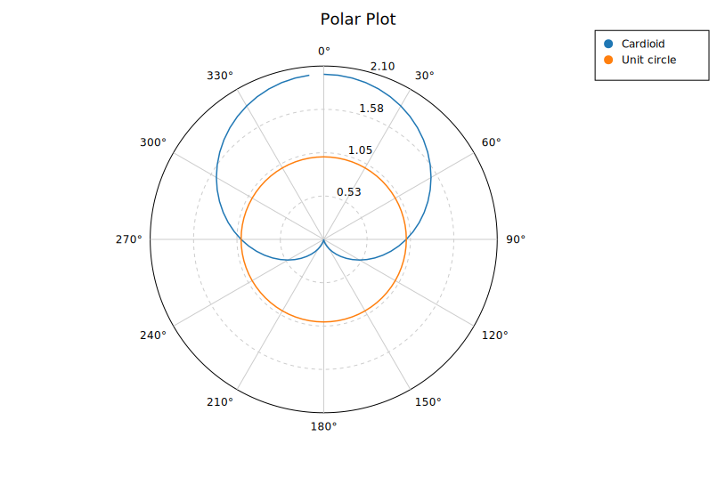
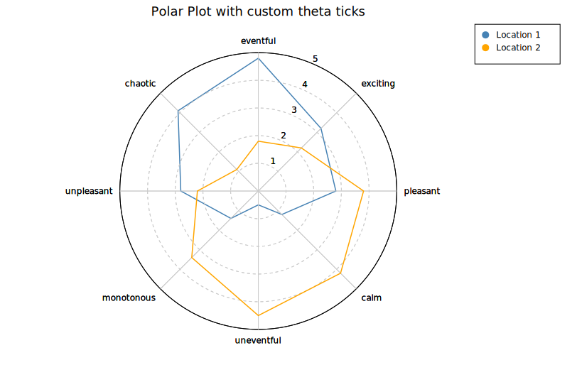
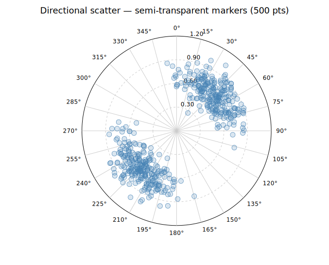
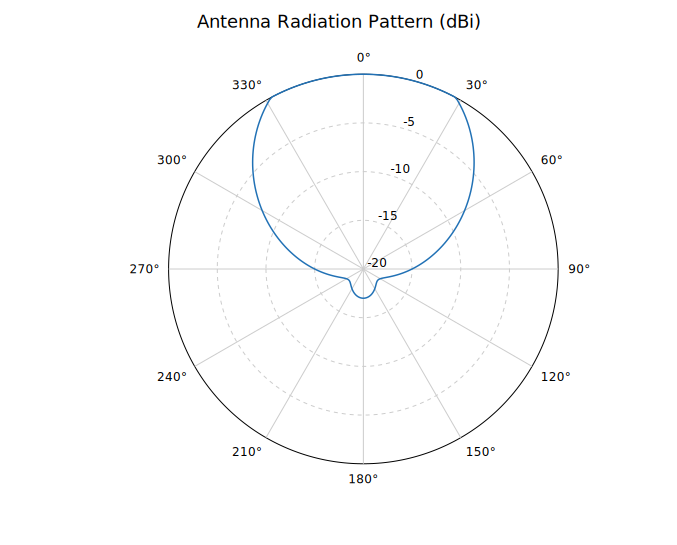

# Polar Plot

A polar coordinate plot renders data in (r, θ) space — radial distance and angle — projected onto a circular canvas with a configurable grid.

By default **kuva** uses compass convention: θ=0 at north (top), increasing clockwise. To use math convention (θ=0 at east, increasing CCW), combine `.with_theta_start(90.0)` and `.with_clockwise(false)`.



## Rust API

```rust
use kuva::plot::polar::{PolarMode, PolarPlot};
use kuva::render::layout::Layout;
use kuva::render::plots::Plot;
use kuva::render::render::render_multiple;
use kuva::backend::svg::SvgBackend;

// Cardioid: r = 1 + cos(θ)
let n = 72;
let theta: Vec<f64> = (0..n).map(|i| i as f64 * 360.0 / n as f64).collect();
let r: Vec<f64> = theta.iter().map(|&t| 1.0 + t.to_radians().cos()).collect();

let plot = PolarPlot::new()
    .with_series_labeled(r, theta, "Cardioid", PolarMode::Line)
    .with_r_max(2.1)
    .with_r_grid_lines(4)
    .with_theta_divisions(12)
    .with_legend(true);

let plots = vec![Plot::Polar(plot)];
let layout = Layout::auto_from_plots(&plots).with_title("Cardioid");
let svg = SvgBackend.render_scene(&render_multiple(plots, layout));
```

### Scatter vs Line mode

```rust
// Scatter (default): each (r, θ) point is a circle
let plot = PolarPlot::new().with_series(r, theta);

// Line: points connected by a path
let plot = PolarPlot::new().with_series_line(r, theta);

// Labeled series (used for legends)
let plot = PolarPlot::new()
    .with_series_labeled(r, theta, "Wind speed", PolarMode::Scatter);
```

### Conventions

```rust
// Compass convention (default): 0° = north, clockwise
let compass = PolarPlot::new()
    .with_theta_start(0.0)
    .with_clockwise(true);

// Math convention: 0° = east, CCW
let math = PolarPlot::new()
    .with_theta_start(90.0)
    .with_clockwise(false);
```

### Theta tick labels

```rust
let mut theta: Vec<f64> = (0..8).map(|i| i as f64 * 45.0).collect();
theta.push(360.0);
let r_location1 = vec![4.8, 3.2, 2.8, 1.2, 0.5, 1.4, 2.8, 4.1, 4.8];
let r_location2 = vec![1.8, 2.2, 3.8, 4.2, 4.5, 3.4, 2.2, 1.1, 1.8];
let plot1 = PolarPlot::new()
    .with_series_labeled(r_location1, theta.clone(), "Location 1", PolarMode::Line)
    .with_theta_divisions(8)
    .with_r_max(5.0)
    .with_r_grid_lines(5)
    .with_color("steelblue")
    .with_legend(true);
let plot2 = PolarPlot::new()
    .with_series_labeled(r_location2, theta, "Location 2", PolarMode::Line)
    .with_theta_divisions(8)
    .with_r_max(5.0)
    .with_r_grid_lines(5)
    .with_color("orange")
    .with_legend(true);

let plots = vec![Plot::Polar(plot1), Plot::Polar(plot2)];
let layout = Layout::auto_from_plots(&plots)
    .with_title("Polar Plot with custom theta ticks")
    .with_x_tick_format(TickFormat::Custom(std::sync::Arc::new(
        |v| {
            let div = 360.0 / 8.0;
            if v < div {
                "eventful".to_string()
            } else if v < 2.0 * div {
                "exciting".to_string()
            } else if v < 3.0 * div {
                "pleasant".to_string()
            } else if v < 4.0 * div {
                "calm".to_string()
            } else if v < 5.0 * div {
                "uneventful".to_string()
            } else if v < 6.0 * div {
                "monotonous".to_string()
            } else if v < 7.0 * div {
                "unpleasant".to_string()
            } else {
                "chaotic".to_string()
            }
        }
    )));
```



### Marker opacity and stroke (scatter mode)

Control fill transparency and an optional outline on scatter-mode points. Settings are per-series and must be called immediately after the series they apply to.

500 observations with two dominant directions (NE at 45° and SW at 225°). With solid markers each directional cluster collapses into an opaque wedge, hiding the internal spread. At `opacity = 0.2` the denser core of each cluster is visibly darker than its fringe, and the thin `0.7 px` stroke keeps individual observations readable.

```rust,no_run
use kuva::plot::polar::PolarPlot;
use kuva::backend::svg::SvgBackend;
use kuva::render::render::render_multiple;
use kuva::render::layout::Layout;
use kuva::render::plots::Plot;

// (populate r_vals and t_vals with 500 (r, theta_degrees) observations)
# let (r_vals, t_vals): (Vec<f64>, Vec<f64>) = (vec![], vec![]);
let plot = PolarPlot::new()
    .with_series(r_vals, t_vals)
    .with_color("steelblue")
    .with_marker_opacity(0.2)
    .with_marker_stroke_width(0.7)
    .with_r_max(1.2)
    .with_theta_divisions(24);

let plots = vec![Plot::Polar(plot)];
let layout = Layout::auto_from_plots(&plots)
    .with_title("Directional scatter — semi-transparent markers (500 pts)");

let svg = SvgBackend.render_scene(&render_multiple(plots, layout));
```



These builders have no effect on `PolarMode::Line` series.

### Negative radius / shifted baseline

Use `.with_r_min(f64)` to set the value that maps to the plot centre. By default `r_min = 0`, so a data point at `r = 0` lands at the centre. When you set a non-zero `r_min`, a data point `(r, θ)` is plotted at radial distance `max(r − r_min, 0) / (r_max − r_min)` from the centre. Points below `r_min` are clamped to the centre.

This is most useful for dB-scale quantities such as antenna radiation patterns, where gain naturally runs from a large negative value (e.g. −20 dBi) up to 0 dBi.

```rust
// Antenna pattern: gain ranges from -20 dBi (null) to 0 dBi (main lobe)
let theta: Vec<f64> = (0..=360).map(|i| i as f64).collect();
let gain_dbi: Vec<f64> = theta.iter().map(|&t| {
    let rad = t.to_radians();
    let main = (rad / 2.0).cos().powi(4);
    ((main * 20.0) - 20.0).clamp(-20.0, 0.0)
}).collect();

let plot = PolarPlot::new()
    .with_series_line(gain_dbi, theta)
    .with_r_min(-20.0)
    .with_r_max(0.0)
    .with_r_grid_lines(4);
```



The centre label automatically shows the `r_min` value (here `−20`) so the scale is unambiguous. Ring labels always display actual data values regardless of the shift.

### Grid control

```rust
let plot = PolarPlot::new()
    .with_r_grid_lines(5)        // 5 concentric rings
    .with_theta_divisions(8)     // 8 spokes (every 45°)
    .with_r_labels(true)         // show r value on each ring
    .with_grid(true);            // show grid (default)
```

### Builder reference

| Method | Default | Description |
|---|---|---|
| `.with_series(r, theta)` | — | Add scatter series |
| `.with_series_line(r, theta)` | — | Add line series |
| `.with_series_labeled(r, theta, label, mode)` | — | Add labeled series |
| `.with_r_max(f64)` | auto | Set maximum radial extent |
| `.with_r_min(f64)` | `0.0` | Value mapped to the plot centre; enables negative-radius data |
| `.with_theta_start(deg)` | `0.0` | Where θ=0 appears (CW from north) |
| `.with_clockwise(bool)` | `true` | Direction of increasing θ |
| `.with_r_grid_lines(n)` | `4` | Number of concentric grid circles |
| `.with_theta_divisions(n)` | `12` | Number of angular spokes |
| `.with_grid(bool)` | `true` | Show/hide grid |
| `.with_r_labels(bool)` | `true` | Show/hide r-value labels |
| `.with_legend(bool)` | `false` | Show legend for labeled series |
| `.with_color(s)` | — | Set fill color of the last added series |
| `.with_marker_opacity(f)` | solid | Fill alpha for scatter markers of the last series (`0.0`–`1.0`) |
| `.with_marker_stroke_width(w)` | none | Outline stroke for scatter markers of the last series |

## CLI

```bash
# Basic scatter
kuva polar data.tsv --r r --theta theta --title "Polar Plot"

# Line mode, multiple series via color-by
kuva polar data.tsv --r r --theta theta --color-by group --mode line

# Custom r-max and angular divisions
kuva polar data.tsv --r r --theta theta --r-max 5.0 --theta-divisions 8
```

### CLI flags

| Flag | Default | Description |
|---|---|---|
| `--r <COL>` | `0` | Radial value column |
| `--theta <COL>` | `1` | Angle column (degrees) |
| `--color-by <COL>` | — | One series per unique group value |
| `--mode <MODE>` | `scatter` | `scatter` or `line` |
| `--r-max <F>` | auto | Maximum radial extent |
| `--theta-divisions <N>` | `12` | Angular grid spokes |
| `--theta-start <DEG>` | `0.0` | Where θ=0 appears (CW from north) |
| `--legend` | off | Show legend |
