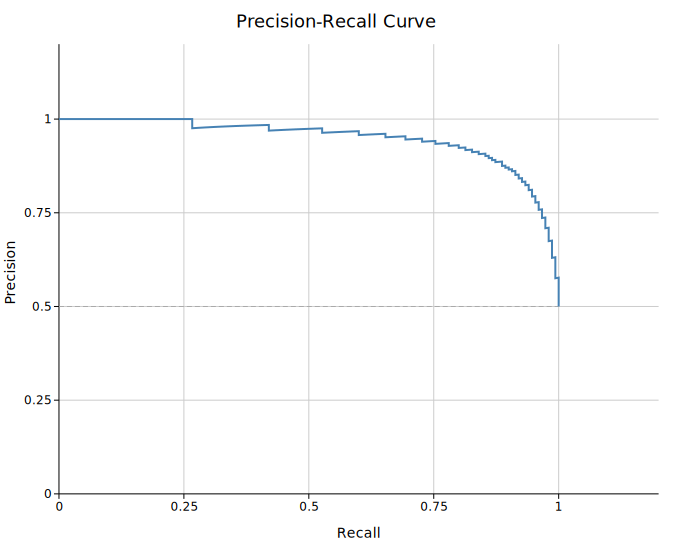
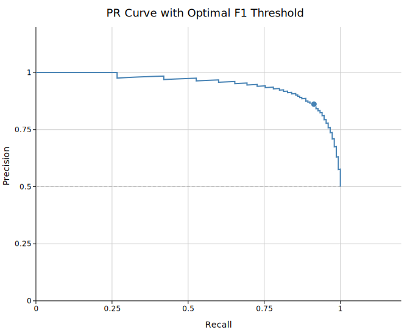
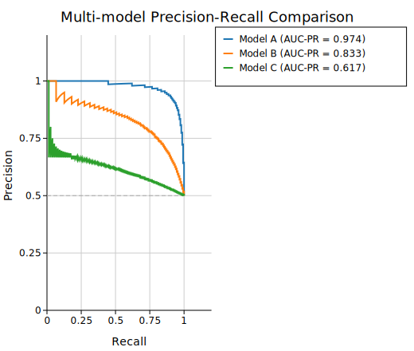

# Precision-Recall Curve

A Precision-Recall (PR) curve plots precision (positive predictive value) against recall (sensitivity) as the classification threshold is varied. Unlike a ROC curve, the PR curve is insensitive to the class imbalance ratio and focuses exclusively on the performance over the positive class — making it the correct choice for imbalanced datasets such as rare disease detection, fraud detection, or information retrieval.

The area under the PR curve (AUC-PR) summarises classifier performance; a perfect classifier achieves AUC-PR = 1.0, while the no-skill baseline is a horizontal line at the prevalence (positive rate).

**Import path:** `kuva::plot::pr::{PrPlot, PrGroup}`

---

## Basic usage

Build one `PrGroup` per classifier using `.with_raw()`, which accepts `(score, bool)` pairs. The curve and AUC-PR are computed internally.

```rust,no_run
use kuva::plot::pr::{PrPlot, PrGroup};
use kuva::backend::svg::SvgBackend;
use kuva::render::render::render_multiple;
use kuva::render::layout::Layout;
use kuva::render::plots::Plot;

/// Generate deterministic imbalanced predictions.
/// 1 positive per `ratio` negatives; positive scores drawn higher.
fn imbalanced_data(n: usize, ratio: usize, signal: f64) -> Vec<(f64, bool)> {
    let mut data = Vec::with_capacity(n);
    for i in 0..n {
        let is_pos = i % ratio == 0;
        let frac = i as f64 / n as f64;
        let score = if is_pos { signal + (1.0 - signal) * frac } else { (1.0 - signal) * frac };
        data.push((score.clamp(0.0, 1.0), is_pos));
    }
    data
}

let group = PrGroup::new("Classifier A")
    .with_raw(imbalanced_data(300, 10, 0.7));

let pr = PrPlot::new().with_group(group);

let plots = vec![Plot::Pr(pr)];
let layout = Layout::auto_from_plots(&plots)
    .with_title("Precision-Recall Curve")
    .with_x_label("Recall")
    .with_y_label("Precision");

let svg = SvgBackend.render_scene(&render_multiple(plots, layout));
std::fs::write("pr.svg", svg).unwrap();
```



The dashed grey horizontal line is the no-skill baseline at the dataset prevalence. The AUC-PR appears in the legend. Both can be suppressed — see the API reference.

---

## Optimal F1 threshold marker

`.with_optimal_point()` marks the threshold that maximises the F1 score (harmonic mean of precision and recall). This is the natural operating point when precision and recall have equal importance.

```rust,no_run
use kuva::plot::pr::{PrPlot, PrGroup};
use kuva::render::plots::Plot;
# use kuva::render::layout::Layout;
# use kuva::render::render::render_multiple;
# fn imbalanced_data(n: usize, ratio: usize, signal: f64) -> Vec<(f64, bool)> { vec![] }

let group = PrGroup::new("Classifier A")
    .with_raw(imbalanced_data(300, 10, 0.7))
    .with_optimal_point();

let pr = PrPlot::new().with_group(group);
let plots = vec![Plot::Pr(pr)];
```



---

## Multi-model comparison

Add one `PrGroup` per model. Use `.with_legend()` on `PrPlot` to show a legend.

```rust,no_run
use kuva::plot::pr::{PrPlot, PrGroup};
use kuva::backend::svg::SvgBackend;
use kuva::render::render::render_multiple;
use kuva::render::layout::Layout;
use kuva::render::plots::Plot;

# fn imbalanced_data(n: usize, ratio: usize, signal: f64) -> Vec<(f64, bool)> { vec![] }
let g1 = PrGroup::new("Logistic Regression")
    .with_raw(imbalanced_data(300, 10, 0.65));

let g2 = PrGroup::new("Random Forest")
    .with_raw(imbalanced_data(300, 10, 0.80))
    .with_optimal_point();

let g3 = PrGroup::new("Neural Network")
    .with_raw(imbalanced_data(300, 10, 0.88))
    .with_optimal_point();

let pr = PrPlot::new()
    .with_group(g1)
    .with_group(g2)
    .with_group(g3)
    .with_legend("Model");

let plots = vec![Plot::Pr(pr)];
let layout = Layout::auto_from_plots(&plots)
    .with_title("Model Comparison — Rare Event Detection")
    .with_x_label("Recall")
    .with_y_label("Precision");

let svg = SvgBackend.render_scene(&render_multiple(plots, layout));
```



---

## Pre-computed (recall, precision) points

If you have already computed the PR curve externally (e.g. from Python's `sklearn.metrics.precision_recall_curve`), pass the points directly. Supply `.with_prevalence()` to draw the correct no-skill baseline.

```rust,no_run
use kuva::plot::pr::{PrPlot, PrGroup};
use kuva::render::plots::Plot;

// (recall, precision) already computed externally; sorted by increasing recall
let points = vec![
    (0.00, 1.00),
    (0.10, 0.91),
    (0.25, 0.84),
    (0.40, 0.76),
    (0.55, 0.67),
    (0.70, 0.55),
    (0.85, 0.42),
    (1.00, 0.10),
];

let group = PrGroup::new("External model")
    .with_points(points)
    .with_prevalence(0.10);  // 10% positive rate

let pr = PrPlot::new().with_group(group);
let plots = vec![Plot::Pr(pr)];
```

---

## Line style

Differentiate models in greyscale or colorblind-safe output using custom stroke styles.

```rust,no_run
use kuva::plot::pr::{PrPlot, PrGroup};
use kuva::render::plots::Plot;
# fn imbalanced_data(n: usize, ratio: usize, signal: f64) -> Vec<(f64, bool)> { vec![] }

let g1 = PrGroup::new("Model A")
    .with_raw(imbalanced_data(300, 8, 0.75))
    .with_color("black")
    .with_line_width(2.0);

let g2 = PrGroup::new("Model B")
    .with_raw(imbalanced_data(300, 8, 0.60))
    .with_color("black")
    .with_line_width(1.5)
    .with_dasharray("6 3");

let pr = PrPlot::new().with_group(g1).with_group(g2).with_legend("Model");
let plots = vec![Plot::Pr(pr)];
```

---

## PrPlot API reference

### `PrPlot` builders

| Method | Default | Description |
|--------|---------|-------------|
| `PrPlot::new()` | — | Create a new PR curve plot |
| `.with_group(PrGroup)` | — | Add one classifier group |
| `.with_groups(iter)` | — | Add multiple groups at once |
| `.with_color(css)` | `"steelblue"` | Fallback color when groups have no explicit color |
| `.with_baseline(bool)` | `true` | Show the no-skill prevalence baseline |
| `.with_legend(label)` | — | Legend title (shown when groups have labels) |

### `PrGroup` builders

| Method | Default | Description |
|--------|---------|-------------|
| `PrGroup::new(label)` | — | Create a group with a display label |
| `.with_raw(iter)` | — | Raw `(score: f64, label: bool)` predictions; computes curve and AUC internally |
| `.with_points(iter)` | — | Pre-computed `(recall, precision)` points; trapezoidal AUC only |
| `.with_prevalence(f)` | — | Override prevalence for the no-skill baseline (pre-computed input) |
| `.with_color(css)` | palette | Curve color |
| `.with_optimal_point()` | — | Mark the F1-optimal threshold |
| `.with_auc_label(bool)` | `true` | Append `AUC = …` to the legend entry |
| `.with_line_width(px)` | `2.0` | Curve stroke width |
| `.with_dasharray(s)` | — | SVG stroke-dasharray string (e.g. `"6 3"`) |
