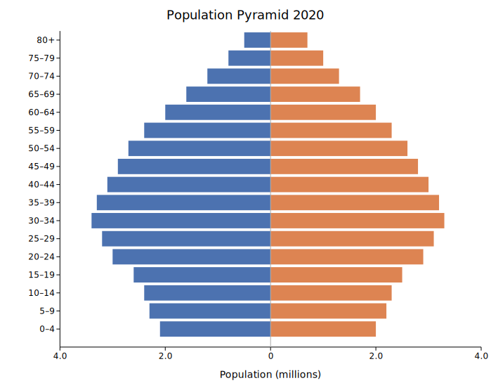
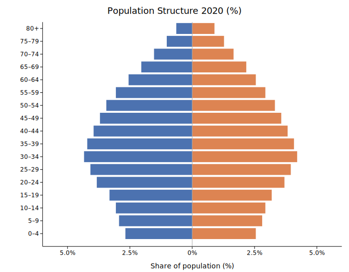
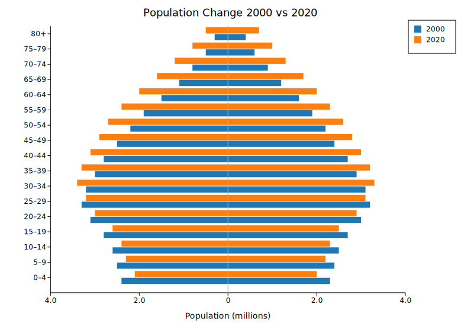

# Population Pyramid

A population pyramid is a back-to-back horizontal bar chart where each row represents an age group. The left side shows one demographic (typically male) and the right side shows another (typically female). The symmetric layout makes it easy to compare age-group distributions across the two sides at a glance.

Population pyramids are used in demography, public health, and epidemiology to visualize age-sex distributions, compare census years, or overlay two populations for planning analysis.

**Import path:** `kuva::plot::pyramid::{PopulationPyramid, PyramidMode}`

---

## Basic usage (single series)

Use `.with_group()` to add rows one at a time. Set side labels with `.with_left_label()` and `.with_right_label()`.

```rust,no_run
use kuva::plot::pyramid::PopulationPyramid;
use kuva::backend::svg::SvgBackend;
use kuva::render::render::render_multiple;
use kuva::render::layout::Layout;
use kuva::render::plots::Plot;

let plot = PopulationPyramid::new()
    .with_left_label("Male")
    .with_right_label("Female")
    .with_group("0–4",   6.5, 6.2)
    .with_group("5–9",   6.8, 6.5)
    .with_group("10–14", 7.1, 6.8)
    .with_group("15–19", 7.3, 6.9)
    .with_group("20–24", 7.0, 6.8)
    .with_group("25–34", 13.2, 12.9)
    .with_group("35–44", 12.5, 12.6)
    .with_group("45–54", 11.8, 12.0)
    .with_group("55–64",  9.4,  9.9)
    .with_group("65–74",  6.8,  7.8)
    .with_group("75+",    4.1,  6.2);

let plots = vec![Plot::Pyramid(plot)];
let layout = Layout::auto_from_plots(&plots)
    .with_title("Population Pyramid 2020")
    .with_x_label("Population (millions)");

let svg = SvgBackend.render_scene(&render_multiple(plots, layout));
std::fs::write("pyramid.svg", svg).unwrap();
```



---

## Normalized (percentage) mode

`.with_normalize(true)` expresses each bar as a percentage of the total population, making the left-right comparison scale-invariant and useful when comparing populations of different sizes.

```rust,no_run
use kuva::plot::pyramid::PopulationPyramid;
use kuva::render::plots::Plot;
# use kuva::render::layout::Layout;
# use kuva::render::render::render_multiple;

let plot = PopulationPyramid::new()
    .with_left_label("Male")
    .with_right_label("Female")
    .with_group("0–14",  28.3, 27.1)
    .with_group("15–29", 26.5, 25.3)
    .with_group("30–44", 22.8, 22.6)
    .with_group("45–59", 14.0, 14.9)
    .with_group("60–74",  6.3,  7.5)
    .with_group("75+",    2.1,  2.6)
    .with_normalize(true)
    .with_show_values(true);

let plots = vec![Plot::Pyramid(plot)];
```



---

## Multi-series census comparison

Use `.with_series()` to add named series (e.g., two census years). In the default `Grouped` mode each series gets its own sub-band within each age group. Use `.with_legend(true)` to label them.

```rust,no_run
use kuva::plot::pyramid::PopulationPyramid;
use kuva::render::plots::Plot;
use kuva::render::layout::Layout;
use kuva::render::render::render_multiple;
use kuva::backend::svg::SvgBackend;

let age_groups = [
    ("0–14", 28.3, 27.1),
    ("15–29", 26.5, 25.3),
    ("30–44", 22.8, 22.6),
    ("45–59", 14.0, 14.9),
    ("60–74",  6.3,  7.5),
    ("75+",    2.1,  2.6),
];

let future = [
    ("0–14", 18.0, 17.4),
    ("15–29", 20.5, 20.1),
    ("30–44", 21.0, 21.3),
    ("45–59", 20.2, 20.8),
    ("60–74", 13.5, 14.6),
    ("75+",    6.8,  5.8),
];

let plot = PopulationPyramid::new()
    .with_left_label("Male")
    .with_right_label("Female")
    .with_series("2020", age_groups.iter().map(|&(a, l, r)| (a, l, r)))
    .with_series("2060 (projected)", future.iter().map(|&(a, l, r)| (a, l, r)))
    .with_legend(true);

let plots = vec![Plot::Pyramid(plot)];
let layout = Layout::auto_from_plots(&plots)
    .with_title("Demographic Shift: 2020 vs 2060")
    .with_x_label("Population (%)");

let svg = SvgBackend.render_scene(&render_multiple(plots, layout));
```



---

## Overlap mode

`PyramidMode::Overlap` renders each series as transparent bars on top of each other — useful when you only have two series and want to emphasize how one population profile sits within another.

```rust,no_run
use kuva::plot::pyramid::{PopulationPyramid, PyramidMode};
use kuva::render::plots::Plot;
# use kuva::render::layout::Layout;
# use kuva::render::render::render_multiple;

let plot = PopulationPyramid::new()
    .with_left_label("Male")
    .with_right_label("Female")
    .with_series("2000", [("20–34", 18.0, 17.5), ("35–49", 20.0, 20.5), ("50–64", 15.0, 16.0)].iter().map(|&(a, l, r)| (a, l, r)))
    .with_series("2020", [("20–34", 14.0, 14.0), ("35–49", 18.0, 18.5), ("50–64", 20.0, 21.0)].iter().map(|&(a, l, r)| (a, l, r)))
    .with_mode(PyramidMode::Overlap)
    .with_legend(true);

let plots = vec![Plot::Pyramid(plot)];
```

---

## PopulationPyramid API reference

### `PopulationPyramid` builders

| Method | Default | Description |
|--------|---------|-------------|
| `PopulationPyramid::new()` | — | Create a pyramid with default settings |
| `.with_group(age, left, right)` | — | Add a row (single-series mode); creates an anonymous first series |
| `.with_series(name, groups)` | — | Add a named series; `groups` yields `(age_label, left, right)` |
| `.with_left_label(s)` | `"Left"` | Label above the left side (e.g., `"Male"`) |
| `.with_right_label(s)` | `"Right"` | Label above the right side (e.g., `"Female"`) |
| `.with_left_color(css)` | `"#4C72B0"` | Bar color for the left side (single-series) |
| `.with_right_color(css)` | `"#DD8452"` | Bar color for the right side (single-series) |
| `.with_series_color(name, css)` | — | Explicit color for a named series (multi-series) |
| `.with_normalize(bool)` | `false` | Express values as % of total population |
| `.with_show_values(bool)` | `false` | Show value labels on each bar |
| `.with_bar_width(f)` | `0.85` | Bar fill fraction per row (complement of `group_gap`) |
| `.with_group_gap(f)` | `0.15` | Blank space between rows as fraction of row height |
| `.with_bar_gap(f)` | `0.04` | Gap between sub-bands in Grouped mode |
| `.with_mode(PyramidMode)` | `Grouped` | `Grouped` (sub-bands) or `Overlap` (transparent overlay) |
| `.with_legend(bool)` | `false` | Show a legend (one entry per series) |
