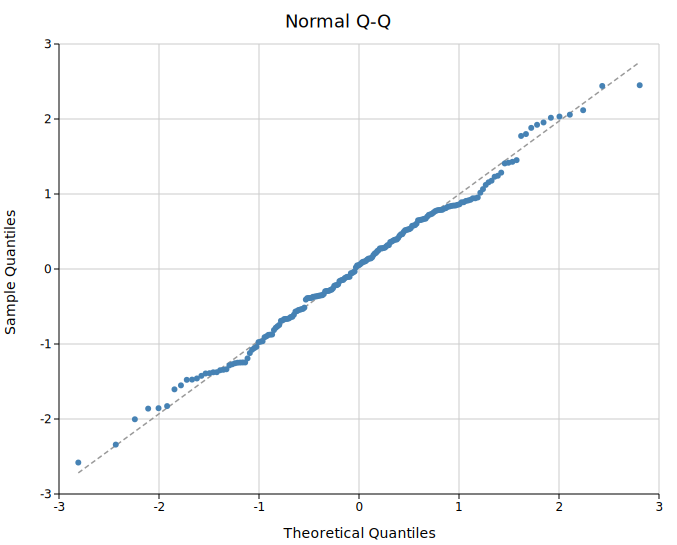
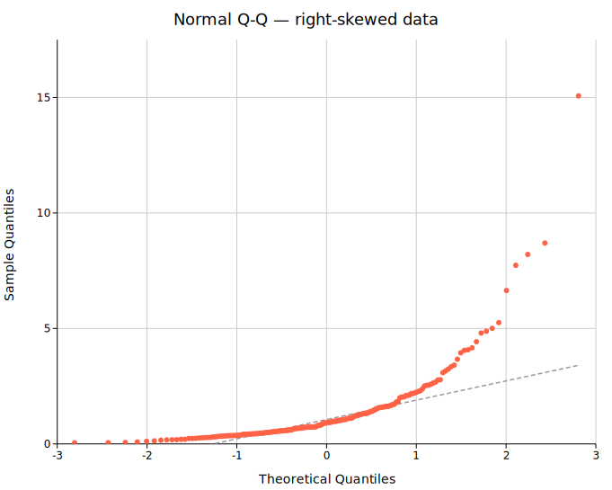
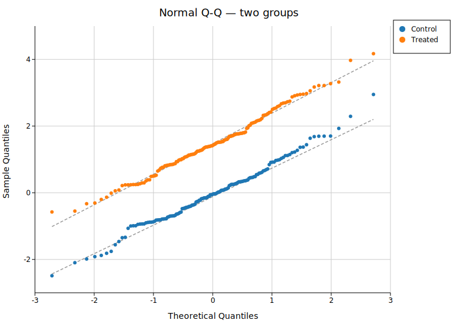
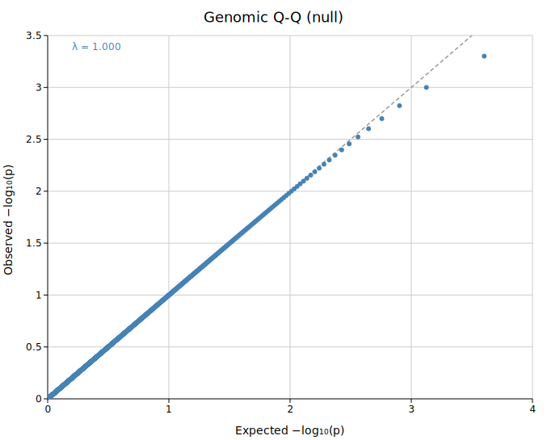
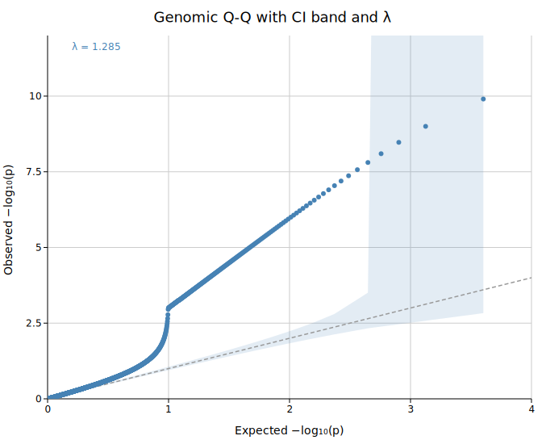
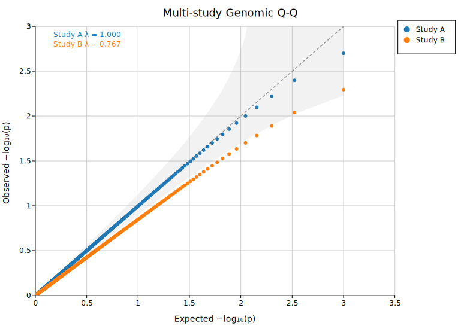

# Q-Q Plot

A Q-Q (quantile-quantile) plot compares the quantile structure of a sample against a theoretical distribution — or against another sample. It is a complete distributional diagnostic: every departure from the reference line carries information about skew, heavy tails, bimodality, or systematic bias.

**Import path:** `kuva::plot::QQPlot`

Two modes are available:

| Mode | x-axis | y-axis | Use for |
|------|--------|--------|---------|
| **Normal** | Theoretical standard-normal quantiles | Sample quantiles | Normality checks, tail shape, comparing distributions |
| **Genomic** | Expected −log₁₀(p) | Observed −log₁₀(p) | GWAS p-value calibration, λ inflation |

---

## Normal Q-Q

Compare a sample against the standard normal. Points on the dashed reference line indicate normally distributed data. Deviations reveal:
- **S-shaped curve** — skew (right or left)
- **Banana / fan shape** — heavy or light tails
- **Parallel shift** — same distribution shape, different location

```rust,no_run
use kuva::plot::QQPlot;
use kuva::backend::svg::SvgBackend;
use kuva::render::render::render_multiple;
use kuva::render::layout::Layout;
use kuva::render::plots::Plot;

let data: Vec<f64> = vec![/* your values */];

let plot = QQPlot::new()
    .with_data("Sample", data)
    .with_color("steelblue");

let plots = vec![Plot::QQ(plot)];
let layout = Layout::auto_from_plots(&plots)
    .with_title("Normal Q-Q")
    .with_x_label("Theoretical Quantiles")
    .with_y_label("Sample Quantiles");

let svg = SvgBackend.render_scene(&render_multiple(plots, layout));
```



When data is right-skewed (e.g. log-normal), the upper tail curves above the reference line:



---

## Multi-group normal Q-Q

Overlay multiple groups on the same axes to compare their distributional shapes. The reference line is drawn independently for each group (each uses its own Q1–Q3 anchored robust line):

```rust,no_run
# use kuva::plot::QQPlot;
# use kuva::render::plots::Plot;
# use kuva::render::layout::Layout;
# use kuva::render::render::render_multiple;
# use kuva::backend::svg::SvgBackend;
# use kuva::render::palette::Palette;
let pal = Palette::category10();

let plot = QQPlot::new()
    .with_data_colored("Control", vec![/* ... */], pal[0].to_string())
    .with_data_colored("Treated",  vec![/* ... */], pal[1].to_string())
    .with_legend("");
```



---

## Genomic Q-Q (GWAS)

`.with_pvalues()` switches to genomic mode. Input values must be raw p-values in (0, 1]. The plot shows −log₁₀(observed p) vs −log₁₀(expected p) under the null hypothesis. Points on the y = x diagonal indicate well-calibrated test statistics:

```rust,no_run
# use kuva::plot::QQPlot;
# use kuva::render::plots::Plot;
let plot = QQPlot::new()
    .with_pvalues("GWAS study", pvalues)
    .with_lambda();   // annotate genomic inflation factor λ
```



---

## CI band and genomic inflation factor λ

`.with_ci_band()` draws a shaded 95 % pointwise confidence band around the y = x diagonal. Points falling outside the band indicate more deviation from the null than expected by chance.

`.with_lambda()` annotates λ, the genomic inflation factor:

> λ = median(χ²₁ observed) / 0.4549

A value near 1.0 means test statistics are well-calibrated. λ > 1 indicates inflation — often caused by population stratification, cryptic relatedness, or systematic batch effects:

```rust,no_run
# use kuva::plot::QQPlot;
# use kuva::render::plots::Plot;
let plot = QQPlot::new()
    .with_pvalues("GWAS study", pvalues)
    .with_ci_band()
    .with_lambda();
```



---

## Multi-study genomic Q-Q

Overlay multiple GWAS datasets to compare calibration between studies or cohorts:

```rust,no_run
# use kuva::plot::QQPlot;
# use kuva::render::plots::Plot;
# use kuva::render::palette::Palette;
let pal = Palette::category10();

let plot = QQPlot::new()
    .with_pvalues_colored("Study A", pvals_a, pal[0].to_string())
    .with_pvalues_colored("Study B", pvals_b, pal[1].to_string())
    .with_ci_band()
    .with_legend("")
    .with_lambda();
```



---

## Builder reference

| Method | Default | Description |
|--------|---------|-------------|
| `.with_data(label, iter)` | — | Add a group (normal mode) |
| `.with_data_colored(label, iter, color)` | — | Add a group with explicit color |
| `.with_pvalues(label, iter)` | — | Add p-values; switches to genomic mode |
| `.with_pvalues_colored(label, iter, color)` | — | Same with explicit color |
| `.with_normal()` | default | Explicitly set normal mode |
| `.with_genomic()` | — | Explicitly set genomic mode |
| `.with_reference_line()` | on | Show the reference line |
| `.without_reference_line()` | — | Hide the reference line |
| `.with_ci_band()` | off | 95 % pointwise CI band around reference diagonal |
| `.with_ci_alpha(f)` | `0.15` | CI band fill opacity |
| `.with_lambda()` | off | Annotate λ (genomic mode only) |
| `.without_lambda()` | — | Hide λ annotation |
| `.with_marker_size(px)` | `3.0` | Scatter marker radius |
| `.with_fill_opacity(f)` | — | Marker fill opacity (useful for dense plots) |
| `.with_stroke_width(f)` | `1.5` | Reference line stroke width |
| `.with_color(css)` | `"steelblue"` | Uniform color (single-group) |
| `.with_legend(title)` | — | Enable legend; `""` for no title |

---

## CLI

```bash
# Normal Q-Q
kuva qq data.tsv --value score --title "Normal Q-Q"

# Multi-group normal Q-Q
kuva qq data.tsv --value score --color-by group

# Genomic Q-Q from GWAS p-values
kuva qq gwas.tsv --value pvalue --genomic \
    --title "GWAS Q-Q" \
    --x-label "Expected -log10(p)" --y-label "Observed -log10(p)"

# Genomic Q-Q with CI band and lambda annotation
kuva qq gwas.tsv --value pvalue --genomic --ci-band --lambda

# Multi-study comparison
kuva qq gwas.tsv --value pvalue --color-by study --genomic --ci-band --lambda
```

### CLI flags

| Flag | Default | Description |
|------|---------|-------------|
| `--value <COL>` | `0` | Column of values (raw data or p-values) |
| `--color-by <COL>` | — | Group by column; one set of points per value |
| `--genomic` | off | Genomic mode: input values are p-values in (0, 1] |
| `--ci-band` | off | 95 % CI band |
| `--lambda` | off | Annotate λ (genomic mode) |
| `--no-reference-line` | — | Hide the reference line |
| `--marker-size <F>` | `3.0` | Marker radius in pixels |
| `--fill-opacity <F>` | — | Marker fill opacity |
| `--x-label <S>` | *(auto)* | X-axis label |
| `--y-label <S>` | *(auto)* | Y-axis label |
