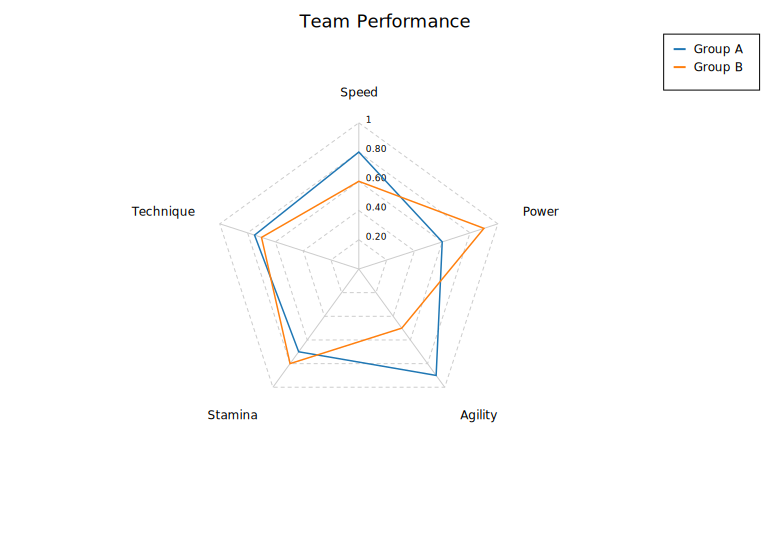
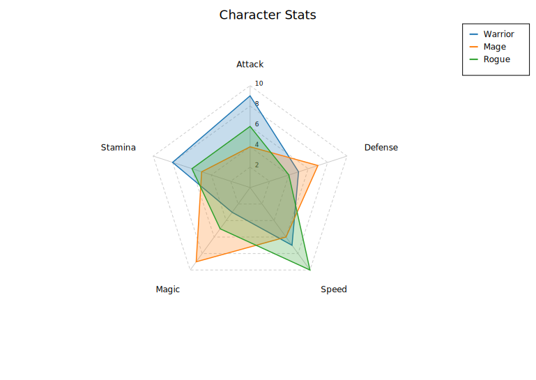

# Radar / Spider Chart

A radar (spider) chart displays multivariate data on radial axes emanating from a common centre. Each axis represents one variable; the distance from the centre encodes the value. Multiple series are drawn as filled or stroked polygons, making it easy to compare profiles across observations or groups.

Radar charts are popular for displaying skill profiles, product comparisons, and quality metrics — any context where you want to compare several dimensions at once.

**Import path:** `kuva::plot::radar::RadarPlot`

---

## Basic usage

Pass axis names to `RadarPlot::new()`, then add series with `.with_series_labeled()`. Colors are assigned from the category10 palette.

```rust,no_run
use kuva::plot::radar::RadarPlot;
use kuva::backend::svg::SvgBackend;
use kuva::render::render::render_multiple;
use kuva::render::layout::Layout;
use kuva::render::plots::Plot;

let plot = RadarPlot::new(["Speed", "Power", "Agility", "Stamina", "Technique"])
    .with_series_labeled([0.80, 0.60, 0.90, 0.70, 0.75], "Group A")
    .with_series_labeled([0.60, 0.90, 0.50, 0.80, 0.70], "Group B")
    .with_legend(true);

let plots = vec![Plot::Radar(plot)];
let layout = Layout::auto_from_plots(&plots).with_title("Team Performance");
let svg = SvgBackend.render_scene(&render_multiple(plots, layout));
std::fs::write("radar.svg", svg).unwrap();
```



---

## Filled polygons

`.with_filled(true)` shades each series polygon with a semi-transparent fill. Adjust transparency with `.with_opacity()`.

```rust,no_run
use kuva::plot::radar::RadarPlot;
use kuva::render::plots::Plot;
use kuva::render::layout::Layout;
use kuva::render::render::render_multiple;
use kuva::backend::svg::SvgBackend;

let plot = RadarPlot::new(["Attack", "Defense", "Speed", "Magic", "Stamina"])
    .with_series_labeled([9.0, 5.0, 7.0, 3.0, 8.0], "Warrior")
    .with_series_labeled([4.0, 7.0, 6.0, 9.0, 5.0], "Mage")
    .with_series_labeled([6.0, 4.0, 10.0, 5.0, 6.0], "Rogue")
    .with_filled(true)
    .with_opacity(0.25)
    .with_range(0.0, 10.0)
    .with_legend(true);

let plots = vec![Plot::Radar(plot)];
let layout = Layout::auto_from_plots(&plots).with_title("Character Stats");
let svg = SvgBackend.render_scene(&render_multiple(plots, layout));
```



---

## Normalised axes

When axes have different units or scales, use `.with_normalize(true)` to map each axis independently to `[0, 1]`. Grid ring labels become percentages.

```rust,no_run
use kuva::plot::radar::RadarPlot;
use kuva::render::plots::Plot;
# use kuva::render::layout::Layout;
# use kuva::render::render::render_multiple;

// Axes in different units: km/h, kg, %, %, m
let plot = RadarPlot::new(["Top Speed", "Weight", "Win Rate", "Accuracy", "Jump Height"])
    .with_series_labeled([230.0, 85.0, 0.62, 0.78, 1.20], "Athlete A")
    .with_series_labeled([195.0, 72.0, 0.55, 0.91, 1.45], "Athlete B")
    .with_normalize(true)
    .with_filled(true)
    .with_legend(true);

let plots = vec![Plot::Radar(plot)];
```

---

## Per-axis error bands

Attach `±error` values to a series with `.with_series_errors()`, called immediately after adding the series. A shaded band is drawn between `value − error` and `value + error` on each axis.

```rust,no_run
use kuva::plot::radar::RadarPlot;
use kuva::render::plots::Plot;
# use kuva::render::layout::Layout;
# use kuva::render::render::render_multiple;

let plot = RadarPlot::new(["Recall", "Precision", "F1", "AUC", "Speed"])
    .with_series_labeled([0.82, 0.75, 0.78, 0.89, 0.70], "Model A")
    .with_series_errors([0.04, 0.06, 0.05, 0.03, 0.08])
    .with_series_labeled([0.70, 0.88, 0.78, 0.84, 0.90], "Model B")
    .with_series_errors([0.05, 0.04, 0.04, 0.04, 0.06])
    .with_range(0.0, 1.0)
    .with_legend(true);

let plots = vec![Plot::Radar(plot)];
```

---

## Reference overlay

`.with_reference()` adds a dashed grey polygon — useful for showing a target, average, or population norm that series should be compared against.

```rust,no_run
use kuva::plot::radar::RadarPlot;
use kuva::render::plots::Plot;
# use kuva::render::layout::Layout;
# use kuva::render::render::render_multiple;

let plot = RadarPlot::new(["Endurance", "Strength", "Flexibility", "Balance", "Power"])
    .with_series_labeled([7.0, 8.0, 5.0, 6.0, 9.0], "Athlete")
    .with_reference([6.0, 6.0, 6.0, 6.0, 6.0], "Population avg")
    .with_range(0.0, 10.0)
    .with_filled(true)
    .with_dot_size(4.0)
    .with_legend(true);

let plots = vec![Plot::Radar(plot)];
```

---

## Circular grid

By default grid rings are polygons. Use `.with_circular_grid(true)` for a more traditional spider-chart appearance.

```rust,no_run
use kuva::plot::radar::RadarPlot;
use kuva::render::plots::Plot;
# use kuva::render::layout::Layout;
# use kuva::render::render::render_multiple;

let plot = RadarPlot::new(["N", "NE", "E", "SE", "S", "SW", "W", "NW"])
    .with_series_labeled([8.0, 3.0, 6.0, 9.0, 5.0, 2.0, 7.0, 4.0], "Signal strength")
    .with_circular_grid(true)
    .with_range(0.0, 10.0)
    .with_filled(true);

let plots = vec![Plot::Radar(plot)];
```

---

## RadarPlot API reference

### `RadarPlot` builders

| Method | Default | Description |
|--------|---------|-------------|
| `RadarPlot::new(axes)` | — | Create a plot; axes are names rendered clockwise from top |
| `.with_series(values)` | — | Add an unlabelled series |
| `.with_series_labeled(values, label)` | — | Add a labelled series |
| `.with_series_color(values, label, color)` | — | Add a labelled series with an explicit color |
| `.with_series_errors(errors)` | — | Attach per-axis ±errors to the most recently added series |
| `.with_series_dasharray(s)` | — | Set SVG stroke-dasharray on the most recently added series |
| `.with_reference(values, label)` | — | Add a dashed reference polygon |
| `.with_reference_color(values, label, color)` | — | Add a dashed reference polygon with explicit color |
| `.with_filled(bool)` | `false` | Fill polygons with a semi-transparent color |
| `.with_opacity(f)` | `0.25` | Fill opacity (used when `filled` is `true`) |
| `.with_range(min, max)` | auto | Shared value range for all axes |
| `.with_axis_range(i, min, max)` | — | Override value range for axis `i` |
| `.with_normalize(bool)` | `false` | Normalise each axis to `[0, 1]` independently |
| `.with_inverted_axis(i)` | — | Invert axis `i` (high values plot near the centre) |
| `.with_inverted_axes(iter)` | — | Invert multiple axes |
| `.with_grid_lines(n)` | `5` | Number of concentric grid rings |
| `.with_grid(bool)` | `true` | Show grid rings and radial axis lines |
| `.with_circular_grid(bool)` | `false` | Draw grid rings as circles instead of polygons |
| `.with_dot_size(px)` | — | Draw filled dots at polygon vertices |
| `.with_stroke_width(px)` | `1.5` | Series polygon stroke width |
| `.with_vertex_labels(bool)` | `false` | Show data value at each polygon vertex |
| `.with_start_angle(deg)` | `-90` | Angle of axis 0 in degrees (clockwise from north) |
| `.with_start_axis(k)` | — | Place axis `k` at the top (north) position |
| `.with_axis_ticks(bool)` | `false` | Tick marks on each axis at grid ring intersections |
| `.with_legend(bool)` | `false` | Show a legend box |
