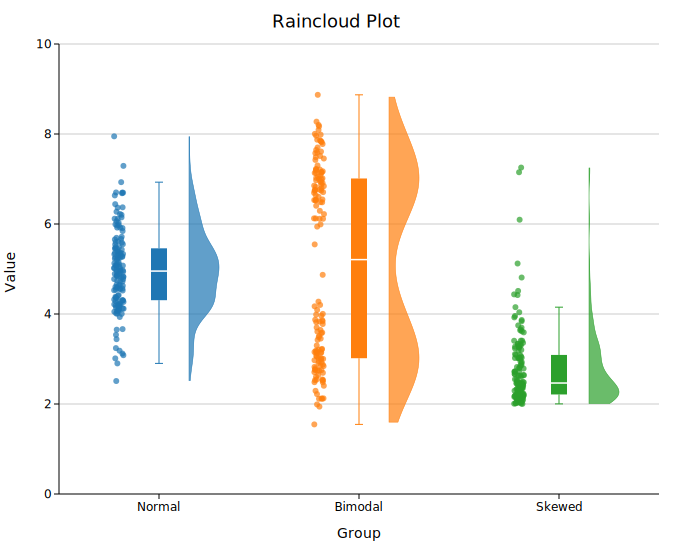
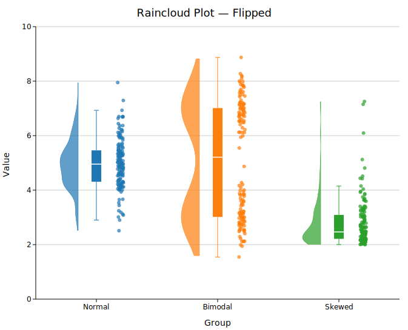
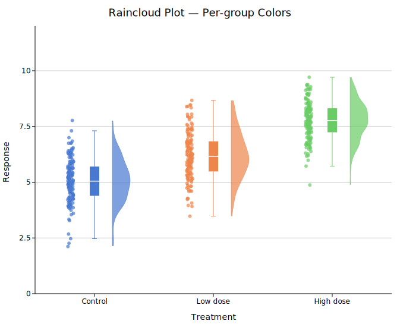

# Raincloud Plot

A raincloud plot (Allen et al. 2019) overlays three complementary views of each group's distribution on a shared axis:

- **Cloud** — a half-violin (KDE) showing the distribution shape
- **Box** — a narrow box-and-whisker showing the five-number summary
- **Rain** — jittered raw points showing every individual observation

This combination avoids the information loss of a box plot (shape is hidden), the visual clutter of a pure strip plot (structure is obscured), and the opacity of a violin (sample size is invisible). All three layers share the same y-axis so they can be compared directly.

**Import path:** `kuva::plot::RaincloudPlot`

---

## Basic usage

Add one group per category with `.with_group(label, values)`. Groups are rendered left-to-right in the order added.

```rust,no_run
use kuva::plot::RaincloudPlot;
use kuva::backend::svg::SvgBackend;
use kuva::render::render::render_multiple;
use kuva::render::layout::Layout;
use kuva::render::plots::Plot;

let plot = RaincloudPlot::new()
    .with_group("Control", control_values)
    .with_group("Low dose", low_dose_values)
    .with_group("High dose", high_dose_values);

let plots = vec![Plot::Raincloud(plot)];
let layout = Layout::auto_from_plots(&plots)
    .with_title("Drug response")
    .with_x_label("Treatment")
    .with_y_label("Response (AU)");

let scene = render_multiple(plots, layout);
let svg = SvgBackend.render_scene(&scene);
std::fs::write("raincloud.svg", svg).unwrap();
```



By default, multi-group plots use the `category10` palette automatically. For a single group the uniform `.with_color()` value is used.

---

## Toggling elements

Each of the three layers can be turned off independently. This lets you build simpler variants when not all three are needed.

```rust,no_run
# use kuva::plot::RaincloudPlot;

// Cloud + box only (no raw points)
let plot = RaincloudPlot::new()
    .with_group("A", data)
    .with_rain(false);

// Cloud + rain only (no summary box)
let plot = RaincloudPlot::new()
    .with_group("A", data)
    .with_box(false);

// Box + rain only (no KDE cloud)
let plot = RaincloudPlot::new()
    .with_group("A", data)
    .with_cloud(false);
```

---

## KDE bandwidth

The cloud shape is a kernel density estimate. By default, bandwidth is chosen automatically using Silverman's rule-of-thumb, which works well for roughly unimodal, normal-ish data but can over-smooth multimodal distributions.

### Bandwidth scale

`.with_bandwidth_scale(s)` multiplies the auto-computed bandwidth by a factor (equivalent to ggplot2's `adjust`). Values below `1.0` produce a sharper, more data-sensitive curve; values above `1.0` produce a smoother curve.

```rust,no_run
# use kuva::plot::RaincloudPlot;

// Tighter — reveals bimodality or shoulders
let plot = RaincloudPlot::new()
    .with_group("A", data)
    .with_bandwidth_scale(0.5);

// Wider — emphasises overall shape, less noise
let plot = RaincloudPlot::new()
    .with_group("A", data)
    .with_bandwidth_scale(2.0);
```

### Explicit bandwidth

`.with_bandwidth(h)` sets an exact bandwidth value, overriding both Silverman's rule and `.with_bandwidth_scale()`.

```rust,no_run
# use kuva::plot::RaincloudPlot;
let plot = RaincloudPlot::new()
    .with_group("A", data)
    .with_bandwidth(0.4);
```

`.with_kde_samples(n)` controls how many points the KDE is evaluated at (default `200`). The default is adequate for most datasets.

---

## Flip direction

By default the cloud appears to the right of centre and rain to the left. `.with_flip(true)` reverses this.

```rust,no_run
# use kuva::plot::RaincloudPlot;
let plot = RaincloudPlot::new()
    .with_group("A", data)
    .with_flip(true);   // cloud left, rain right
```



---

## Per-group colors

`.with_group_colors()` assigns colors to groups by position.

```rust,no_run
use kuva::plot::RaincloudPlot;
use kuva::backend::svg::SvgBackend;
use kuva::render::render::render_multiple;
use kuva::render::layout::Layout;
use kuva::render::plots::Plot;

let plot = RaincloudPlot::new()
    .with_group("Control",   control_values)
    .with_group("Low dose",  low_values)
    .with_group("High dose", high_values)
    .with_group_colors(["#4878d0", "#ee854a", "#6acc65"]);

let plots = vec![Plot::Raincloud(plot)];
let layout = Layout::auto_from_plots(&plots)
    .with_title("Raincloud — per-group colors")
    .with_y_label("Response");

let svg = SvgBackend.render_scene(&render_multiple(plots, layout));
```



---

## Legend

`.with_legend(label)` triggers per-group legend entries. Each group's label and color appear as a separate row in the legend — the string passed to `.with_legend()` is not used as an entry label but serves as a signal to show the legend.

```rust,no_run
# use kuva::plot::RaincloudPlot;
# use kuva::render::plots::Plot;
# use kuva::render::layout::Layout;
# use kuva::render::render::render_multiple;
# use kuva::backend::svg::SvgBackend;
let plot = RaincloudPlot::new()
    .with_group("Control", control_values)
    .with_group("Treated", treated_values)
    .with_legend("show");   // triggers per-group entries

let plots = vec![Plot::Raincloud(plot)];
let layout = Layout::auto_from_plots(&plots)
    .with_title("Treatment comparison");
let svg = SvgBackend.render_scene(&render_multiple(plots, layout));
```

---

## Fine-tuning layout

The offsets and widths of all three elements can be adjusted if groups overlap or look too sparse.

```rust,no_run
# use kuva::plot::RaincloudPlot;
let plot = RaincloudPlot::new()
    .with_group("A", data_a)
    .with_group("B", data_b)
    .with_cloud_width(40.0)    // wider cloud (default 30.0 px)
    .with_cloud_offset(0.20)   // cloud centre further from group centre (default 0.15)
    .with_rain_offset(0.25)    // rain centre further from group centre (default 0.20)
    .with_box_width(0.12)      // wider box (default 0.08, fraction of slot)
    .with_rain_size(2.5)       // smaller rain points (default 3.0 px radius)
    .with_rain_jitter(0.04)    // tighter horizontal spread (default 0.05)
    .with_cloud_alpha(0.6)     // slightly more transparent cloud (default 0.7)
    .with_rain_alpha(0.5)      // more transparent rain (default 0.7)
    .with_seed(123);           // different jitter seed (default 42)
```

---

## API reference

| Method | Description |
|--------|-------------|
| `RaincloudPlot::new()` | Create a raincloud plot with defaults |
| `.with_group(label, values)` | Add a group; accepts any `Vec<f64>` |
| `.with_groups(iter)` | Add multiple `(label, values)` pairs at once |
| `.with_color(s)` | Uniform fill color, used for single-group plots (default `"steelblue"`) |
| `.with_group_colors(iter)` | Per-group fill colors matched by position |
| `.with_cloud(bool)` | Show/hide the cloud half-violin (default `true`) |
| `.with_cloud_width(px)` | Maximum pixel half-width of the cloud (default `30.0`) |
| `.with_cloud_offset(f)` | Data-axis offset of cloud centre from group centre (default `0.15`) |
| `.with_cloud_alpha(a)` | Cloud fill opacity 0–1 (default `0.7`) |
| `.with_bandwidth(h)` | Explicit KDE bandwidth; overrides Silverman + scale |
| `.with_bandwidth_scale(s)` | Multiplier on Silverman bandwidth (default `1.0`; `< 1` sharper, `> 1` smoother) |
| `.with_kde_samples(n)` | KDE evaluation points (default `200`) |
| `.with_box(bool)` | Show/hide the box-and-whisker (default `true`) |
| `.with_box_width(f)` | Box half-width as fraction of slot width (default `0.08`) |
| `.with_rain(bool)` | Show/hide the jitter points (default `true`) |
| `.with_rain_size(px)` | Rain point radius in pixels (default `3.0`) |
| `.with_rain_jitter(f)` | Horizontal jitter spread in data units (default `0.05`) |
| `.with_rain_alpha(a)` | Rain point opacity 0–1 (default `0.7`) |
| `.with_rain_offset(f)` | Data-axis offset of rain centre from group centre (default `0.20`) |
| `.with_flip(bool)` | Swap cloud and rain sides (default `false` — cloud right, rain left) |
| `.with_seed(u64)` | RNG seed for reproducible jitter (default `42`) |
| `.with_legend(s)` | Show per-group legend entries |
