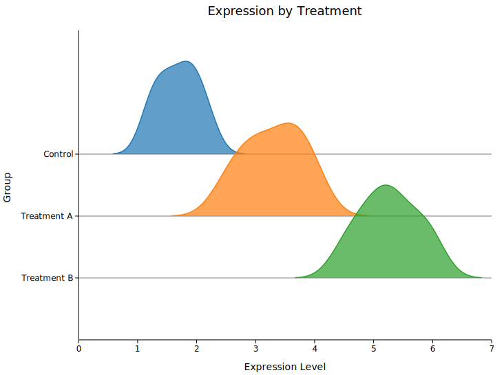
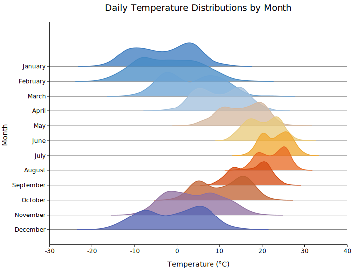

# Ridgeline Plot

A ridgeline plot (also called a joyplot) stacks multiple KDE density curves vertically — one per group. Groups are labelled on the y-axis; the x-axis is the continuous data range. Curves can overlap for the classic "mountain range" look.



---

## Basic usage

```rust,no_run
use kuva::plot::ridgeline::RidgelinePlot;
use kuva::render::plots::Plot;
use kuva::render::layout::Layout;
use kuva::render::render::render_multiple;
use kuva::backend::svg::SvgBackend;

let plot = RidgelinePlot::new()
    .with_group("Control",     vec![1.2, 1.5, 1.8, 2.0, 2.2, 1.9, 1.6, 1.3])
    .with_group("Treatment A", vec![2.5, 3.0, 3.5, 4.0, 3.8, 3.2, 2.8, 3.6])
    .with_group("Treatment B", vec![4.5, 5.0, 5.5, 6.0, 5.8, 5.2, 4.8, 5.3]);

let plots = vec![Plot::Ridgeline(plot)];
let layout = Layout::auto_from_plots(&plots)
    .with_title("Expression by Treatment")
    .with_x_label("Expression Level")
    .with_y_label("Group");
let svg = SvgBackend.render_scene(&render_multiple(plots, layout));
```


---

## Per-group colors — seasonal temperature example

`.with_group_color(label, data, color)` lets you assign an explicit color to each group. A cold-to-warm gradient across months gives the plot an intuitive thermal feel.

```rust,no_run
use kuva::plot::ridgeline::RidgelinePlot;
use kuva::render::plots::Plot;
use kuva::render::layout::Layout;
use kuva::render::render::render_multiple;
use kuva::backend::svg::SvgBackend;

// (month, mean °C, std-dev) for a temperate-climate city
let months = [
    ("January",   -3.0_f64, 5.0_f64),
    ("February",  -1.5,     5.5),
    ("March",      4.0,     5.0),
    ("April",     10.0,     4.0),
    ("May",       15.5,     3.5),
    ("June",      20.0,     3.0),
    ("July",      23.0,     2.5),
    ("August",    22.5,     2.5),
    ("September", 17.0,     3.0),
    ("October",   10.5,     4.0),
    ("November",   3.5,     5.0),
    ("December",  -1.0,     5.5),
];

// Blue → red gradient (cold → hot)
let colors = [
    "#3a7abf", "#4589c4", "#6ba3d4", "#a0bfdc",
    "#d4b8a0", "#e8c97a", "#f0a830", "#e86820",
    "#d44a10", "#c06030", "#9070a0", "#5060b0",
];

let mut plot = RidgelinePlot::new()
    .with_overlap(0.6)
    .with_opacity(0.75);

for (i, &(month, mean, std)) in months.iter().enumerate() {
    let data: Vec<f64> = vec![/* 200 samples from N(mean, std) */];
    plot = plot.with_group_color(month, data, colors[i]);
}

let plots = vec![Plot::Ridgeline(plot)];
let layout = Layout::auto_from_plots(&plots)
    .with_title("Daily Temperature Distributions by Month")
    .with_x_label("Temperature (°C)")
    .with_y_label("Month");
let svg = SvgBackend.render_scene(&render_multiple(plots, layout));
```



---

## CLI

```bash
kuva ridgeline samples.tsv --group-by group --value expression \
    --title "Ridgeline" --x-label "Expression"
```

---

## Builder reference

| Method | Default | Description |
|--------|---------|-------------|
| `.with_group(label, data)` | — | Append a group |
| `.with_group_color(label, data, color)` | — | Append a group with explicit color |
| `.with_groups(iter)` | — | Add multiple groups at once |
| `.with_filled(bool)` | `true` | Fill the area under each curve |
| `.with_opacity(f64)` | `0.7` | Fill opacity |
| `.with_overlap(f64)` | `0.5` | Fraction of cell height ridges may overlap |
| `.with_bandwidth(f64)` | Silverman | KDE bandwidth |
| `.with_kde_samples(usize)` | `200` | Number of KDE evaluation points |
| `.with_stroke_width(f64)` | `1.5` | Outline stroke width |
| `.with_normalize(bool)` | `false` | Use PDF normalization instead of visual scaling |
| `.with_legend(bool)` | `false` | Show a legend (y-axis labels are usually sufficient) |
| `.with_line_dash(str)` | — | SVG stroke-dasharray for dashed outline |
