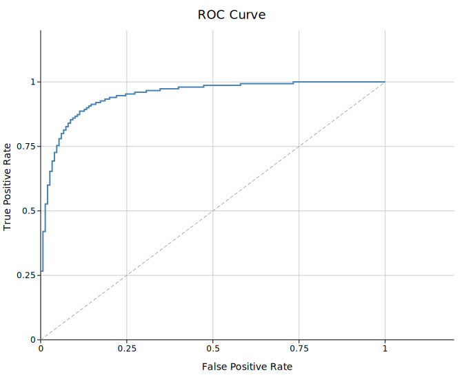
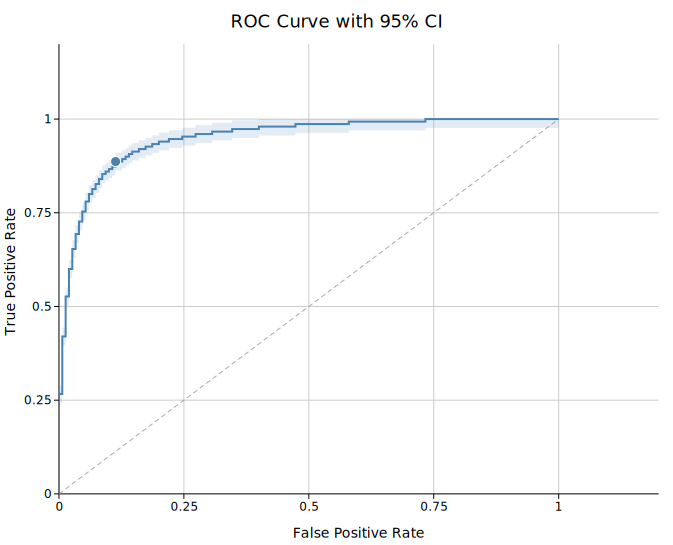
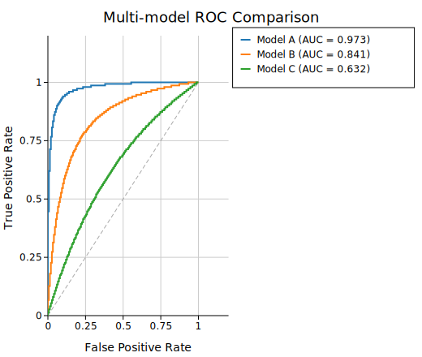
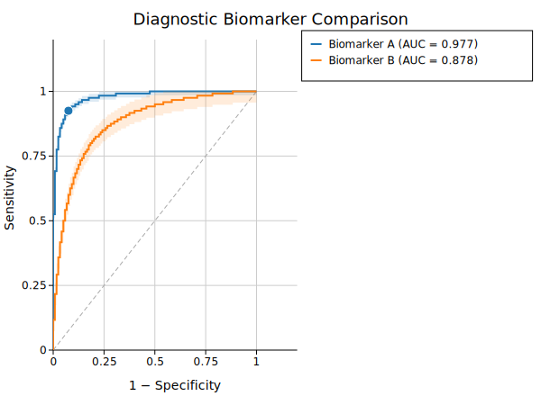

# ROC Curve

A Receiver Operating Characteristic (ROC) curve plots the true positive rate (sensitivity) against the false positive rate (1 − specificity) as the classification threshold is swept from high to low. The area under the curve (AUC) summarises discrimination ability in a single number; AUC = 1.0 is perfect, AUC = 0.5 is no better than chance.

`RocPlot` supports multiple classifiers on one canvas, DeLong 95% confidence intervals, Youden's J optimal threshold marker, and partial AUC restricted to a FPR sub-range.

**Import path:** `kuva::plot::{RocPlot, RocGroup}`

---

## Basic usage

Build one `RocGroup` per classifier using `.with_raw()`, which accepts `(score, bool)` pairs. Pass raw scores — `RocGroup` computes the curve and AUC internally.

```rust,no_run
use kuva::plot::{RocPlot, RocGroup};
use kuva::backend::svg::SvgBackend;
use kuva::render::render::render_multiple;
use kuva::render::layout::Layout;
use kuva::render::plots::Plot;

/// Deterministic (score, label) dataset from logistic quantiles.
/// n positive samples drawn from Logistic(+mu, scale),
/// n negative from Logistic(-mu, scale), mapped to [0,1] via sigmoid.
fn logistic_dataset(n: usize, mu: f64, scale: f64) -> Vec<(f64, bool)> {
    let mut data = Vec::with_capacity(2 * n);
    for i in 1..=n {
        let p = i as f64 / (n + 1) as f64;
        let logit = (p / (1.0 - p)).ln();
        let pos = 1.0 / (1.0 + (-(mu + scale * logit)).exp());
        let neg = 1.0 / (1.0 + (-(-mu + scale * logit)).exp());
        data.push((pos, true));
        data.push((neg, false));
    }
    data
}

let group = RocGroup::new("Classifier")
    .with_raw(logistic_dataset(150, 1.0, 0.5));

let roc = RocPlot::new().with_group(group);

let plots = vec![Plot::Roc(roc)];
let layout = Layout::auto_from_plots(&plots)
    .with_title("ROC Curve")
    .with_x_label("False Positive Rate")
    .with_y_label("True Positive Rate");

let scene = render_multiple(plots, layout);
let svg = SvgBackend.render_scene(&scene);
std::fs::write("roc.svg", svg).unwrap();
```



The AUC is shown in the legend by default. The dashed diagonal represents a random classifier (AUC = 0.5). Both can be suppressed — see the API reference below.

---

## DeLong 95% confidence interval

`.with_ci(true)` on a `RocGroup` shades the DeLong 95% CI band around the curve. The DeLong estimator is computed from the raw `(score, label)` pairs and requires no bootstrap.

```rust,no_run
# use kuva::plot::{RocPlot, RocGroup};
# use kuva::render::plots::Plot;
# fn logistic_dataset(n: usize, mu: f64, scale: f64) -> Vec<(f64, bool)> { vec![] }
let group = RocGroup::new("Classifier")
    .with_raw(logistic_dataset(150, 1.0, 0.5))
    .with_ci(true)
    .with_optimal_point();   // also mark the Youden J point

let roc = RocPlot::new().with_group(group);
let plots = vec![Plot::Roc(roc)];
```



`.with_ci_alpha(f)` controls the band opacity (default `0.15`). The CI is only available with `.with_raw()` input — pre-computed point data uses only the trapezoidal AUC, and the CI is not shown.

---

## Optimal threshold (Youden's J)

`.with_optimal_point()` marks the threshold that maximises Youden's J statistic, defined as J = TPR − FPR. The marked point gives the operating point with the best trade-off between sensitivity and specificity.

```rust,no_run
# use kuva::plot::{RocPlot, RocGroup};
# use kuva::render::plots::Plot;
# fn logistic_dataset(n: usize, mu: f64, scale: f64) -> Vec<(f64, bool)> { vec![] }
let group = RocGroup::new("Biomarker A")
    .with_raw(logistic_dataset(120, 1.1, 0.45))
    .with_optimal_point();
```

The marker is rendered as a filled circle. Its (FPR, TPR) coordinates correspond to the sensitivity and specificity at that threshold: sensitivity = TPR, specificity = 1 − FPR.

To display the exact numeric values, combine with a stats box (see [Stats Box](../reference/stats_box.md)):

```rust,no_run
use kuva::render::layout::Layout;
use kuva::plot::legend::LegendPosition;
# use kuva::render::plots::Plot;
# let plots: Vec<Plot> = vec![];

// After computing sensitivity/specificity at your chosen threshold:
let layout = Layout::auto_from_plots(&plots)
    .with_title("Biomarker")
    .with_x_label("1 − Specificity")
    .with_y_label("Sensitivity")
    .with_stats_box_at(
        LegendPosition::InsideBottomRight,
        vec!["Sensitivity = 0.843", "Specificity = 0.779"],
    );
```

---

## Multi-model comparison

Add one `RocGroup` per model. Colors are drawn automatically from the palette; attach `.with_legend()` on the `RocPlot` to show a legend title.

```rust,no_run
use kuva::plot::{RocPlot, RocGroup};
use kuva::backend::svg::SvgBackend;
use kuva::render::render::render_multiple;
use kuva::render::layout::Layout;
use kuva::render::plots::Plot;

# fn logistic_dataset(n: usize, mu: f64, scale: f64) -> Vec<(f64, bool)> { vec![] }
let g1 = RocGroup::new("Model A").with_raw(logistic_dataset(150, 1.2, 0.5));
let g2 = RocGroup::new("Model B").with_raw(logistic_dataset(150, 0.6, 0.5));
let g3 = RocGroup::new("Model C").with_raw(logistic_dataset(150, 0.2, 0.5));

let roc = RocPlot::new()
    .with_group(g1)
    .with_group(g2)
    .with_group(g3)
    .with_legend("Classifier");

let plots = vec![Plot::Roc(roc)];
let layout = Layout::auto_from_plots(&plots)
    .with_title("Multi-model ROC Comparison")
    .with_x_label("False Positive Rate")
    .with_y_label("True Positive Rate");

let svg = SvgBackend.render_scene(&render_multiple(plots, layout));
```



Each entry in the legend automatically appends the AUC value (e.g. `Model A (AUC = 0.88)`). Suppress this with `.with_auc_label(false)` on any group.

---

## Diagnostic biomarker comparison with CI

A common bioinformatics use case: comparing two biomarkers on the same cohort with confidence bands to assess whether the difference in AUC is meaningful.

```rust,no_run
use kuva::plot::{RocPlot, RocGroup};
use kuva::backend::svg::SvgBackend;
use kuva::render::render::render_multiple;
use kuva::render::layout::Layout;
use kuva::render::plots::Plot;

# fn logistic_dataset(n: usize, mu: f64, scale: f64) -> Vec<(f64, bool)> { vec![] }
let g1 = RocGroup::new("Biomarker A")
    .with_raw(logistic_dataset(120, 1.1, 0.45))
    .with_ci(true)
    .with_optimal_point();

let g2 = RocGroup::new("Biomarker B")
    .with_raw(logistic_dataset(120, 0.7, 0.5))
    .with_ci(true);

let roc = RocPlot::new()
    .with_group(g1)
    .with_group(g2)
    .with_legend("Biomarker");

let plots = vec![Plot::Roc(roc)];
let layout = Layout::auto_from_plots(&plots)
    .with_title("Diagnostic Biomarker Comparison")
    .with_x_label("1 − Specificity")
    .with_y_label("Sensitivity");

let svg = SvgBackend.render_scene(&render_multiple(plots, layout));
```



---

## Partial AUC

`.with_pauc(fpr_lo, fpr_hi)` restricts the AUC calculation to a FPR sub-range. This is useful in clinical settings where only low false-positive-rate operating points are clinically relevant. The partial AUC is normalised to the width of the range so that a perfect classifier still gives 1.0.

```rust,no_run
# use kuva::plot::{RocPlot, RocGroup};
# use kuva::render::plots::Plot;
# fn logistic_dataset(n: usize, mu: f64, scale: f64) -> Vec<(f64, bool)> { vec![] }

// Restrict AUC to the clinically relevant FPR ∈ [0, 0.2] region
let group = RocGroup::new("Classifier")
    .with_raw(logistic_dataset(150, 1.0, 0.5))
    .with_pauc(0.0, 0.2);

let roc = RocPlot::new().with_group(group);
let plots = vec![Plot::Roc(roc)];
```

The legend shows `pAUC (0.0–0.2) = …` when a pAUC range is set.

---

## Pre-computed (FPR, TPR) points

If you have already computed the ROC curve externally (e.g. from Python's `sklearn.metrics.roc_curve`), pass the points directly. AUC is estimated via the trapezoidal rule; DeLong CI is not available for pre-computed input.

```rust,no_run
# use kuva::plot::{RocPlot, RocGroup};
# use kuva::render::plots::Plot;

// (fpr, tpr) points already sorted by increasing FPR
let points = vec![
    (0.00, 0.00),
    (0.05, 0.42),
    (0.10, 0.61),
    (0.20, 0.78),
    (0.35, 0.88),
    (0.50, 0.93),
    (0.75, 0.97),
    (1.00, 1.00),
];

let group = RocGroup::new("External classifier")
    .with_points(points);

let roc = RocPlot::new().with_group(group);
let plots = vec![Plot::Roc(roc)];
```

---

## Line style

Differentiate classifiers in greyscale publications using custom stroke styles on individual groups:

```rust,no_run
# use kuva::plot::{RocPlot, RocGroup};
# use kuva::render::plots::Plot;
# fn logistic_dataset(n: usize, mu: f64, scale: f64) -> Vec<(f64, bool)> { vec![] }

let g1 = RocGroup::new("Model A")
    .with_raw(logistic_dataset(150, 1.2, 0.5))
    .with_color("black")
    .with_line_width(2.5);

let g2 = RocGroup::new("Model B")
    .with_raw(logistic_dataset(150, 0.6, 0.5))
    .with_color("black")
    .with_line_width(1.5)
    .with_dasharray("8 4");

let roc = RocPlot::new().with_group(g1).with_group(g2);
let plots = vec![Plot::Roc(roc)];
```

---

## RocPlot API reference

### `RocPlot` builders

| Method | Default | Description |
|--------|---------|-------------|
| `RocPlot::new()` | — | Create a new ROC plot |
| `.with_group(RocGroup)` | — | Add one classifier group |
| `.with_groups(iter)` | — | Add multiple groups at once |
| `.with_color(css)` | `"steelblue"` | Fallback color when groups have no explicit color |
| `.with_diagonal(bool)` | `true` | Show the random-classifier reference diagonal |
| `.with_legend(label)` | — | Legend title (shown when groups have labels) |

### `RocGroup` builders

| Method | Default | Description |
|--------|---------|-------------|
| `RocGroup::new(label)` | — | Create a group with a display label |
| `.with_raw(iter)` | — | Raw `(score: f64, label: bool)` predictions; computes curve and AUC internally |
| `.with_points(iter)` | — | Pre-computed `(fpr, tpr)` points; trapezoidal AUC only |
| `.with_color(css)` | palette | Curve and band color |
| `.with_ci(bool)` | `false` | Overlay DeLong 95% CI band (requires `.with_raw()`) |
| `.with_ci_alpha(f)` | `0.15` | CI band opacity |
| `.with_pauc(lo, hi)` | — | Restrict AUC to FPR ∈ `[lo, hi]`, normalised to range width |
| `.with_optimal_point()` | — | Mark the Youden's J optimal threshold point |
| `.with_auc_label(bool)` | `true` | Append `AUC = …` to the legend entry |
| `.with_line_width(px)` | `2.0` | Curve stroke width |
| `.with_dasharray(s)` | — | SVG stroke-dasharray string (e.g. `"8 4"`) |
