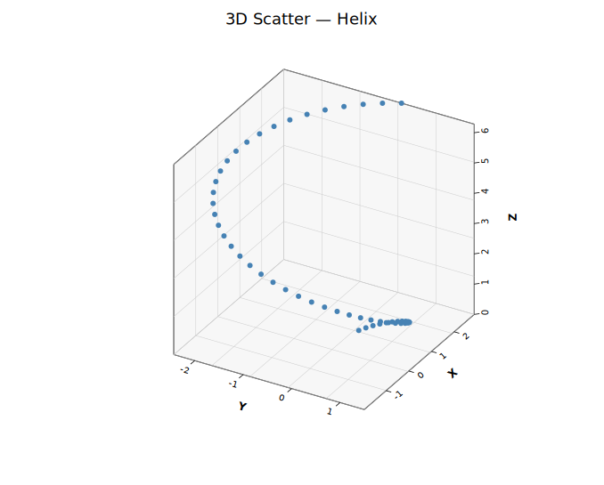
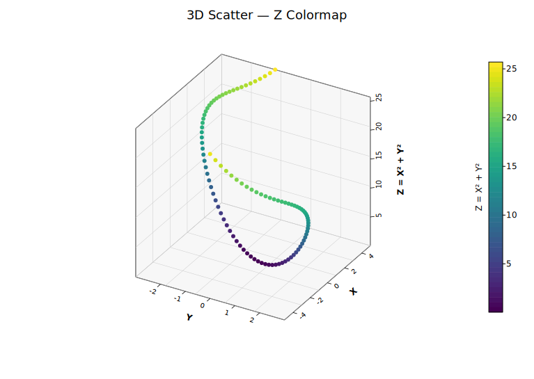
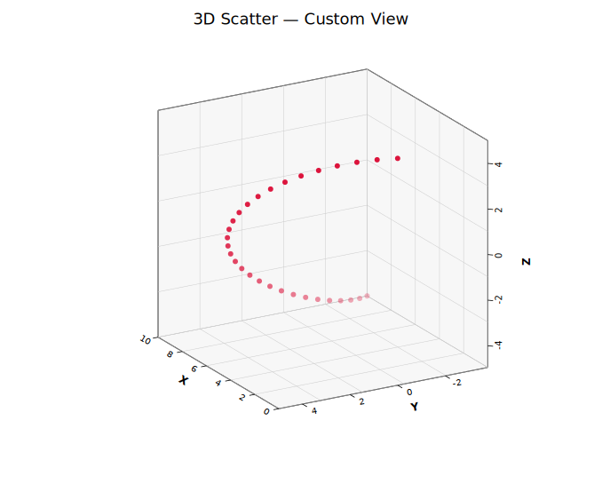

# 3D Scatter Plot

Renders 3D point data using orthographic projection with a depth-sorted painter's algorithm. Points are projected onto a 2D canvas with a matplotlib-style open-box wireframe, back-pane fills, and grid lines on all three back walls. Supports z-colormap coloring, depth shading, per-point colors and sizes, and six marker shapes.

**Import path:** `kuva::plot::scatter3d::Scatter3DPlot`

---

## Basic usage

Pass `(x, y, z)` tuples via `with_data()`:

```rust,no_run
use kuva::plot::scatter3d::Scatter3DPlot;
use kuva::backend::svg::SvgBackend;
use kuva::render::render::render_multiple;
use kuva::render::layout::Layout;
use kuva::render::plots::Plot;

let scatter = Scatter3DPlot::new()
    .with_data(vec![(1.0, 2.0, 3.0), (4.0, 5.0, 6.0), (7.0, 8.0, 9.0)])
    .with_color("steelblue")
    .with_x_label("X")
    .with_y_label("Y")
    .with_z_label("Z");

let plots = vec![Plot::Scatter3D(scatter)];
let layout = Layout::auto_from_plots(&plots).with_title("3D Scatter");

let scene = render_multiple(plots, layout);
let svg = SvgBackend.render_scene(&scene);
std::fs::write("scatter3d.svg", svg).unwrap();
```



---

## Z-colormap

Color points by their Z value using a colormap. A colorbar is rendered automatically alongside the plot:

```rust,no_run
# use kuva::plot::scatter3d::Scatter3DPlot;
# use kuva::plot::heatmap::ColorMap;
let scatter = Scatter3DPlot::new()
    .with_data(vec![(1.0, 2.0, 3.0), (4.0, 5.0, 6.0)])
    .with_z_colormap(ColorMap::Viridis)
    .with_z_label("Z");   // also labels the colorbar
```

Available colormaps: `Viridis`, `Inferno`, `Grayscale`, `Custom`.



---

## Custom view angles

Adjust the camera position with azimuth and elevation. Enable `with_depth_shade()` to fade distant points as an additional depth cue:

```rust,no_run
# use kuva::plot::scatter3d::Scatter3DPlot;
let scatter = Scatter3DPlot::new()
    .with_data(vec![(1.0, 2.0, 3.0)])
    .with_azimuth(-120.0)
    .with_elevation(20.0)
    .with_depth_shade();
```

Alternatively, pass a `View3D` struct directly:

```rust,no_run
# use kuva::plot::scatter3d::Scatter3DPlot;
# use kuva::plot::plot3d::View3D;
let scatter = Scatter3DPlot::new()
    .with_data(vec![(1.0, 2.0, 3.0)])
    .with_view(View3D { azimuth: -120.0, elevation: 20.0 });
```



---

## Per-point colors and sizes

```rust,no_run
# use kuva::plot::scatter3d::Scatter3DPlot;
let data = vec![(0.0, 0.0, 0.0), (1.0, 1.0, 1.0), (2.0, 2.0, 2.0)];
let scatter = Scatter3DPlot::new()
    .with_data(data)
    .with_colors(vec!["crimson", "steelblue", "seagreen"])
    .with_sizes(vec![4.0, 6.0, 8.0]);
```

---

## Builder reference

| Method | Default | Description |
|---|---|---|
| `.with_data(iter)` | — | Set `(x, y, z)` data points |
| `.with_points(vec)` | — | Set data as `Vec<Scatter3DPoint>` |
| `.with_color(css)` | `"steelblue"` | Uniform point color |
| `.with_size(px)` | `3.0` | Marker radius in pixels |
| `.with_marker(shape)` | `Circle` | Marker shape (`Circle`, `Square`, `Triangle`, `Diamond`, `Cross`, `Plus`) |
| `.with_colors(iter)` | — | Per-point colors (overrides `with_color`) |
| `.with_sizes(vec)` | — | Per-point radii (overrides `with_size`) |
| `.with_marker_opacity(f)` | — | Fill opacity (0.0–1.0) |
| `.with_marker_stroke_width(w)` | — | Stroke width around markers |
| `.with_z_colormap(map)` | — | Color by Z value; renders a colorbar automatically |
| `.with_depth_shade()` | off | Fade distant points for depth cue |
| `.with_azimuth(deg)` | `-60.0` | Horizontal viewing angle |
| `.with_elevation(deg)` | `30.0` | Vertical viewing angle |
| `.with_view(View3D)` | — | Set azimuth and elevation together |
| `.with_x_label(s)` | — | X-axis label |
| `.with_y_label(s)` | — | Y-axis label |
| `.with_z_label(s)` | — | Z-axis label (also labels the colorbar) |
| `.with_no_grid()` | grid on | Hide grid lines on back walls |
| `.with_no_box()` | box on | Hide the wireframe bounding box |
| `.with_grid_lines(n)` | `5` | Number of grid/tick divisions per axis |
| `.with_z_axis_right(bool)` | auto | Force Z axis to right (`true`) or left (`false`) |
| `.with_z_axis_auto()` | — | Reset to automatic placement (default) |
| `.with_legend(s)` | — | Legend entry label |

---

## CLI

```bash
# Basic
kuva scatter3d data.tsv --x x --y y --z z \
    --title "3D Scatter" --x-label "X" --y-label "Y" --z-label "Z"

# Group colors with legend
kuva scatter3d data.tsv --x x --y y --z z --color-by group

# Z colormap with depth shading
kuva scatter3d data.tsv --x x --y y --z z \
    --z-color viridis --depth-shade

# Custom view, no grid
kuva scatter3d data.tsv --x x --y y --z z \
    --azimuth -120 --elevation 20 --no-grid --no-box
```

### CLI flags

| Flag | Default | Description |
|---|---|---|
| `--x <COL>` | `0` | X value column |
| `--y <COL>` | `1` | Y value column |
| `--z <COL>` | `2` | Z value column |
| `--color-by <COL>` | — | One color per unique group value |
| `--color <CSS>` | `steelblue` | Uniform point color |
| `--size <PX>` | `3.0` | Marker radius |
| `--z-color <MAP>` | — | Color by Z: `viridis`, `inferno`, `grayscale` |
| `--depth-shade` | off | Fade distant points |
| `--azimuth <DEG>` | `-60` | Horizontal viewing angle |
| `--elevation <DEG>` | `30` | Vertical viewing angle |
| `--x-label <S>` | — | X-axis label |
| `--y-label <S>` | — | Y-axis label |
| `--z-label <S>` | — | Z-axis label |
| `--no-grid` | grid on | Hide back-wall grid lines |
| `--no-box` | box on | Hide wireframe bounding box |
| `--grid-lines <N>` | `5` | Grid/tick divisions per axis |
| `--z-axis-left` | auto | Force Z axis to the left side |
