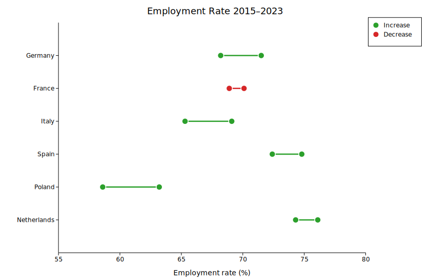
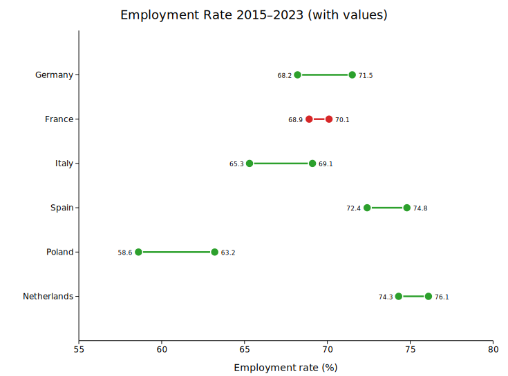
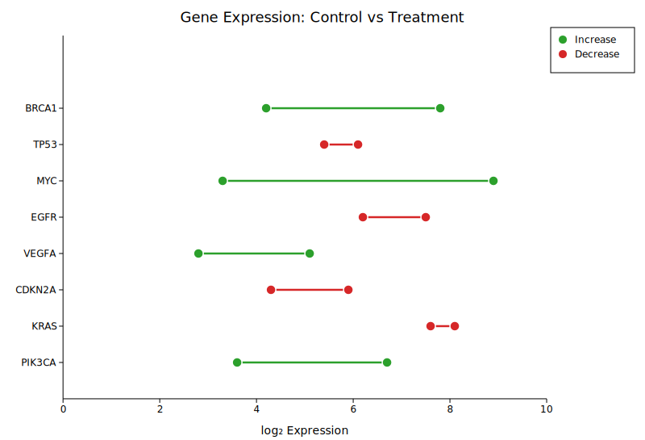
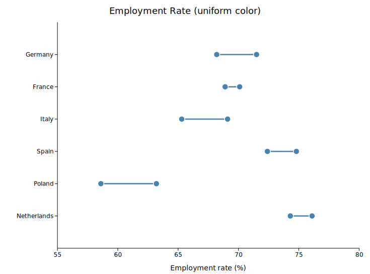

# Slope Chart

A slope chart (also called a dumbbell plot or connected dot plot) displays how a numeric value changes between two timepoints or conditions for a set of labelled entities. Each row shows:

- A dot at the **before** (left) value
- A dot at the **after** (right) value
- A connecting horizontal segment

By default, the segment and dots are coloured **green** when the value increases and **red** when it decreases, making trends immediately apparent at a glance.

Slope charts are a compact alternative to grouped bar charts when you want to emphasise change rather than absolute magnitude.

**Import path:** `kuva::plot::slope::{SlopePlot, SlopePoint, SlopeValueFormat}`

---

## Basic usage

```rust,no_run
use kuva::plot::slope::SlopePlot;
use kuva::backend::svg::SvgBackend;
use kuva::render::render::render_multiple;
use kuva::render::layout::Layout;
use kuva::render::plots::Plot;

let sp = SlopePlot::new()
    .with_before_label("2015")
    .with_after_label("2023")
    .with_point("Germany",     68.2, 71.5)
    .with_point("France",      70.1, 68.9)
    .with_point("Italy",       65.3, 69.1)
    .with_point("Spain",       72.4, 74.8)
    .with_point("Poland",      58.6, 63.2)
    .with_point("Netherlands", 74.3, 76.1)
    .with_legend("Direction");

let plots = vec![Plot::Slope(sp)];
let layout = Layout::auto_from_plots(&plots)
    .with_title("Employment Rate 2015–2023")
    .with_x_label("Employment rate (%)");

let scene = render_multiple(plots, layout);
let svg = SvgBackend.render_scene(&scene);
std::fs::write("slope.svg", svg).unwrap();
```



The legend shows "Increase" and "Decrease" entries when `color_by_direction` is enabled (the default).

---

## Showing numeric labels

Use `.with_values(true)` to render a label beside each dot showing the raw value.

```rust,no_run
# use kuva::plot::slope::SlopePlot;
# use kuva::render::plots::Plot;
let sp = SlopePlot::new()
    .with_before_label("2015")
    .with_after_label("2023")
    .with_point("Germany", 68.2, 71.5)
    // ... more rows ...
    .with_values(true);
```



The default format (`SlopeValueFormat::Auto`) shows integers without a decimal point and drops trailing zeros for fractional values. Use `SlopeValueFormat::Fixed(n)` for a fixed number of decimal places or `SlopeValueFormat::Integer` to always round to the nearest integer.

---

## Bioinformatics example: gene expression

Slope charts are well-suited to before/after comparisons in differential expression data.

```rust,no_run
# use kuva::plot::slope::SlopePlot;
# use kuva::render::plots::Plot;
let sp = SlopePlot::new()
    .with_before_label("Control")
    .with_after_label("Treatment")
    .with_point("BRCA1",  4.2, 7.8)
    .with_point("TP53",   6.1, 5.4)
    .with_point("MYC",    3.3, 8.9)
    .with_point("EGFR",   7.5, 6.2)
    .with_point("VEGFA",  2.8, 5.1)
    .with_point("CDKN2A", 5.9, 4.3)
    .with_legend("Direction");
```



---

## Uniform color

Turn off direction-based coloring with `.with_direction_colors(false)` and supply a single CSS color via `.with_color()`.

```rust,no_run
# use kuva::plot::slope::SlopePlot;
# use kuva::render::plots::Plot;
let sp = SlopePlot::new()
    .with_direction_colors(false)
    .with_color("steelblue")
    .with_point("Germany",     68.2, 71.5)
    .with_point("France",      70.1, 68.9);
```



---

## Per-group color override

Supply one color per row via `.with_group_colors()`. When set, these take precedence over both direction coloring and the uniform `color` field.

```rust,no_run
# use kuva::plot::slope::SlopePlot;
# use kuva::render::plots::Plot;
let sp = SlopePlot::new()
    .with_group_colors(["#e41a1c", "#377eb8", "#4daf4a"])
    .with_point("A", 10.0, 15.0)
    .with_point("B", 20.0, 18.0)
    .with_point("C", 30.0, 35.0);
```

---

## API reference

### `SlopePlot` builder methods

| Method | Default | Description |
|--------|---------|-------------|
| `with_point(label, before, after)` | — | Add a single row. |
| `with_points(iter)` | — | Add rows from an iterator of `(label, before, after)`. |
| `with_before_label(s)` | `None` | Column header for the left endpoint, drawn above the plot. |
| `with_after_label(s)` | `None` | Column header for the right endpoint, drawn above the plot. |
| `with_color_up(s)` | `"#2ca02c"` | Color when `after > before` (direction mode). |
| `with_color_down(s)` | `"#d62728"` | Color when `after < before` (direction mode). |
| `with_color_flat(s)` | `"#aaaaaa"` | Color when `after == before` (direction mode). |
| `with_direction_colors(bool)` | `true` | Toggle direction-based coloring. |
| `with_color(s)` | `"steelblue"` | Uniform color used when `color_by_direction = false`. |
| `with_group_colors(iter)` | `None` | Per-row color overrides. Indexed by row order. |
| `with_dot_radius(f64)` | `6.0` | Dot radius in pixels. |
| `with_line_width(f64)` | `2.5` | Connecting segment stroke width in pixels. |
| `with_dot_opacity(f64)` | `1.0` | Dot fill opacity. |
| `with_line_opacity(f64)` | `0.7` | Connecting segment stroke opacity. |
| `with_values(bool)` | `false` | Show numeric labels beside each dot. |
| `with_value_format(fmt)` | `Auto` | Format for value labels. |
| `with_legend(s)` | `None` | Enable legend; title string is passed as the trigger. |

### `SlopeValueFormat` variants

| Variant | Behaviour |
|---------|-----------|
| `Auto` | Integers displayed without decimal point; trailing zeros stripped for floats. |
| `Fixed(n)` | Exactly `n` decimal places. |
| `Integer` | Round to the nearest integer (`{:.0}` format). |
