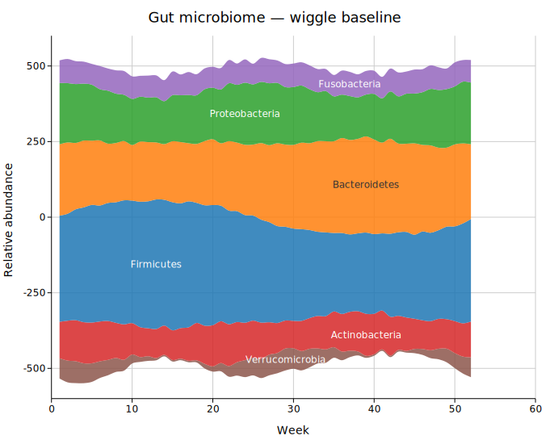
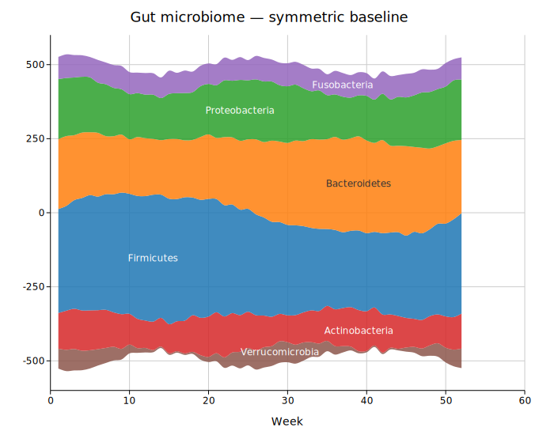
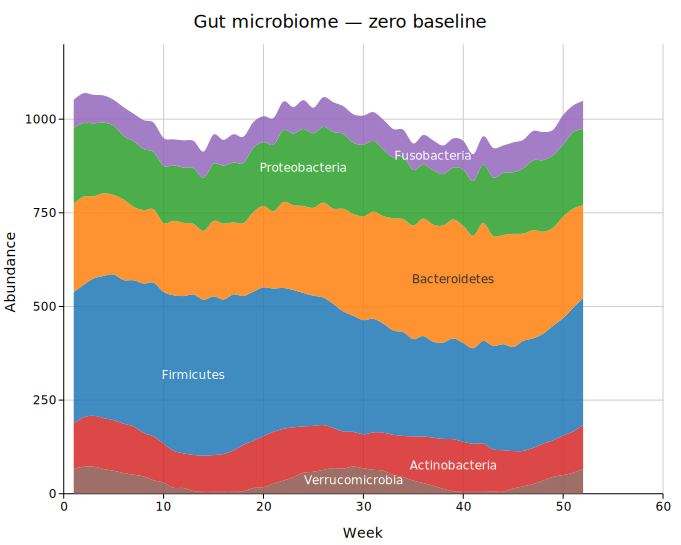
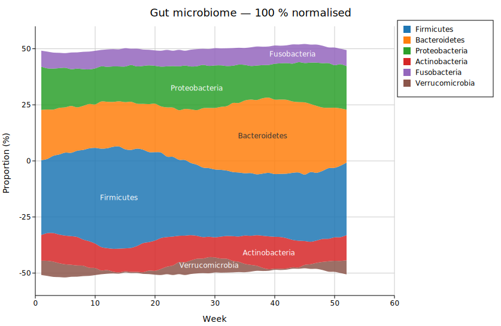
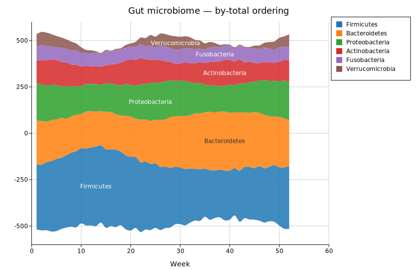
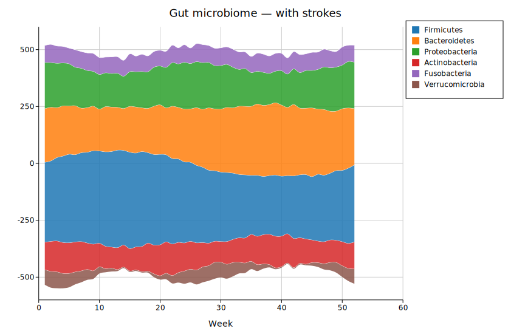
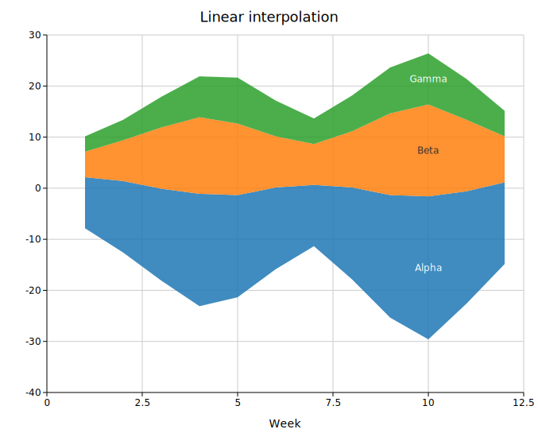

# Streamgraph

A streamgraph is a flowing stacked area chart with a displaced baseline. Instead of stacking series from y = 0, the baseline is shifted so the total shape undulates organically around a central axis. This makes it significantly easier to read when there are many overlapping series — the eye can track individual bands as they widen and narrow over time.

**Import path:** `kuva::plot::StreamgraphPlot`

---

## Wiggle baseline (default)

The Byron & Wattenberg (2008) wiggle algorithm positions the baseline to minimise the sum of squared slopes across all layer boundaries, keeping the silhouette as flat as possible. This is the canonical "streamgraph" look.

```rust,no_run
use kuva::plot::StreamgraphPlot;
use kuva::backend::svg::SvgBackend;
use kuva::render::render::render_multiple;
use kuva::render::layout::Layout;
use kuva::render::plots::Plot;
use kuva::render::palette::Palette;

let pal = Palette::category10();
let weeks: Vec<f64> = (1..=52).map(|w| w as f64).collect();

let sg = StreamgraphPlot::new()
    .with_x(weeks)
    .with_series(firmicutes).with_color(pal[0].to_string()).with_label("Firmicutes")
    .with_series(bacteroidetes).with_color(pal[1].to_string()).with_label("Bacteroidetes")
    // … more series …
    ;

let plots = vec![Plot::Streamgraph(sg)];
let layout = Layout::auto_from_plots(&plots)
    .with_title("Gut microbiome — wiggle baseline")
    .with_x_label("Week");

let svg = SvgBackend.render_scene(&render_multiple(plots, layout));
```



---

## Symmetric baseline (ThemeRiver)

`.with_baseline(StreamBaseline::Symmetric)` centres the total stack symmetrically around y = 0 at every x. The silhouette mirrors above and below the axis, giving a clear "river" aesthetic.

```rust,no_run
# use kuva::plot::StreamgraphPlot;
# use kuva::render::plots::Plot;
use kuva::plot::streamgraph::StreamBaseline;

let sg = StreamgraphPlot::new()
    /* … data … */
    .with_baseline(StreamBaseline::Symmetric);
```



---

## Zero baseline

`.with_baseline(StreamBaseline::Zero)` stacks from y = 0 — this is equivalent to a regular stacked area chart but with Catmull-Rom smooth curves.



---

## 100 % normalised

`.with_normalized()` rescales each column to sum to 100 %, revealing proportional composition rather than absolute magnitude. Combines well with `.with_legend("")` since the y-axis no longer has meaningful units.

```rust,no_run
# use kuva::plot::StreamgraphPlot;
# use kuva::render::plots::Plot;
let sg = StreamgraphPlot::new()
    /* … data … */
    .with_normalized()
    .with_legend("");
```



---

## Layer ordering

Three orderings control which series ends up in the centre vs at the edges:

| Method | Effect |
|--------|--------|
| `.with_order(StreamOrder::InsideOut)` | **Default.** Widest streams near the centre, alternating outward. Best visual balance. |
| `.with_order(StreamOrder::ByTotal)` | Sort by total area descending; largest at the bottom. |
| `.with_order(StreamOrder::Original)` | Preserve the order series were added. |

```rust,no_run
# use kuva::plot::StreamgraphPlot;
# use kuva::render::plots::Plot;
use kuva::plot::streamgraph::StreamOrder;

let sg = StreamgraphPlot::new()
    /* … data … */
    .with_order(StreamOrder::ByTotal)
    .with_legend("Phylum");
```



---

## Inter-stream strokes

`.with_stroke()` draws a thin white line along the upper edge of each band, improving legibility when adjacent streams have similar hues.

```rust,no_run
# use kuva::plot::StreamgraphPlot;
# use kuva::render::plots::Plot;
let sg = StreamgraphPlot::new()
    /* … data … */
    .with_stroke()
    .with_stream_labels(false)  // strokes + legend instead of inline labels
    .with_legend("");
```



---

## Linear interpolation

`.with_linear()` disables Catmull-Rom smoothing and uses straight line segments. This gives the familiar angular stacked-area look, useful when the x values are very closely spaced or when sharp transitions should be preserved.



---

## Builder reference

| Method | Default | Description |
|--------|---------|-------------|
| `.with_x(iter)` | — | Shared x values for all series |
| `.with_series(iter)` | — | Append a series; chain `.with_color()` and `.with_label()` |
| `.with_color(css)` | palette | Fill color of the most recently added series |
| `.with_label(str)` | — | Inline label of the most recently added series |
| `.with_baseline(b)` | `Wiggle` | `Wiggle`, `Symmetric`, `Zero` |
| `.with_order(o)` | `InsideOut` | `InsideOut`, `ByTotal`, `Original` |
| `.with_linear()` | — | Disable Catmull-Rom splines (use straight segments) |
| `.with_fill_opacity(f)` | `0.85` | Fill opacity (0–1) |
| `.with_stroke()` | off | Draw white separator strokes between streams |
| `.with_stroke_width(f)` | `0.8` | Width of separator strokes |
| `.with_stream_labels(bool)` | `true` | Show/hide inline stream labels |
| `.with_min_label_height(f)` | `14.0` | Minimum band height (px) before label is drawn |
| `.with_normalized()` | off | 100 % column normalisation |
| `.with_legend(title)` | — | Enable legend box; `""` for no title |
| `.with_legend_position(pos)` | `OutsideRightTop` | Legend placement |

---

## CLI

```bash
# Default wiggle streamgraph
kuva streamgraph data.tsv --title "My streamgraph"

# Symmetric baseline, normalised
kuva streamgraph data.tsv --baseline symmetric --normalize

# Linear segments with strokes
kuva streamgraph data.tsv --linear --stroke --no-labels

# Custom columns
kuva streamgraph data.tsv --x-col week --group-col phylum --y-col abundance
```

### CLI flags

| Flag | Default | Description |
|------|---------|-------------|
| `--x-col <COL>` | `0` | X-axis column |
| `--group-col <COL>` | `1` | Group/category column |
| `--y-col <COL>` | `2` | Value column |
| `--baseline <S>` | `wiggle` | `wiggle`, `symmetric`, `zero` |
| `--order <S>` | `inside-out` | `inside-out`, `by-total`, `original` |
| `--linear` | off | Use straight line segments |
| `--normalize` | off | 100 % normalisation |
| `--stroke` | off | White inter-stream strokes |
| `--no-labels` | — | Hide inline labels |
| `--min-label-height <F>` | `14.0` | Minimum band height for labels |
| `--fill-opacity <F>` | `0.85` | Fill opacity |

---

*See also: [Shared flags](../cli/index.md#shared-flags) — output, appearance, axes.*
