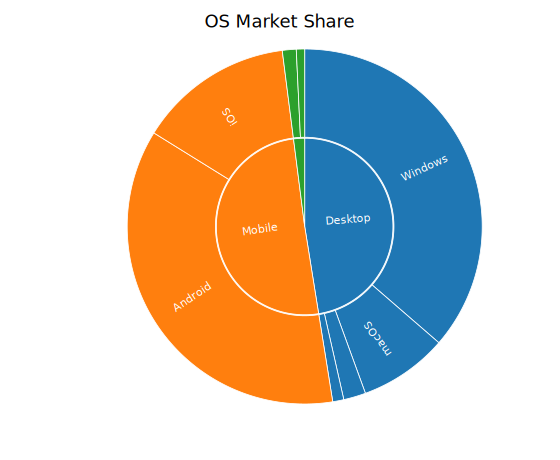

# Sunburst Chart

A sunburst chart displays hierarchical data as concentric rings. Each ring represents one depth level; arc widths within a ring are proportional to node values. Uses the same `TreemapNode` data model as the `TreemapPlot`.

**Import path:** `kuva::plot::sunburst::SunburstPlot`, `kuva::plot::sunburst::SunburstColorMode`, `kuva::plot::treemap::TreemapNode`, `kuva::plot::ColorMap`

---

## Basic usage

```rust,no_run
use kuva::plot::sunburst::SunburstPlot;
use kuva::plot::treemap::TreemapNode;
use kuva::backend::svg::SvgBackend;
use kuva::render::render::render_multiple;
use kuva::render::layout::Layout;
use kuva::render::plots::Plot;

let plot = SunburstPlot::new()
    .with_node(TreemapNode::new("Root", vec![
        TreemapNode::leaf("A", 30.0),
        TreemapNode::leaf("B", 45.0),
        TreemapNode::leaf("C", 25.0),
    ]));

let plots = vec![Plot::Sunburst(plot)];
let layout = Layout::auto_from_plots(&plots).with_title("Sunburst");
let svg = SvgBackend.render_scene(&render_multiple(plots, layout));
std::fs::write("sunburst.svg", svg).unwrap();
```



---

## Hierarchical data (multiple levels)

Use `TreemapNode::new(label, children)` for inner nodes. Values auto-sum from children when `value = 0.0`.

```rust,no_run
# use kuva::plot::sunburst::SunburstPlot;
# use kuva::plot::treemap::TreemapNode;
# use kuva::render::{plots::Plot, layout::Layout, render::render_multiple};
# use kuva::backend::svg::SvgBackend;
let plot = SunburstPlot::new()
    .with_node(TreemapNode::new("Animals", vec![
        TreemapNode::new("Mammals", vec![
            TreemapNode::leaf("Dog",  40.0),
            TreemapNode::leaf("Cat",  35.0),
            TreemapNode::leaf("Bear", 25.0),
        ]),
        TreemapNode::new("Birds", vec![
            TreemapNode::leaf("Eagle",  60.0),
            TreemapNode::leaf("Parrot", 40.0),
        ]),
    ]));
```

---

## Multiple roots (forest)

Multiple root nodes share the innermost ring, each receiving a distinct category color.

```rust,no_run
# use kuva::plot::sunburst::SunburstPlot;
# use kuva::plot::treemap::TreemapNode;
let plot = SunburstPlot::new()
    .with_children("Frontend", vec![
        TreemapNode::leaf("React", 50.0),
        TreemapNode::leaf("Vue",   30.0),
        TreemapNode::leaf("Svelte", 20.0),
    ])
    .with_children("Backend", vec![
        TreemapNode::leaf("Rust",   40.0),
        TreemapNode::leaf("Go",     35.0),
        TreemapNode::leaf("Python", 25.0),
    ]);
```

---

## Donut style

Set `.with_inner_radius(frac)` where `frac` is the fractional inner hole size (`0.0` = solid disc, `0.3` = 30% hole).

```rust,no_run
# use kuva::plot::sunburst::SunburstPlot;
# use kuva::plot::treemap::TreemapNode;
let plot = SunburstPlot::new()
    .with_node(TreemapNode::new("Root", vec![
        TreemapNode::leaf("A", 40.0),
        TreemapNode::leaf("B", 35.0),
        TreemapNode::leaf("C", 25.0),
    ]))
    .with_inner_radius(0.35);   // 35% inner hole
```

---

## Color modes

### By parent (default)

Each root node gets a distinct category10 color; descendants inherit it.

```rust,no_run
# use kuva::plot::sunburst::{SunburstPlot, SunburstColorMode};
# use kuva::plot::treemap::TreemapNode;
let plot = SunburstPlot::new()
    .with_children("Group A", vec![
        TreemapNode::leaf("X", 40.0),
        TreemapNode::leaf("Y", 60.0),
    ])
    .with_color_mode(SunburstColorMode::ByParent);
```

### By value

Color arcs by a continuous colormap. Parent arcs appear as neutral `#e0e0e0`.

```rust,no_run
# use kuva::plot::sunburst::{SunburstPlot, SunburstColorMode};
# use kuva::plot::treemap::TreemapNode;
# use kuva::plot::ColorMap;
let plot = SunburstPlot::new()
    .with_node(TreemapNode::new("Root", vec![
        TreemapNode::leaf("A", 30.0),
        TreemapNode::leaf("B", 45.0),
        TreemapNode::leaf("C", 25.0),
    ]))
    .with_color_mode(SunburstColorMode::ByValue(ColorMap::Viridis))
    .with_colorbar(true)
    .with_colorbar_label("Score");
```

### Explicit

Use `TreemapNode::leaf_colored(label, value, css_color)` for per-node CSS colors.

```rust,no_run
# use kuva::plot::sunburst::{SunburstPlot, SunburstColorMode};
# use kuva::plot::treemap::TreemapNode;
let plot = SunburstPlot::new()
    .with_node(TreemapNode::new("Root", vec![
        TreemapNode::leaf_colored("Red slice",  40.0, "#e74c3c"),
        TreemapNode::leaf_colored("Blue slice", 35.0, "#3498db"),
        TreemapNode::leaf_colored("Green slice",25.0, "#2ecc71"),
    ]))
    .with_color_mode(SunburstColorMode::Explicit);
```

---

## Second-dimension coloring (`color_values`)

For GO enrichment-style charts: size = gene count, color = p-value (independent of arc size).

```rust,no_run
# use kuva::plot::sunburst::{SunburstPlot, SunburstColorMode};
# use kuva::plot::treemap::TreemapNode;
# use kuva::plot::ColorMap;
let terms = vec![
    ("GO:0006955 immune response",      120_usize, 1e-10_f64),
    ("GO:0007049 cell cycle",            85,        2e-7),
    ("GO:0016310 phosphorylation",       60,        5e-5),
];

let mut plot = SunburstPlot::new();
let mut pvalues = Vec::new();
for (label, count, pval) in &terms {
    plot = plot.with_node(TreemapNode::leaf(label.to_string(), *count as f64));
    pvalues.push(-pval.log10());   // –log₁₀(p) so high = significant
}
let plot = plot
    .with_color_values(pvalues)
    .with_color_mode(SunburstColorMode::ByValue(ColorMap::Viridis))
    .with_colorbar(true)
    .with_colorbar_label("−log₁₀(p)");
```

---

## Start angle and depth limit

```rust,no_run
# use kuva::plot::sunburst::SunburstPlot;
# use kuva::plot::treemap::TreemapNode;
let plot = SunburstPlot::new()
    .with_node(TreemapNode::new("Root", vec![
        TreemapNode::leaf("A", 30.0),
        TreemapNode::leaf("B", 70.0),
    ]))
    .with_start_angle(90.0)   // start from east instead of north
    .with_max_depth(2)        // limit to 2 rings
    .with_ring_gap(2.0);      // wider gap between rings
```

---

## Builder reference

| Method | Default | Description |
|---|---|---|
| `.with_node(node)` | — | Add a root node |
| `.with_children(label, children)` | — | Add a named parent with children |
| `.with_color_mode(mode)` | `ByParent` | Color mode (`ByParent`, `ByValue(cmap)`, `Explicit`) |
| `.with_color_values(vals)` | — | Parallel leaf-order values for `ByValue` coloring |
| `.with_inner_radius(frac)` | `0.0` | Fractional inner hole size `[0.0, 0.95)` |
| `.with_start_angle(deg)` | `0.0` | Starting angle in degrees (0 = north, clockwise) |
| `.with_ring_gap(px)` | `1.0` | Gap in pixels between rings |
| `.with_show_labels(bool)` | `true` | Show arc labels |
| `.with_min_label_angle(deg)` | `15.0` | Minimum arc sweep for label to render |
| `.with_max_depth(n)` | — | Limit rendered depth |
| `.with_tooltips(bool)` | `true` | Enable SVG hover tooltips |
| `.with_colorbar(bool)` | `false` | Show colorbar (auto-enabled by `ByValue`) |
| `.with_colorbar_label(str)` | — | Colorbar label |
| `.with_color_range(lo, hi)` | — | Clamp colorbar scale |
