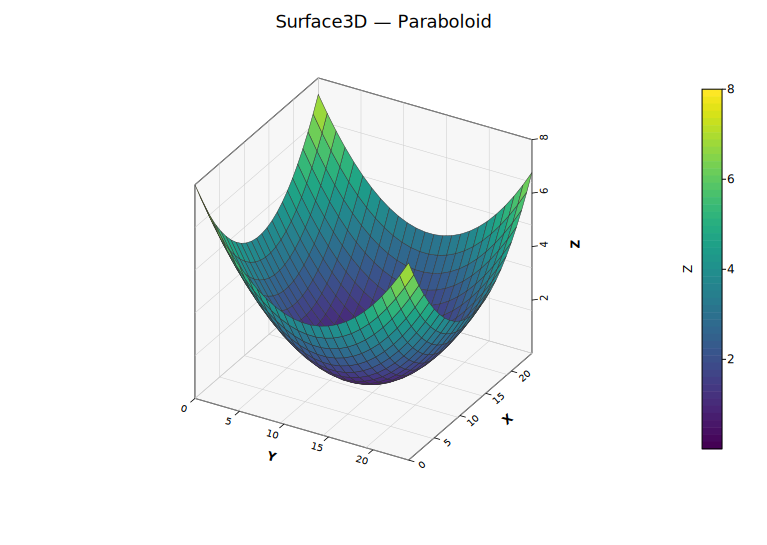
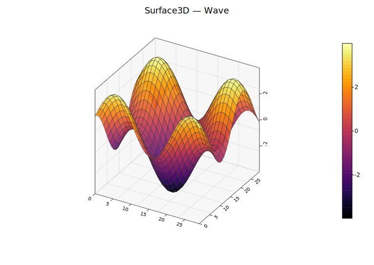

# 3D Surface Plot

Renders a 2D grid of Z values as a depth-sorted quadrilateral mesh with orthographic projection. Each grid cell becomes a filled quad, optionally colored by its average Z value through a colormap. Uses the same open-box wireframe, back-pane fills, and rotated tick labels as the 3D scatter plot.

**Import path:** `kuva::plot::surface3d::Surface3DPlot`

---

## Basic usage

Pass a 2D grid of Z values (`z_data[row][col]`):

```rust,no_run
use kuva::plot::surface3d::Surface3DPlot;
use kuva::plot::heatmap::ColorMap;
use kuva::backend::svg::SvgBackend;
use kuva::render::render::render_multiple;
use kuva::render::layout::Layout;
use kuva::render::plots::Plot;

let z_data: Vec<Vec<f64>> = (0..20).map(|i| {
    (0..20).map(|j| {
        let x = (i as f64 - 10.0) / 5.0;
        let y = (j as f64 - 10.0) / 5.0;
        x * x + y * y
    }).collect()
}).collect();

let surface = Surface3DPlot::new(z_data)
    .with_z_colormap(ColorMap::Viridis)
    .with_x_label("X")
    .with_y_label("Y")
    .with_z_label("Z");

let plots = vec![Plot::Surface3D(surface)];
let layout = Layout::auto_from_plots(&plots).with_title("Paraboloid");

let scene = render_multiple(plots, layout);
let svg = SvgBackend.render_scene(&scene);
std::fs::write("surface3d.svg", svg).unwrap();
```

When `with_z_colormap()` is set, a colorbar is rendered automatically. `with_z_label()` also labels the colorbar.



---

## From a function

Generate a surface from a math function over a coordinate range:

```rust,no_run
# use kuva::plot::surface3d::Surface3DPlot;
# use kuva::plot::heatmap::ColorMap;
let surface = Surface3DPlot::new(vec![])
    .with_data_fn(
        |x, y| (x * x + y * y).sqrt().sin(),
        -3.0..=3.0, -3.0..=3.0, 50, 50,
    )
    .with_z_colormap(ColorMap::Viridis);
```

The last two arguments are grid resolution (`x_res`, `y_res`). Higher values produce smoother surfaces at the cost of more SVG paths.



---

## Explicit coordinates

By default axes are labeled `0..nrows` / `0..ncols`. Supply real coordinates with `with_x_coords` and `with_y_coords`:

```rust,no_run
# use kuva::plot::surface3d::Surface3DPlot;
# use kuva::plot::heatmap::ColorMap;
let xs: Vec<f64> = (-5..=5).map(|i| i as f64 * 0.5).collect();
let ys: Vec<f64> = (-5..=5).map(|i| i as f64 * 0.5).collect();
let z_data: Vec<Vec<f64>> = ys.iter()
    .map(|&y| xs.iter().map(|&x| (x * x + y * y).sqrt().sin()).collect())
    .collect();

let surface = Surface3DPlot::new(z_data)
    .with_x_coords(xs)
    .with_y_coords(ys)
    .with_z_colormap(ColorMap::Viridis);
```

---

## Wireframe and transparency

The wireframe is on by default. Disable it with `with_no_wireframe()`, or combine it with transparency:

```rust,no_run
# use kuva::plot::surface3d::Surface3DPlot;
# use kuva::plot::heatmap::ColorMap;
// Semi-transparent with fine wireframe
let surface = Surface3DPlot::new(vec![])
    .with_data_fn(|x, y| x * y, -2.0..=2.0, -2.0..=2.0, 20, 20)
    .with_z_colormap(ColorMap::Viridis)
    .with_alpha(0.8)
    .with_wireframe_color("#222222")
    .with_wireframe_width(0.3);

// No wireframe — clean filled surface
let surface2 = Surface3DPlot::new(vec![])
    .with_data_fn(|x, y| x * y, -2.0..=2.0, -2.0..=2.0, 20, 20)
    .with_z_colormap(ColorMap::Inferno)
    .with_no_wireframe();
```

---

## Builder reference

| Method | Default | Description |
|---|---|---|
| `.with_z_data(grid)` | — | Set Z value grid directly |
| `.with_x_coords(vec)` | `0..ncols` | Explicit X coordinate per column |
| `.with_y_coords(vec)` | `0..nrows` | Explicit Y coordinate per row |
| `.with_data_fn(f, xr, yr, xn, yn)` | — | Generate grid from `f(x, y) -> z` |
| `.with_color(css)` | `"steelblue"` | Uniform surface color (when no colormap) |
| `.with_z_colormap(map)` | — | Color faces by average Z; renders a colorbar automatically |
| `.with_no_wireframe()` | wireframe on | Hide wireframe edges |
| `.with_wireframe_color(css)` | `"#333333"` | Wireframe edge color |
| `.with_wireframe_width(px)` | `0.5` | Wireframe stroke width |
| `.with_alpha(f)` | `1.0` | Surface opacity (0.0–1.0) |
| `.with_azimuth(deg)` | `-60.0` | Horizontal viewing angle |
| `.with_elevation(deg)` | `30.0` | Vertical viewing angle |
| `.with_view(View3D)` | — | Set azimuth and elevation together |
| `.with_x_label(s)` | — | X-axis label |
| `.with_y_label(s)` | — | Y-axis label |
| `.with_z_label(s)` | — | Z-axis label (also labels the colorbar) |
| `.with_no_grid()` | grid on | Hide grid lines on back walls |
| `.with_no_box()` | box on | Hide the wireframe bounding box |
| `.with_grid_lines(n)` | `5` | Number of grid/tick divisions per axis |
| `.with_z_axis_right(bool)` | auto | Force Z axis to right (`true`) or left (`false`) |
| `.with_z_axis_auto()` | — | Reset to automatic placement (default) |
| `.with_legend(s)` | — | Legend entry label |

---

## CLI

The CLI accepts **long format** (x, y, z columns) or **matrix format** (`--matrix`, one row of Z values per line).

```bash
# Long format with colormap
kuva surface3d data.tsv --x x --y y --z z --z-color viridis \
    --title "3D Surface" --x-label "X" --y-label "Y" --z-label "Z"

# Upsample a coarse grid to 50×50 with bilinear interpolation
kuva surface3d data.tsv --x x --y y --z z \
    --z-color inferno --resolution 50

# Matrix format (no header, each row = one row of Z values)
kuva surface3d matrix.tsv --matrix --z-color viridis --no-header

# Semi-transparent surface, no wireframe
kuva surface3d data.tsv --x x --y y --z z \
    --z-color viridis --alpha 0.8 --no-wireframe

# Custom view
kuva surface3d data.tsv --x x --y y --z z \
    --z-color viridis --azimuth 45 --elevation 45
```

### CLI flags

| Flag | Default | Description |
|---|---|---|
| `--x <COL>` | `0` | X value column (long format) |
| `--y <COL>` | `1` | Y value column (long format) |
| `--z <COL>` | `2` | Z value column (long format) |
| `--matrix` | off | Read input as a matrix of Z values |
| `--z-color <MAP>` | — | Colormap: `viridis`, `inferno`, `grayscale` |
| `--color <CSS>` | `steelblue` | Uniform surface color (when no colormap) |
| `--alpha <F>` | `1.0` | Surface opacity (0.0–1.0) |
| `--resolution <N>` | — | Upsample grid to N×N via bilinear interpolation |
| `--no-wireframe` | wireframe on | Hide wireframe edges |
| `--azimuth <DEG>` | `-60` | Horizontal viewing angle |
| `--elevation <DEG>` | `30` | Vertical viewing angle |
| `--x-label <S>` | — | X-axis label |
| `--y-label <S>` | — | Y-axis label |
| `--z-label <S>` | — | Z-axis label |
| `--no-grid` | grid on | Hide back-wall grid lines |
| `--no-box` | box on | Hide wireframe bounding box |
| `--grid-lines <N>` | `5` | Grid/tick divisions per axis |
| `--z-axis-left` | auto | Force Z axis to the left side |
