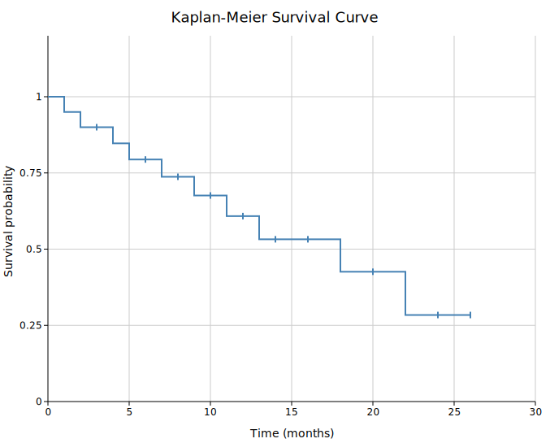

# Kaplan-Meier Survival Curve

A Kaplan-Meier (KM) survival plot displays the probability that subjects remain event-free over time. Each subject contributes one observation: the time to event (e.g., death, relapse) or the time at last follow-up for censored subjects who did not experience the event.

KM curves are the standard tool in clinical trials, epidemiology, and any study that measures time-to-event outcomes. Multiple groups are compared side-by-side, and a log-rank p-value is typically annotated.

**Import path:** `kuva::plot::survival::{SurvivalPlot, KMGroup}`

---

## Basic usage

Pass `times` (float) and `events` (bool) vectors to `.with_group()`. `true` means the event occurred; `false` means the observation was censored. Censoring tick marks appear on the curve by default.

```rust,no_run
use kuva::plot::survival::SurvivalPlot;
use kuva::backend::svg::SvgBackend;
use kuva::render::render::render_multiple;
use kuva::render::layout::Layout;
use kuva::render::plots::Plot;

let times  = vec![2.0, 4.0, 6.0, 8.0, 10.0, 12.0, 14.0, 16.0, 18.0, 20.0];
let events = vec![true, true, false, true, false, true, false, true, false, true];

let plot = SurvivalPlot::new()
    .with_group("Treatment", times, events);

let plots = vec![Plot::Survival(plot)];
let layout = Layout::auto_from_plots(&plots)
    .with_title("Overall Survival")
    .with_x_label("Time (months)")
    .with_y_label("Survival probability");

let svg = SvgBackend.render_scene(&render_multiple(plots, layout));
std::fs::write("survival.svg", svg).unwrap();
```



Tick marks on the curve indicate censored observations — subjects who were still event-free at their last follow-up. Suppress them with `.with_censoring(false)`.

---

## Multi-group comparison

Add one `.with_group()` per arm. Attach `.with_legend()` to label the curves. The log-rank p-value is user-supplied — compute it externally and annotate with `.with_pvalue_text()`.

```rust,no_run
use kuva::plot::survival::SurvivalPlot;
use kuva::backend::svg::SvgBackend;
use kuva::render::render::render_multiple;
use kuva::render::layout::Layout;
use kuva::render::plots::Plot;

let plot = SurvivalPlot::new()
    .with_group(
        "Arm A",
        vec![3.0, 6.0, 9.0, 12.0, 15.0, 18.0, 21.0, 24.0],
        vec![true, true, false, true, true, false, true, false],
    )
    .with_group(
        "Arm B",
        vec![2.0, 4.0, 5.0, 8.0, 11.0, 14.0, 17.0, 22.0],
        vec![true, true, true, false, true, true, false, true],
    )
    .with_pvalue_text("log-rank p = 0.031")
    .with_legend("Treatment");

let plots = vec![Plot::Survival(plot)];
let layout = Layout::auto_from_plots(&plots)
    .with_title("Progression-Free Survival")
    .with_x_label("Time (months)")
    .with_y_label("Survival probability");

let svg = SvgBackend.render_scene(&render_multiple(plots, layout));
```


---

## Confidence intervals

`.with_ci(true)` overlays Greenwood 95% CI bands around each curve. Control opacity with `.with_ci_alpha()`.

```rust,no_run
use kuva::plot::survival::SurvivalPlot;
use kuva::render::plots::Plot;
# use kuva::render::layout::Layout;
# use kuva::render::render::render_multiple;

let plot = SurvivalPlot::new()
    .with_group(
        "Biomarker high",
        vec![4.0, 8.0, 12.0, 16.0, 20.0, 24.0, 28.0, 32.0, 36.0],
        vec![true, true, false, true, false, true, false, false, true],
    )
    .with_group(
        "Biomarker low",
        vec![2.0, 3.0, 6.0, 9.0, 11.0, 14.0, 17.0, 20.0, 23.0],
        vec![true, true, true, true, false, true, true, false, true],
    )
    .with_ci(true)
    .with_ci_alpha(0.15)
    .with_pvalue_text("p < 0.001")
    .with_legend("Biomarker status");

let plots = vec![Plot::Survival(plot)];
```


---

## Custom colors

Use `.with_colored_group()` to set a per-group color, or `.with_group_colors()` to set all colors at once.

```rust,no_run
use kuva::plot::survival::SurvivalPlot;
use kuva::render::plots::Plot;
# use kuva::render::layout::Layout;
# use kuva::render::render::render_multiple;

let plot = SurvivalPlot::new()
    .with_colored_group(
        "Responders",
        vec![8.0, 12.0, 18.0, 24.0, 30.0, 36.0],
        vec![true, false, true, false, false, true],
        "#2ca02c",
    )
    .with_colored_group(
        "Non-responders",
        vec![3.0, 5.0, 7.0, 10.0, 13.0, 16.0],
        vec![true, true, true, false, true, true],
        "#d62728",
    )
    .with_ci(true)
    .with_legend("Response");

let plots = vec![Plot::Survival(plot)];
```

---

## SurvivalPlot API reference

### `SurvivalPlot` builders

| Method | Default | Description |
|--------|---------|-------------|
| `SurvivalPlot::new()` | — | Create a survival plot with default settings |
| `.with_group(label, times, events)` | — | Add a group; `events`: `true` = event occurred, `false` = censored |
| `.with_colored_group(label, times, events, color)` | — | Add a group with a per-group color |
| `.with_color(css)` | `"steelblue"` | Fallback color for a single unlabeled group |
| `.with_group_colors(iter)` | — | Per-group colors (by group order) |
| `.with_line_width(px)` | `2.0` | Curve stroke width |
| `.with_ci(bool)` | `false` | Overlay Greenwood 95% CI bands |
| `.with_ci_alpha(f)` | `0.2` | CI band opacity |
| `.with_censoring(bool)` | `true` | Show censoring tick marks on curves |
| `.with_censoring_size(px)` | `4.0` | Half-height of censoring ticks |
| `.with_pvalue_text(s)` | — | P-value or annotation rendered in the upper-right corner |
| `.with_legend(label)` | — | Legend title (one entry per group) |
