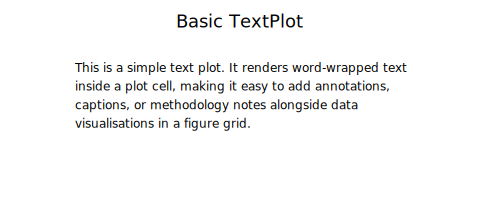
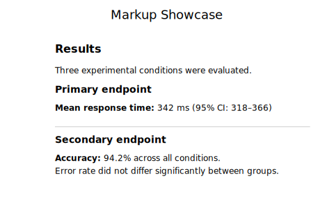
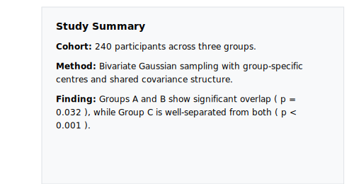
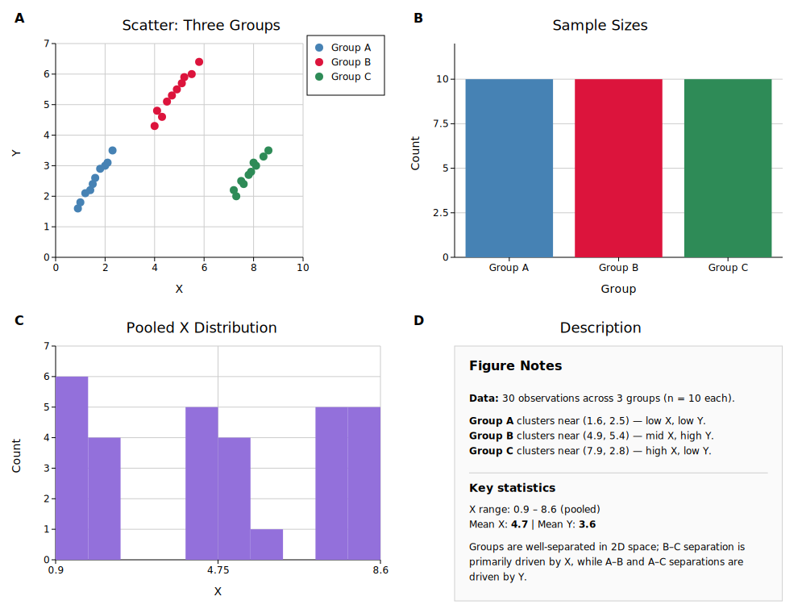

# Text Plot

`TextPlot` renders formatted, word-wrapped text inside a figure cell. Use it to add methodology notes, statistical summaries, captions, or any prose annotation alongside your data panels.

**Import path:** `kuva::plot::TextPlot`

---

## Basic usage

Supply body text with `.with_body()`. Long lines are automatically word-wrapped to fit the cell width.

```rust,no_run
use kuva::plot::TextPlot;
use kuva::render::plots::Plot;
use kuva::prelude::*;

let note = TextPlot::new()
    .with_title("Methods")
    .with_body("Samples were collected from three sites between April and June. \
                All measurements are reported as mean ± SD (n = 48).");

let plots: Vec<Plot> = vec![note.into()];
let layout = Layout::auto_from_plots(&plots);
let svg = SvgBackend.render_scene(&render_multiple(plots, layout));
std::fs::write("text.svg", svg).unwrap();
```



---

## Markup syntax

Body text supports a small set of line-level markup:

| Syntax | Renders as |
|--------|-----------|
| `# Heading` | Large bold heading |
| `## Subheading` | Medium bold heading |
| `**bold line**` | Bold paragraph |
| `---` | Horizontal rule |
| Blank line | Paragraph spacing |

```rust,no_run
use kuva::plot::TextPlot;
use kuva::render::plots::Plot;

let text = TextPlot::new()
    .with_body("\
# Results

The treatment group showed a significant improvement.

## Primary endpoint

**p < 0.001 (log-rank test)**

---

Secondary endpoints are reported in the supplementary material.");
```



---

## Appearance options

Control the background, border, text color, font size, padding, and alignment:

```rust,no_run
use kuva::plot::{TextPlot, TextAlign};
use kuva::render::plots::Plot;

let styled = TextPlot::new()
    .with_title("Note")
    .with_body("Significant outliers were removed prior to analysis (n = 3, z > 3.5).")
    .with_background("#f8f4e8")
    .with_border("#ccaa66", 1.5)
    .with_font_size(13)
    .with_padding(20.0)
    .with_align(TextAlign::Center)
    .with_text_color("#333333");
```



---

## Inside a figure

The most common use: place a `TextPlot` in one cell of a figure alongside data plots.

```rust,no_run
use kuva::prelude::*;
use kuva::plot::TextPlot;

let scatter = ScatterPlot::new()
    .with_data(vec![(1.0_f64, 2.3), (2.1, 4.1), (3.4, 3.2), (4.2, 5.8)])
    .with_color("steelblue");

let description = TextPlot::new()
    .with_title("About this data")
    .with_body("\
Measurements taken from the Northern transect.

**n = 48**, collected April–June 2025.

---

Outliers excluded per pre-registered protocol.");

let data_plots: Vec<Plot> = vec![scatter.into()];
let text_plots: Vec<Plot> = vec![description.into()];

let layout = Layout::auto_from_plots(&data_plots)
    .with_title("Northern Transect")
    .with_x_label("Distance (km)")
    .with_y_label("Concentration (μg/L)");

let scene = Figure::new(1, 2)
    .with_cell_size(500.0, 380.0)
    .with_col_width(1, 220.0)
    .with_plots(vec![data_plots, text_plots])
    .with_layouts(vec![layout, Layout::auto_from_plots(&[])])
    .render();

let svg = SvgBackend.render_scene(&scene);
std::fs::write("figure_with_text.svg", svg).unwrap();
```



---

## API reference

| Method | Default | Description |
|--------|---------|-------------|
| `TextPlot::new()` | — | Empty text plot |
| `.with_body(s)` | `""` | Body text; supports markup (see above) |
| `.with_title(s)` | none | Bold title above the body |
| `.with_font_size(n)` | theme default | Font size in pixels |
| `.with_padding(px)` | `16.0` | Inner padding on all sides |
| `.with_background(css)` | none (transparent) | Background fill color |
| `.with_border(css, width)` | none | Border color and stroke width |
| `.with_align(TextAlign)` | `Left` | Text alignment: `Left`, `Center`, or `Right` |
| `.with_text_color(css)` | theme default | Text color |
