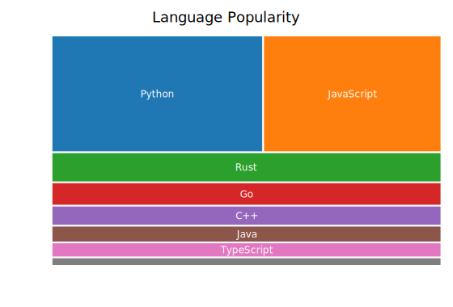
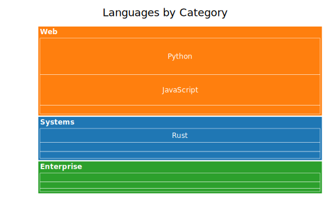
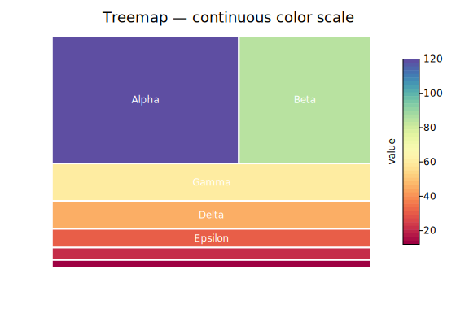

# Treemap Plot

A treemap tiles a rectangle with nested rectangles proportional to node values. Squarified layout (default) minimises worst-case aspect ratios. Supports arbitrary depth hierarchies, second-dimension coloring, and SVG hover tooltips.

**Import path:** `kuva::plot::treemap::TreemapPlot`, `kuva::plot::treemap::TreemapNode`, `kuva::plot::treemap::TreemapColorMode`, `kuva::plot::treemap::TreemapLayout`, `kuva::plot::ColorMap`

---

## Basic usage

Pass leaf nodes to `.with_node()`. The plot tiles the canvas area proportionally to each node's value.

```rust,no_run
use kuva::plot::treemap::{TreemapPlot, TreemapNode};
use kuva::backend::svg::SvgBackend;
use kuva::render::render::render_multiple;
use kuva::render::layout::Layout;
use kuva::render::plots::Plot;

let plot = TreemapPlot::new()
    .with_node(TreemapNode::leaf("Rust",   40.0))
    .with_node(TreemapNode::leaf("Python", 35.0))
    .with_node(TreemapNode::leaf("Go",     25.0));

let plots = vec![Plot::Treemap(plot)];
let layout = Layout::auto_from_plots(&plots).with_title("Language usage");
let svg = SvgBackend.render_scene(&render_multiple(plots, layout));
std::fs::write("treemap.svg", svg).unwrap();
```



---

## Hierarchical data

Use `TreemapNode::new(label, children)` for inner nodes. Values auto-sum from children when `value = 0.0`.

```rust,no_run
# use kuva::plot::treemap::{TreemapPlot, TreemapNode};
# use kuva::render::plots::Plot;
let plot = TreemapPlot::new()
    .with_node(TreemapNode::new("Languages", vec![
        TreemapNode::leaf("Rust",   40.0),
        TreemapNode::leaf("Python", 35.0),
        TreemapNode::leaf("Go",     25.0),
    ]))
    .with_node(TreemapNode::new("Databases", vec![
        TreemapNode::leaf("Postgres", 60.0),
        TreemapNode::leaf("SQLite",   30.0),
    ]));
```



Parent cells show a group label at top-left. Children are tiled inside with padding and a label-reserve row.

---

## Forest (multiple roots)

Pass multiple `.with_node()` calls — each root gets a distinct category10 color and its descendants inherit it.

```rust,no_run
# use kuva::plot::treemap::{TreemapPlot, TreemapNode};
# use kuva::render::plots::Plot;
let plot = TreemapPlot::new()
    .with_node(TreemapNode::new("Alpha", vec![
        TreemapNode::leaf("a1", 10.0),
        TreemapNode::leaf("a2", 20.0),
    ]))
    .with_node(TreemapNode::new("Beta", vec![
        TreemapNode::leaf("b1", 30.0),
        TreemapNode::leaf("b2", 15.0),
    ]))
    .with_node(TreemapNode::leaf("Gamma", 25.0));
```

---

## Color modes

### ByParent (default)

Each root group inherits a distinct `category10` color. All descendants use the same hue.

### ByValue

Color leaves by their value (or a parallel `color_values` vector) using a colormap.

```rust,no_run
use kuva::plot::treemap::{TreemapPlot, TreemapNode, TreemapColorMode, ColorMap};
# use kuva::render::plots::Plot;

let plot = TreemapPlot::new()
    .with_node(TreemapNode::leaf("A", 10.0))
    .with_node(TreemapNode::leaf("B", 50.0))
    .with_node(TreemapNode::leaf("C", 25.0))
    .with_color_mode(TreemapColorMode::ByValue(ColorMap::Viridis));
// show_colorbar is automatically enabled when ByValue is set
```



### Explicit

Use the `color` field on each node (CSS string). Call `.with_color_mode(TreemapColorMode::Explicit)`.

```rust,no_run
use kuva::plot::treemap::{TreemapPlot, TreemapNode, TreemapColorMode};
# use kuva::render::plots::Plot;

let plot = TreemapPlot::new()
    .with_node(TreemapNode::leaf_colored("Red",  30.0, "#e74c3c"))
    .with_node(TreemapNode::leaf_colored("Blue", 20.0, "#3498db"))
    .with_color_mode(TreemapColorMode::Explicit);
```

---

## Second-dimension coloring (GO enrichment pattern)

Use `color_values` to color leaves by a variable independent of size. A common bioinformatics pattern: size = gene count, color = p-value.

```rust,no_run
use kuva::plot::treemap::{TreemapPlot, TreemapNode, TreemapColorMode, ColorMap};
# use kuva::render::plots::Plot;

let gene_counts = vec![120_f64, 80.0, 55.0, 40.0];
let p_values    = vec![0.001, 0.023, 0.045, 0.0001];

let plot = TreemapPlot::new()
    .with_node(TreemapNode::leaf("GO:0008150 — biological process", gene_counts[0]))
    .with_node(TreemapNode::leaf("GO:0005575 — cellular component",  gene_counts[1]))
    .with_node(TreemapNode::leaf("GO:0003674 — molecular function",  gene_counts[2]))
    .with_node(TreemapNode::leaf("GO:0006950 — response to stress",  gene_counts[3]))
    .with_color_values(p_values)
    .with_color_mode(TreemapColorMode::ByValue(ColorMap::Viridis))
    .with_colorbar_label("p-value");
```

Or use the convenience builder:

```rust,no_run
use kuva::plot::treemap::TreemapPlot;
# use kuva::render::plots::Plot;

let plot = TreemapPlot::new()
    .with_go_terms(vec![
        ("GO:0008150", "biological process", 120, 0.001),
        ("GO:0005575", "cellular component",  80, 0.023),
        ("GO:0003674", "molecular function",  55, 0.045),
    ])
    .with_colorbar_label("p-value");
```


---

## Layout algorithms

`.with_layout(algo)` selects the tiling strategy.

```rust,no_run
use kuva::plot::treemap::{TreemapPlot, TreemapNode, TreemapLayout};
# use kuva::render::plots::Plot;

// Squarify (default): minimises worst aspect ratio
let plot = TreemapPlot::new()
    .with_layout(TreemapLayout::Squarify);

// SliceDice: alternating H/V cuts per level — fast, may produce slivers
let plot = TreemapPlot::new()
    .with_layout(TreemapLayout::SliceDice);

// Binary: balanced binary splits — good for uniform distributions
let plot = TreemapPlot::new()
    .with_layout(TreemapLayout::Binary);
```

| `TreemapLayout` variant | Description |
|-------------------------|-------------|
| `Squarify` **(default)** | Bruls 2000 — minimises worst aspect ratio per strip |
| `SliceDice` | Alternating H/V slices by depth — simple and predictable |
| `Binary` | Balanced binary splits; alternating H/V |

---

## Padding and borders

`.with_padding(px)` sets the gap between a parent's border and its children. Padding halves at each depth level.

```rust,no_run
# use kuva::plot::treemap::{TreemapPlot, TreemapNode};
# use kuva::render::plots::Plot;
let plot = TreemapPlot::new()
    .with_padding(6.0)
    .with_border_width(0.5)
    .with_root_border_width(2.5);
```

---

## Depth limiting

`.with_max_depth(n)` renders at most `n` levels deep (root = depth 0). Nodes at the limit are treated as leaves even if they have children.

```rust,no_run
# use kuva::plot::treemap::{TreemapPlot, TreemapNode};
# use kuva::render::plots::Plot;
let plot = TreemapPlot::new()
    .with_max_depth(2);  // root + 2 child levels
```

---

## Tooltips

By default each cell emits an SVG `<title>` tooltip showing the breadcrumb path and value on hover. Disable with `.with_tooltips(false)`.

```rust,no_run
# use kuva::plot::treemap::{TreemapPlot, TreemapNode};
# use kuva::render::plots::Plot;
// Tooltips off — smaller SVG
let plot = TreemapPlot::new()
    .with_tooltips(false);
```

---

## API reference

| Method | Description |
|--------|-------------|
| `TreemapPlot::new()` | Default: 20-bin Squarify, ByParent, tooltips on |
| `.with_node(node)` | Add a root node |
| `.with_children(label, children)` | Add a parent node with given children |
| `.with_color_mode(mode)` | `ByParent` / `ByValue(cmap)` / `Explicit` |
| `.with_color_values(vals)` | Parallel leaf color values (depth-first order) |
| `.with_layout(algo)` | `Squarify` / `SliceDice` / `Binary` |
| `.with_padding(px)` | Padding between parent and children (default `4.0`) |
| `.with_border_width(px)` | Leaf / inner border width (default `0.5`) |
| `.with_root_border_width(px)` | Root border width (default `2.0`) |
| `.with_min_label_area(px²)` | Hide label when cell area < threshold (default `1200.0`) |
| `.with_show_labels(bool)` | Show leaf labels (default `true`) |
| `.with_show_parent_labels(bool)` | Show parent labels (default `true`) |
| `.with_colorbar(bool)` | Show colorbar (auto-on in ByValue mode) |
| `.with_colorbar_label(str)` | Override colorbar label |
| `.with_color_range(lo, hi)` | Clamp colorbar scale |
| `.with_max_depth(n)` | Limit render depth |
| `.with_tooltips(bool)` | SVG hover tooltips (default `true`) |
| `.with_go_terms(iter)` | Convenience builder for GO enrichment |

### `TreemapNode` constructors

| Constructor | Description |
|-------------|-------------|
| `TreemapNode::leaf(label, value)` | Leaf node — no children |
| `TreemapNode::new(label, children)` | Inner node — value auto-summed from children |
| `TreemapNode::with_value(label, value, children)` | Inner node with explicit value |
| `TreemapNode::leaf_colored(label, value, css_color)` | Leaf with explicit CSS color |

---

*See also: [Shared flags](./index.md#shared-flags) — output, appearance, axes, log scale.*
