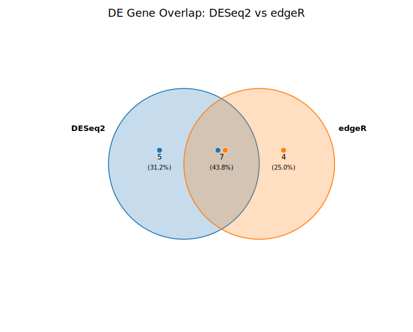
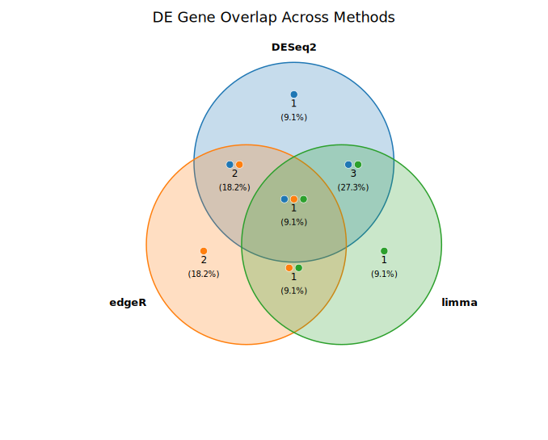
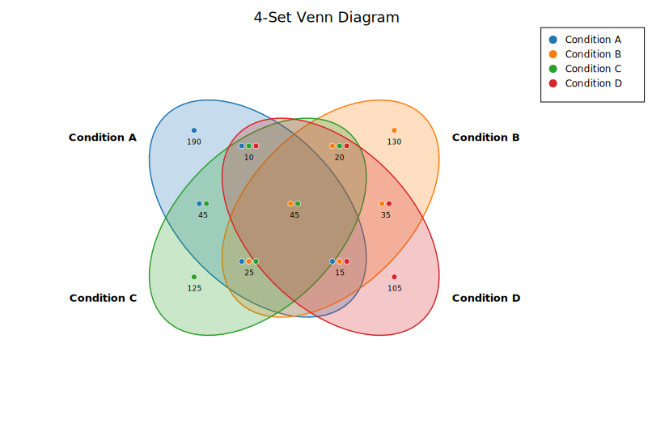
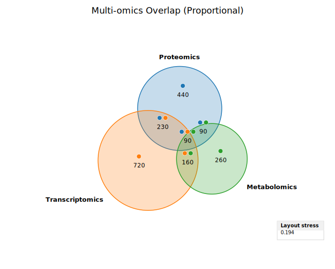

# Venn Diagram

A Venn diagram displays set membership and overlap between 2, 3, or 4 groups. Each group is represented by a translucent circle (or ellipse for 4 sets), and overlapping regions show elements that belong to multiple groups simultaneously.

Venn diagrams are widely used in bioinformatics to compare gene lists from different tools, samples, or conditions — for example, the shared and unique genes identified by DESeq2, edgeR, and limma.

**Import path:** `kuva::plot::venn::{VennPlot, VennSet, VennOverlap}`

---

## Input modes

VennPlot supports two input modes:

**Raw elements** — provide the actual element lists; intersections are computed automatically using set operations:

```rust,no_run
use kuva::plot::venn::VennPlot;

let venn = VennPlot::new()
    .with_set("DESeq2", vec!["BRCA1", "TP53", "MYC", "EGFR"])
    .with_set("edgeR",  vec!["TP53", "MYC", "KRAS", "PIK3CA"]);
```

**Pre-computed sizes** — supply the total size of each set and each intersection directly:

```rust,no_run
use kuva::plot::venn::VennPlot;

let venn = VennPlot::new()
    .with_set_size("Set A", 500)
    .with_set_size("Set B", 400)
    .with_overlap(["Set A", "Set B"], 120);
```

---

## 2-set diagram

```rust,no_run
use kuva::plot::venn::VennPlot;
use kuva::render::plots::Plot;
use kuva::render::layout::Layout;
use kuva::render::render::render_multiple;
use kuva::backend::svg::SvgBackend;

let deseq2 = vec!["BRCA1","TP53","MYC","EGFR","VEGFA","CDKN2A","KRAS","PTEN","MDM2","RB1"];
let edger  = vec!["TP53","MYC","KRAS","PIK3CA","PTEN","RB1","AKT1","MTOR","CDK4"];

let venn = VennPlot::new()
    .with_set("DESeq2", deseq2.iter().map(|s| s.to_string()).collect())
    .with_set("edgeR",  edger.iter().map(|s| s.to_string()).collect())
    .with_percentages(true);

let plots = vec![Plot::Venn(venn)];
let layout = Layout::auto_from_plots(&plots).with_title("DE Gene Overlap");
let scene = render_multiple(plots, layout);
let svg = SvgBackend.render_scene(&scene);
std::fs::write("venn_2set.svg", svg).unwrap();
```



---

## 3-set diagram

Three circles are arranged in an equilateral triangle. All 7 regions (unique to each set, pairwise overlaps, and the triple overlap) are labeled.

```rust,no_run
use kuva::plot::venn::VennPlot;
use kuva::render::plots::Plot;

let deseq2 = vec!["BRCA1","TP53","MYC","EGFR","VEGFA","CDKN2A","KRAS"];
let edger  = vec!["TP53","MYC","KRAS","PIK3CA","PTEN","RB1"];
let limma  = vec!["BRCA1","MYC","EGFR","PIK3CA","CDKN2A","MDM2"];

let venn = VennPlot::new()
    .with_set("DESeq2", deseq2.iter().map(|s| s.to_string()).collect())
    .with_set("edgeR",  edger.iter().map(|s| s.to_string()).collect())
    .with_set("limma",  limma.iter().map(|s| s.to_string()).collect())
    .with_counts(true)
    .with_percentages(true);
```



---

## 4-set diagram

Four-set Venns use rotated ellipses in a symmetric arrangement, producing all 15 non-empty regions. Proportional mode is not supported for 4-set diagrams.

```rust,no_run
use kuva::plot::venn::VennPlot;

let venn = VennPlot::new()
    .with_set_size("Condition A", 400)
    .with_set_size("Condition B", 350)
    .with_set_size("Condition C", 300)
    .with_set_size("Condition D", 250)
    .with_overlap(["Condition A", "Condition B"], 120)
    .with_overlap(["Condition A", "Condition C"], 90)
    // ... all pairwise, triple, and quadruple overlaps ...
    .with_overlap(["Condition A", "Condition B", "Condition C", "Condition D"], 10)
    .with_counts(true);
```



---

## Proportional mode

Enable `.with_proportional(true)` to scale circle areas proportional to set sizes. The renderer uses binary search to find center-to-center distances that approximate the target intersection areas using the lens-area formula.

```rust,no_run
use kuva::plot::venn::VennPlot;

let venn = VennPlot::new()
    .with_set_size("Proteomics",      850)
    .with_set_size("Transcriptomics", 1200)
    .with_set_size("Metabolomics",    600)
    .with_overlap(["Proteomics", "Transcriptomics"], 320)
    .with_overlap(["Proteomics", "Metabolomics"],    180)
    .with_overlap(["Transcriptomics", "Metabolomics"], 250)
    .with_overlap(["Proteomics", "Transcriptomics", "Metabolomics"], 90)
    .with_proportional(true)
    .with_loss(true);
```



Note: proportional mode is supported for 2 and 3 sets only.

---

## API reference

| Method | Description |
|--------|-------------|
| `with_set(label, elements)` | Add a set from a raw element list. |
| `with_set_size(label, size)` | Add a set with a pre-computed total size. |
| `with_overlap(labels, size)` | Pre-computed intersection size for 2+ sets. |
| `with_counts(bool)` | Show element counts in each region (default: `true`). |
| `with_percentages(bool)` | Show percentage of total in each region (default: `false`). |
| `with_set_labels(bool)` | Show set name labels (default: `true`). |
| `with_fill_opacity(f64)` | Fill opacity for circles/ellipses (default: `0.25`). |
| `with_stroke_width(f64)` | Outline stroke width (default: `1.5`). |
| `with_proportional(bool)` | Scale circles proportionally to set sizes (default: `false`). |
| `with_loss(bool)` | Display layout stress score in proportional mode (default: `false`). |
| `with_colors(iter)` | Override colors per set (CSS color strings). |
| `with_legend(label)` | Attach a legend with one entry per set. |
