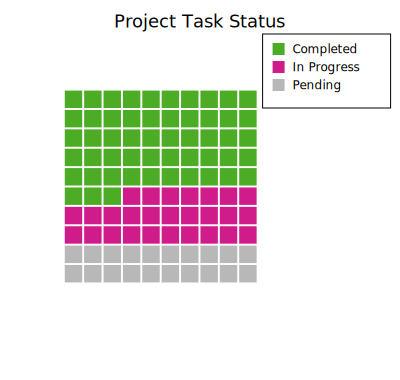
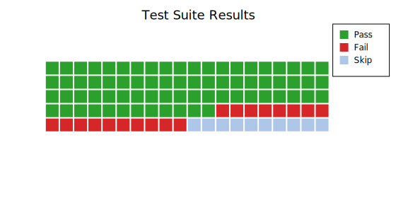
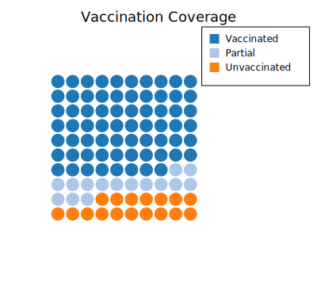
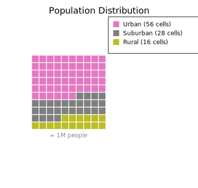

# Waffle Chart

A waffle chart encodes proportions as colored cells in a rectangular grid. Where a pie chart encodes data as angles, a waffle chart encodes it as area — making it easier to estimate percentages at a glance, especially at multiples of 5% on a 10×10 grid.

Waffle charts are popular in infographic and policy contexts where the audience may find pie slices hard to compare, and they pair naturally with a unit label like "■ = 100 people" to communicate absolute counts.

**Import path:** `kuva::plot::waffle::{WafflePlot, FillOrder, CellShape}`

---

## Basic usage

Add categories with `.with_category(label, value, color)`. Values are proportional — only their relative sizes matter. The grid is filled using Largest Remainder (Hamilton) rounding so the total filled cells always equals exactly `rows × cols`.

```rust,no_run
use kuva::plot::waffle::{WafflePlot, FillOrder, CellShape};
use kuva::backend::svg::SvgBackend;
use kuva::render::render::render_multiple;
use kuva::render::layout::Layout;
use kuva::render::plots::Plot;

let waffle = WafflePlot::new()
    .with_category("Treated",   45.0, "#2196F3")
    .with_category("Partial",   30.0, "#FF9800")
    .with_category("Untreated", 25.0, "#F44336")
    .with_legend("Status")
    .with_show_percents();

let plots = vec![Plot::Waffle(waffle)];
let layout = Layout::auto_from_plots(&plots).with_title("Treatment Coverage");
let svg = SvgBackend.render_scene(&render_multiple(plots, layout));
std::fs::write("waffle.svg", svg).unwrap();
```



---

## Grid size and aspect ratio

The default is a 10×10 grid (100 cells), which cleanly maps 1 cell per percent. Adjust with `.with_grid(rows, cols)` for different aspect ratios.

```rust,no_run
use kuva::plot::waffle::WafflePlot;
use kuva::render::plots::Plot;
# use kuva::render::layout::Layout;
# use kuva::render::render::render_multiple;

// 5 rows × 20 cols = 100 cells, wide aspect ratio
let waffle = WafflePlot::new()
    .with_grid(5, 20)
    .with_category("Agree",        52.0, "#4CAF50")
    .with_category("Neutral",      21.0, "#9E9E9E")
    .with_category("Disagree",     27.0, "#F44336")
    .with_legend("Response")
    .with_show_percents();

let plots = vec![Plot::Waffle(waffle)];
```



---

## Circle cells

Use `.with_shape(CellShape::Circle)` for a bubbly, more modern infographic style.

```rust,no_run
use kuva::plot::waffle::{WafflePlot, CellShape};
use kuva::render::plots::Plot;
use kuva::render::layout::Layout;
use kuva::render::render::render_multiple;
use kuva::backend::svg::SvgBackend;

let waffle = WafflePlot::new()
    .with_shape(CellShape::Circle)
    .with_gap(0.15)
    .with_category("Yes",     63.0, "#2ca02c")
    .with_category("No",      37.0, "#d62728")
    .with_legend("Vote")
    .with_show_percents();

let plots = vec![Plot::Waffle(waffle)];
let layout = Layout::auto_from_plots(&plots).with_title("Survey Result");
let svg = SvgBackend.render_scene(&render_multiple(plots, layout));
```



---

## Fill direction

`FillOrder` controls where the first cell is placed and in which direction the grid fills. Use `RowMajorBottomLeft` to fill upward like a progress bar, or `ColMajorTopLeft` for column-first layout.

```rust,no_run
use kuva::plot::waffle::{WafflePlot, FillOrder};
use kuva::render::plots::Plot;
# use kuva::render::layout::Layout;
# use kuva::render::render::render_multiple;

// Bottom-up fill — reads like a "filled" progress bar
let waffle = WafflePlot::new()
    .with_fill_order(FillOrder::RowMajorBottomLeft)
    .with_category("Complete", 68.0, "#1f77b4")
    .with_category("Remaining", 32.0, "#aec7e8")
    .with_legend("Progress")
    .with_show_percents();

let plots = vec![Plot::Waffle(waffle)];
```

---

## Unit label and absolute counts

When each cell represents a fixed number, add a `.with_unit_label()` annotation below the grid and `.with_show_counts()` to append cell counts to legend entries.

```rust,no_run
use kuva::plot::waffle::WafflePlot;
use kuva::render::plots::Plot;
use kuva::render::layout::Layout;
use kuva::render::render::render_multiple;
use kuva::backend::svg::SvgBackend;

// A population of 10,000: each cell = 100 people
let waffle = WafflePlot::new()
    .with_category("Vaccinated",    7800.0, "#2ca02c")
    .with_category("Unvaccinated",  2200.0, "#d62728")
    .with_legend("Status")
    .with_show_percents()
    .with_show_counts()
    .with_unit_label("■ = 100 people");

let plots = vec![Plot::Waffle(waffle)];
let layout = Layout::auto_from_plots(&plots).with_title("Vaccination Coverage (n = 10,000)");
let svg = SvgBackend.render_scene(&render_multiple(plots, layout));
```



---

## WafflePlot API reference

### `WafflePlot` builders

| Method | Default | Description |
|--------|---------|-------------|
| `WafflePlot::new()` | — | 10×10 grid, square cells, row-major top-left, 10% gap |
| `.with_category(label, value, color)` | — | Add a proportional category |
| `.with_categories(iter)` | — | Add multiple `(label, value, color)` at once |
| `.with_grid(rows, cols)` | `10, 10` | Set grid dimensions |
| `.with_rows(n)` | `10` | Set number of rows |
| `.with_cols(n)` | `10` | Set number of columns |
| `.with_gap(f)` | `0.1` | Gap between cells as fraction of cell size |
| `.with_fill_order(FillOrder)` | `RowMajorTopLeft` | Fill direction and starting corner |
| `.with_shape(CellShape)` | `Square` | Cell shape: `Square` or `Circle` |
| `.with_empty_color(css)` | `"#e8e8e8"` | Color for unfilled background cells |
| `.with_legend(label)` | — | Attach a legend (one entry per category) |
| `.with_show_percents()` | — | Append `(xx.x%)` to legend entries |
| `.with_show_counts()` | — | Append `(N cells)` to legend entries |
| `.with_unit_label(s)` | — | Annotation below the grid (e.g. `"■ = 100 people"`) |

### `FillOrder` variants

| Variant | Description |
|---------|-------------|
| `RowMajorTopLeft` | Left-to-right, top-to-bottom (reading order, default) |
| `RowMajorBottomLeft` | Left-to-right, bottom-to-top (progress bar style) |
| `ColMajorTopLeft` | Top-to-bottom, left-to-right (column first) |
| `ColMajorBottomLeft` | Bottom-to-top, left-to-right |

### `CellShape` variants

| Variant | Description |
|---------|-------------|
| `Square` | Filled rectangle (default) |
| `Circle` | Filled circle inscribed in the cell |
