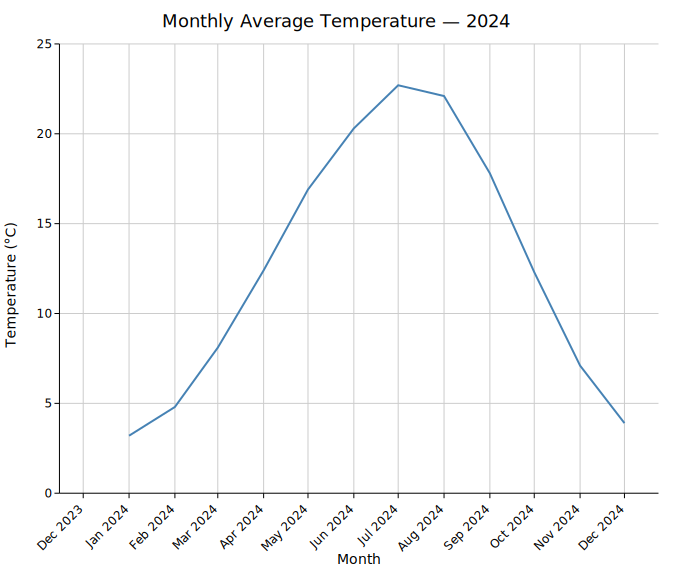
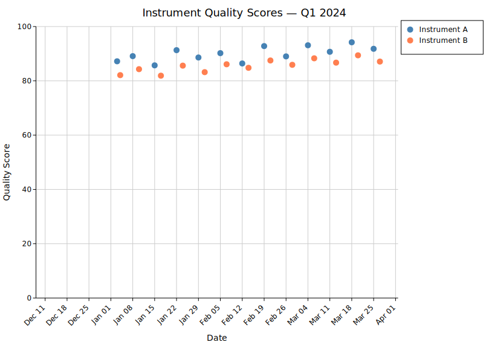
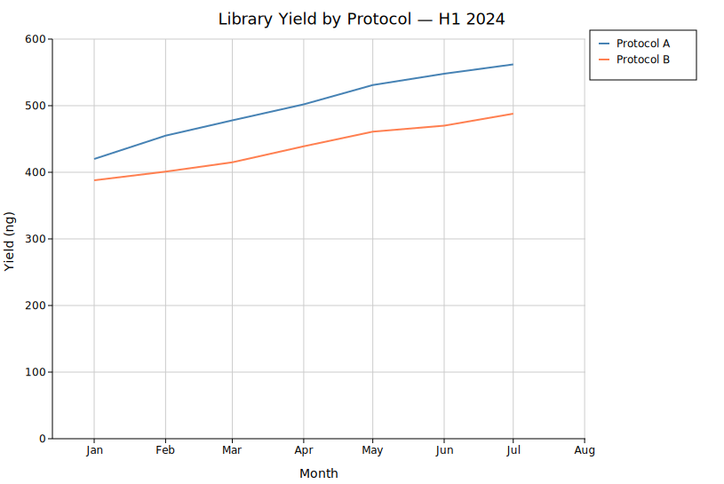
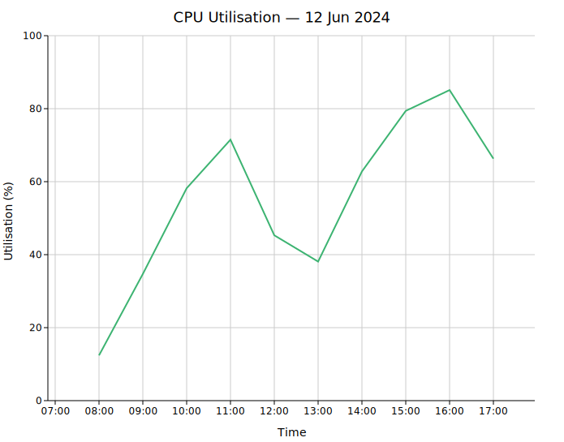

# Date & Time Axes

kuva plots use `f64` for all axis values. Dates and times are represented as **Unix timestamps in seconds**, and the `DateTimeAxis` type tells the renderer how to format and space tick marks on a date axis.

Three helpers are exported from the prelude:

| Symbol | Description |
|--------|-------------|
| `ymd(y, m, d)` | Unix timestamp for a calendar date at midnight UTC |
| `ymd_hms(y, m, d, h, min, s)` | Unix timestamp for a date + time UTC |
| `DateTimeAxis` | Axis configuration: tick unit, step, and `strftime` format string |

---

## Quick start

Convert your dates to `f64` with `ymd()`, pass them as the x (or y) coordinate, and attach a `DateTimeAxis` to the layout:

```rust,no_run
use kuva::prelude::*;

// Monthly temperature readings
let data: Vec<(f64, f64)> = vec![
    (ymd(2024,  1, 1),  3.2),
    (ymd(2024,  2, 1),  4.8),
    (ymd(2024,  3, 1),  8.1),
    // ...
];

let plot = LinePlot::new()
    .with_data(data)
    .with_color("steelblue");

let plots = vec![Plot::Line(plot)];
let layout = Layout::auto_from_plots(&plots)
    .with_title("Monthly Temperature")
    .with_x_label("Month")
    .with_y_label("°C")
    .with_x_datetime(DateTimeAxis::months("%b %Y"));

let svg = render_to_svg(plots, layout);
```



---

## DateTimeAxis constructors

Each constructor takes a `strftime`-style format string for tick labels. The format is passed directly to `chrono`'s `NaiveDateTime::format`.

| Constructor | Tick unit | Typical format |
|-------------|-----------|----------------|
| `DateTimeAxis::years(fmt)` | 1 year | `"%Y"` |
| `DateTimeAxis::months(fmt)` | 1 month | `"%b %Y"` |
| `DateTimeAxis::weeks(fmt)` | 1 week (Mon) | `"%b %d"` |
| `DateTimeAxis::days(fmt)` | 1 day | `"%Y-%m-%d"` |
| `DateTimeAxis::hours(fmt)` | 1 hour | `"%H:%M"` |
| `DateTimeAxis::minutes(fmt)` | 1 minute | `"%H:%M"` |
| `DateTimeAxis::auto(min, max)` | auto-selected | auto |

`.with_step(n)` on any constructor places a tick every `n` units instead of every 1:

```rust,no_run
// Tick every 2 months
DateTimeAxis::months("%b").with_step(2)
```

### Auto mode

`DateTimeAxis::auto(min, max)` inspects the axis range (in seconds) and selects an appropriate unit and format automatically. It is convenient when you don't know the data range ahead of time:

```rust,no_run
let min = data.iter().map(|(x, _)| *x).fold(f64::MAX, f64::min);
let max = data.iter().map(|(x, _)| *x).fold(f64::MIN, f64::max);

let layout = Layout::auto_from_plots(&plots)
    .with_x_datetime(DateTimeAxis::auto(min, max));
```

---

## Scatter plot with dates

`ymd()` works the same for scatter plots — each point's x coordinate is a timestamp:

```rust,no_run
use kuva::prelude::*;

let measurements: Vec<(f64, f64)> = vec![
    (ymd(2024, 1,  3), 87.2),
    (ymd(2024, 1, 15), 85.7),
    (ymd(2024, 2,  5), 90.2),
    // ...
];

let plot = ScatterPlot::new()
    .with_data(measurements)
    .with_color("steelblue")
    .with_size(5.0);

let plots = vec![Plot::Scatter(plot)];
let layout = Layout::auto_from_plots(&plots)
    .with_x_datetime(DateTimeAxis::weeks("%b %d"))
    .with_x_tick_rotate(-45.0);
```



---

## Multi-series with dates

Add `.with_legend("name")` to each plot to get a legend; the layout shows it automatically:

```rust,no_run
use kuva::prelude::*;

let plots = vec![
    Plot::Line(
        LinePlot::new()
            .with_data(series_a)
            .with_color("steelblue")
            .with_legend("Protocol A"),
    ),
    Plot::Line(
        LinePlot::new()
            .with_data(series_b)
            .with_color("coral")
            .with_legend("Protocol B"),
    ),
];

let layout = Layout::auto_from_plots(&plots)
    .with_x_datetime(DateTimeAxis::months("%b"));
```



---

## Sub-day granularity

For hourly or finer data, use `ymd_hms()` and a matching `DateTimeAxis`:

```rust,no_run
use kuva::prelude::*;

let data: Vec<(f64, f64)> = vec![
    (ymd_hms(2024, 6, 12,  8, 0, 0), 12.4),
    (ymd_hms(2024, 6, 12,  9, 0, 0), 34.7),
    (ymd_hms(2024, 6, 12, 10, 0, 0), 58.2),
    // ...
];

let layout = Layout::auto_from_plots(&plots)
    .with_x_datetime(DateTimeAxis::hours("%H:%M"));
```



---

## Applying to the y-axis

`with_y_datetime()` works identically to `with_x_datetime()` for plots where time is on the vertical axis:

```rust,no_run
let layout = Layout::auto_from_plots(&plots)
    .with_y_datetime(DateTimeAxis::days("%Y-%m-%d"));
```

---

## Converting from other date libraries

kuva stores dates as Unix timestamps (seconds, `f64`). Converting from any date library is straightforward:

**`chrono`:**
```rust,no_run
use chrono::NaiveDate;
let ts = NaiveDate::from_ymd_opt(2024, 6, 1).unwrap()
    .and_hms_opt(0, 0, 0).unwrap()
    .and_utc()
    .timestamp() as f64;
```

**`time` crate:**
```rust,no_run
use time::{Date, Month, PrimitiveDateTime, Time};
let dt = PrimitiveDateTime::new(
    Date::from_calendar_date(2024, Month::June, 1).unwrap(),
    Time::MIDNIGHT,
);
let ts = dt.assume_utc().unix_timestamp() as f64;
```

**`std::time::SystemTime`:**
```rust,no_run
use std::time::{SystemTime, UNIX_EPOCH};
let ts = SystemTime::now()
    .duration_since(UNIX_EPOCH)
    .unwrap()
    .as_secs_f64();
```
