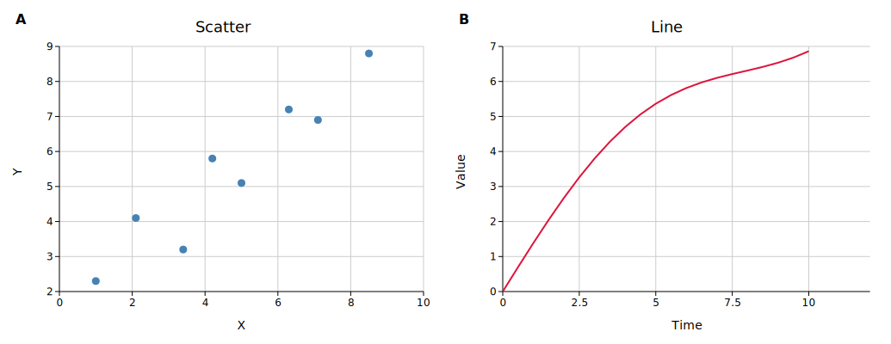
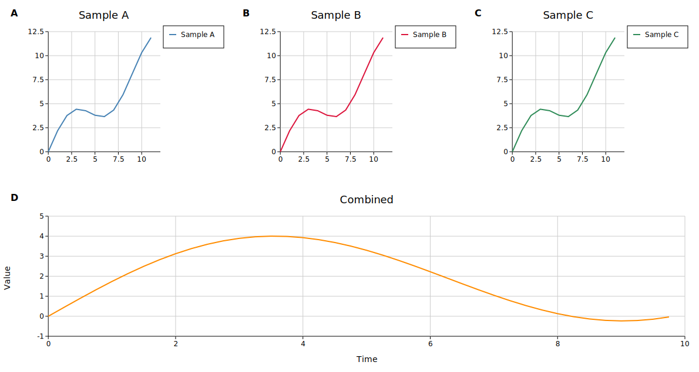
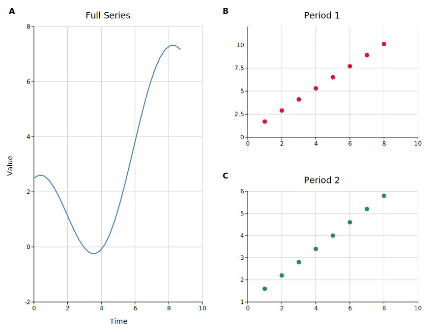
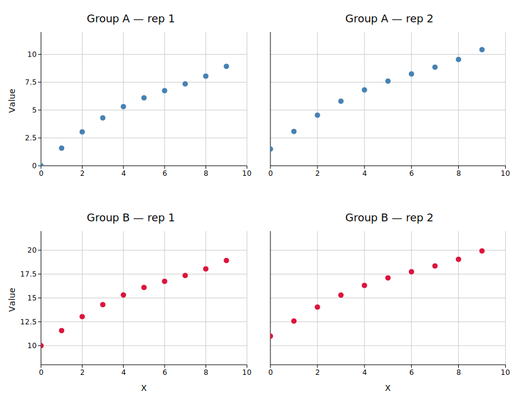
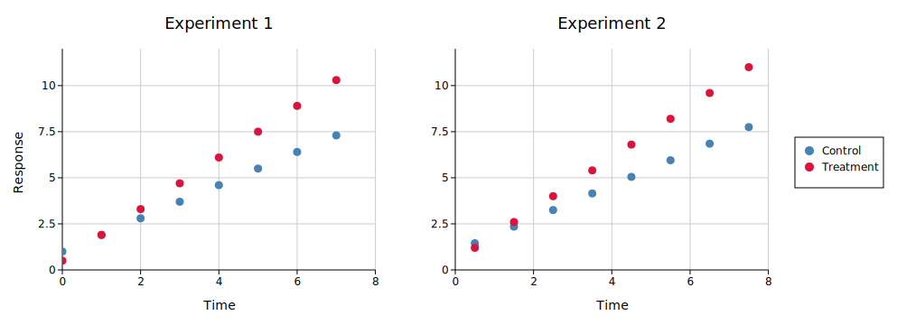
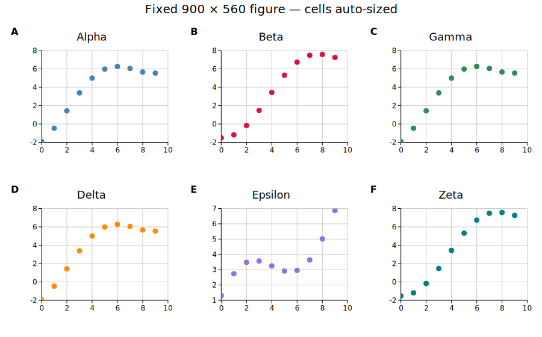

# Figure (Multi-Plot Layout)

`Figure` arranges multiple independent plots in a grid. Each cell can contain any plot type. Cells can span multiple rows or columns, axes can be shared across cells, and a single legend can be collected from all panels.

---

## Basic grid

```rust,no_run
use kuva::prelude::*;

let scatter = ScatterPlot::new()
    .with_data(vec![(1.0_f64, 2.3), (2.1, 4.1), (3.4, 3.2), (4.2, 5.8)])
    .with_color("steelblue");

let line = LinePlot::new()
    .with_data(vec![(0.0_f64, 0.4), (2.0, 2.0), (4.0, 3.7), (6.0, 4.9), (8.0, 6.3)])
    .with_color("crimson");

// Build plot vecs first so layouts can auto-range from the data
let plots_a: Vec<Plot> = vec![scatter.into()];
let plots_b: Vec<Plot> = vec![line.into()];

let layout_a = Layout::auto_from_plots(&plots_a).with_title("Scatter").with_x_label("X").with_y_label("Y");
let layout_b = Layout::auto_from_plots(&plots_b).with_title("Line").with_x_label("Time").with_y_label("Value");

let scene = Figure::new(1, 2)                          // 1 row, 2 columns
    .with_plots(vec![plots_a, plots_b])
    .with_layouts(vec![layout_a, layout_b])
    .with_labels()                                     // bold A, B panel labels
    .render();

let svg = SvgBackend.render_scene(&scene);
std::fs::write("figure.svg", svg).unwrap();
```

`with_plots` takes a `Vec<Vec<Plot>>` — one inner `Vec` per panel, in row-major order (left to right, top to bottom). `with_layouts` takes a `Vec<Layout>` in the same order.

Build each layout from its plot vec **before** passing both to the figure — `Layout::auto_from_plots` needs to see the data to compute axis ranges. `with_layouts` is optional; omit it and each panel auto-computes its own range.



---

## Merged cells

Use `with_structure` to span cells. The structure is a `Vec<Vec<usize>>` where each inner vec lists the cell indices (row-major) that form one panel.

```rust,no_run
use kuva::prelude::*;

// 2×3 grid: three small plots on top, one wide plot spanning the full bottom row
let figure = Figure::new(2, 3)
    .with_structure(vec![
        vec![0],        // top-left
        vec![1],        // top-centre
        vec![2],        // top-right
        vec![3, 4, 5],  // bottom row — spans all 3 columns
    ])
    .with_plots(vec![
        vec![/* plot A */],
        vec![/* plot B */],
        vec![/* plot C */],
        vec![/* wide plot D */],
    ]);
```

For a tall left panel spanning both rows of a 2×2 grid:

```rust,no_run
// cell indices for a 2×2 grid:
//   0  1
//   2  3
Figure::new(2, 2)
    .with_structure(vec![
        vec![0, 2],  // left column, both rows — tall panel
        vec![1],     // top-right
        vec![3],     // bottom-right
    ]);
```

Groups must be filled rectangles — L-shapes and other non-rectangular spans are not supported.



For a tall left panel:



---

## Shared axes

Sharing an axis unifies the range across the linked panels and suppresses duplicate tick labels on inner edges.

```rust,no_run
use kuva::prelude::*;

Figure::new(2, 2)
    // ...
    .with_shared_y_all()       // same Y range across all panels
    .with_shared_x_all()       // same X range across all panels
    ;
```



Fine-grained control:

| Method | Effect |
|--------|--------|
| `.with_shared_y_all()` | Shared Y across every panel |
| `.with_shared_x_all()` | Shared X across every panel |
| `.with_shared_y(row)` | Shared Y within a single row |
| `.with_shared_x(col)` | Shared X within a single column |
| `.with_shared_y_slice(row, col_start, col_end)` | Shared Y for a subset of a row |
| `.with_shared_x_slice(col, row_start, row_end)` | Shared X for a subset of a column |

---

## Panel labels

```rust,no_run
figure.with_labels()            // A, B, C, ... (bold, size 16 — default)
figure.with_labels_lowercase()  // a, b, c, ...
figure.with_labels_numeric()    // 1, 2, 3, ...

// Custom strings — size and bold are the only meaningful config fields here
figure.with_labels_custom(
    vec!["i", "ii", "iii"],
    LabelConfig { style: PanelLabelStyle::Uppercase, size: 14, bold: false },
)
```

---

## Shared legend

Collect legend entries from all panels into a single figure-level legend. Per-panel legends are suppressed automatically.

```rust,no_run
use kuva::prelude::*;

Figure::new(1, 2)
    // ...
    .with_shared_legend()         // legend to the right (default)
    .with_shared_legend_bottom()  // legend below the grid
    ;
```



To keep per-panel legends visible alongside the shared one:

```rust,no_run
figure.with_keep_panel_legends()
```

To supply manual legend entries instead of auto-collecting:

```rust,no_run
use kuva::plot::{LegendEntry, LegendShape};

figure.with_shared_legend_entries(vec![
    LegendEntry { label: "Control".into(), color: "steelblue".into(), shape: LegendShape::Rect },
    LegendEntry { label: "Treatment".into(), color: "crimson".into(), shape: LegendShape::Rect },
])
```

---

## Sizing and spacing

```rust,no_run
Figure::new(2, 3)
    .with_cell_size(500.0, 380.0)  // width × height per cell in pixels (default)
    .with_spacing(15.0)            // gap between cells in pixels (default 15)
    .with_padding(10.0)            // outer margin in pixels (default 10)
    .with_title("My Figure")       // centered title above the grid
    .with_title_size(20)           // title font size (default 20)
```

The total SVG dimensions are computed automatically from the cell size, spacing, padding, title height, and any shared legend.

Alternatively, set the **total** figure size and let cells auto-compute:

```rust,no_run
Figure::new(2, 3)
    .with_figure_size(900.0, 560.0)  // total width × height; cells sized to fit
```

`with_figure_size` takes precedence over `with_cell_size` when both are set. The cell size budget is computed after reserving space for padding, spacing, title height, and any shared legend — so the output SVG dimensions exactly match what you specify.



### Per-row and per-column overrides

Override the height of individual rows or the width of individual columns while leaving the rest at their default cell size:

```rust,no_run
Figure::new(3, 2)
    .with_cell_size(500.0, 380.0)
    .with_row_height(2, 80.0)    // third row is a thin annotation strip
    .with_col_width(1, 180.0)    // second column is a narrow legend column
```

When combined with `with_figure_size`, the explicit sizes are subtracted first and the remaining budget is divided equally among unconstrained rows/cols — so the total SVG dimensions are still exactly honoured.

---

## API reference

| Method | Description |
|--------|-------------|
| `Figure::new(rows, cols)` | Create a rows × cols grid |
| `.with_structure(vec)` | Define merged cells; default is one panel per cell |
| `.with_plots(vec)` | Set plot data, one `Vec<Plot>` per panel |
| `.with_layouts(vec)` | Set layouts; panels without a layout auto-range from data |
| `.with_title(s)` | Centered title above the grid |
| `.with_title_size(n)` | Title font size in pixels (default 20) |
| `.with_labels()` | Bold uppercase panel labels (A, B, C, …) |
| `.with_labels_lowercase()` | Lowercase panel labels (a, b, c, …) |
| `.with_labels_numeric()` | Numeric panel labels (1, 2, 3, …) |
| `.with_labels_custom(labels, config)` | Custom label strings with font config |
| `.with_shared_y_all()` | Shared Y range across all panels |
| `.with_shared_x_all()` | Shared X range across all panels |
| `.with_shared_y(row)` | Shared Y within one row |
| `.with_shared_x(col)` | Shared X within one column |
| `.with_shared_y_slice(row, c0, c1)` | Shared Y for columns c0..=c1 in a row |
| `.with_shared_x_slice(col, r0, r1)` | Shared X for rows r0..=r1 in a column |
| `.with_shared_legend()` | Figure-level legend to the right |
| `.with_shared_legend_bottom()` | Figure-level legend below the grid |
| `.with_shared_legend_entries(vec)` | Override auto-collected legend entries |
| `.with_keep_panel_legends()` | Keep per-panel legends alongside the shared one |
| `.with_cell_size(w, h)` | Cell dimensions in pixels (default 500 × 380) |
| `.with_figure_size(w, h)` | Total figure dimensions; cells auto-compute to fit |
| `.with_row_height(row, px)` | Override height of a single row (0-based); other rows use `cell_height` |
| `.with_col_width(col, px)` | Override width of a single column (0-based); other columns use `cell_width` |
| `.with_spacing(px)` | Gap between cells (default 15) |
| `.with_padding(px)` | Outer margin (default 10) |
| `.render()` | Consume the Figure and return a `Scene` |
