# Layout & Axes

`Layout` is the single configuration struct passed to every render function. It controls axis ranges, labels, tick marks, log scale, canvas size, annotations, and typography. Every plot type goes through a `Layout` before becoming an SVG.

**Import path:** `kuva::render::layout::Layout`

---

## Constructors

### `Layout::auto_from_plots()`

The recommended starting point. Inspects the data in a `Vec<Plot>` and automatically computes axis ranges, padding, legend visibility, and colorbar presence.

```rust,no_run
# use kuva::render::layout::Layout;
# use kuva::render::plots::Plot;
# let plots: Vec<Plot> = vec![];
let layout = Layout::auto_from_plots(&plots)
    .with_title("My Plot")
    .with_x_label("X")
    .with_y_label("Y");
```

### `Layout::new()`

Sets explicit axis ranges. Use this when you need precise control — for example, when comparing multiple plots that must share the same scale, or when the auto-range would include unwanted padding.

```rust,no_run
# use kuva::render::layout::Layout;
// x from 0 to 100, y from -1 to 1
let layout = Layout::new((0.0, 100.0), (-1.0, 1.0))
    .with_title("Fixed Range")
    .with_x_label("Time (ms)")
    .with_y_label("Amplitude");
```

---

## Labels and title

```rust,no_run
# use kuva::render::layout::Layout;
# use kuva::render::plots::Plot;
# let plots: Vec<Plot> = vec![];
let layout = Layout::auto_from_plots(&plots)
    .with_title("My Plot")          // text above the plot area
    .with_x_label("Concentration")  // label below the x-axis
    .with_y_label("Response (%)");  // label left of the y-axis
```

---

## Canvas size

The default canvas is `600 × 450` pixels for the plot area, with margins computed automatically from the title, tick labels, and legend. Override either dimension:

```rust,no_run
# use kuva::render::layout::Layout;
# use kuva::render::plots::Plot;
# let plots: Vec<Plot> = vec![];
let layout = Layout::auto_from_plots(&plots)
    .with_width(800.0)   // total SVG width in pixels
    .with_height(300.0); // total SVG height in pixels
```

---

## Ticks

The number of tick marks is chosen automatically based on the canvas size. Override it with `.with_ticks()`:

```rust,no_run
# use kuva::render::layout::Layout;
# use kuva::render::plots::Plot;
# let plots: Vec<Plot> = vec![];
let layout = Layout::auto_from_plots(&plots)
    .with_ticks(8);  // request approximately 8 tick intervals
```

### Tick formats

`TickFormat` controls how numeric tick labels are rendered. Import it from `kuva::TickFormat`.

| Variant | Example output | Use case |
|---------|----------------|----------|
| `Auto` *(default)* | `5`, `3.14`, `1.2e5` | General purpose — integers without `.0`, minimal decimals, sci notation for extremes |
| `Fixed(n)` | `3.14` (n=2) | Fixed decimal places |
| `Integer` | `5` | Round to nearest integer |
| `Sci` | `1.23e4` | Always scientific notation |
| `Percent` | `45.0%` | Multiply by 100 and append `%` — for data in the range 0–1 |
| `Custom(fn)` | anything | Provide your own `fn(f64) -> String` |

Apply the same format to both axes, or set them independently:

```rust,no_run
use kuva::TickFormat;
# use kuva::render::layout::Layout;
# use kuva::render::plots::Plot;
# let plots: Vec<Plot> = vec![];

// Same format on both axes
let layout = Layout::auto_from_plots(&plots)
    .with_tick_format(TickFormat::Fixed(2));

// Independent formats
let layout = Layout::auto_from_plots(&plots)
    .with_x_tick_format(TickFormat::Percent)
    .with_y_tick_format(TickFormat::Sci);

// Custom formatter — append a unit suffix
let layout = Layout::auto_from_plots(&plots)
    .with_y_tick_format(TickFormat::Custom(
        std::sync::Arc::new(|v| format!("{:.0} ms", v))
    ));
```

<table>
<tr>
<td>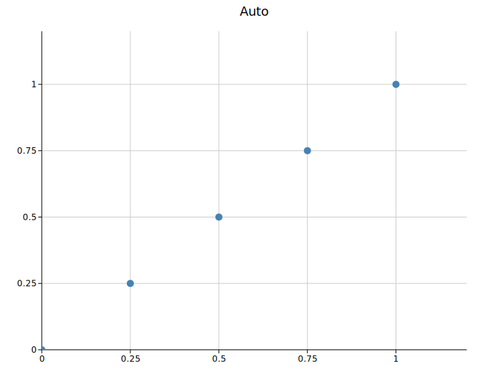</td>
<td>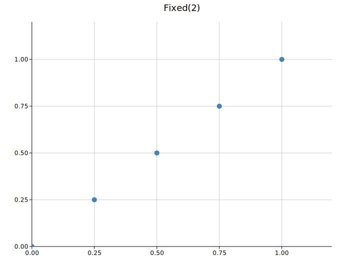</td>
</tr>
<tr>
<td align="center"><code>Auto</code></td>
<td align="center"><code>Fixed(2)</code></td>
</tr>
<tr>
<td>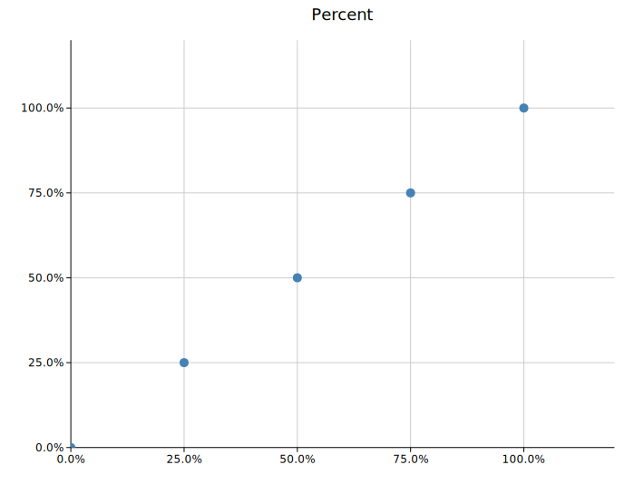</td>
<td>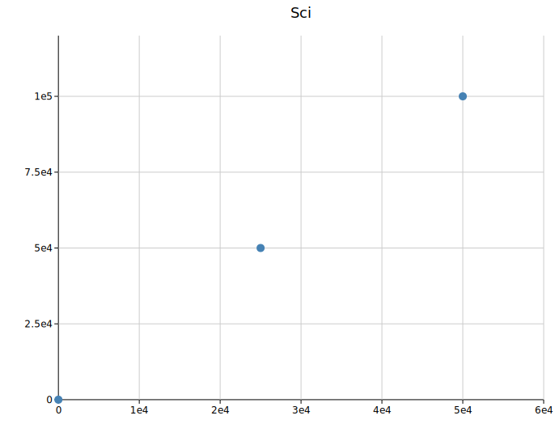</td>
</tr>
<tr>
<td align="center"><code>Percent</code></td>
<td align="center"><code>Sci</code></td>
</tr>
</table>

### Tick rotation

Rotate x-axis tick labels when category names are long:

```rust,no_run
# use kuva::render::layout::Layout;
# use kuva::render::plots::Plot;
# let plots: Vec<Plot> = vec![];
let layout = Layout::auto_from_plots(&plots)
    .with_x_tick_rotate(45.0);  // degrees; 45 or 90 are common
```

---

## Log scale

Enable logarithmic axes for data spanning multiple orders of magnitude. Ticks are placed at powers of 10; narrow ranges add 2× and 5× sub-ticks automatically.

```rust,no_run
# use kuva::render::layout::Layout;
# use kuva::render::plots::Plot;
# let plots: Vec<Plot> = vec![];
// Both axes log
let layout = Layout::auto_from_plots(&plots).with_log_scale();

// X axis only
let layout = Layout::auto_from_plots(&plots).with_log_x();

// Y axis only
let layout = Layout::auto_from_plots(&plots).with_log_y();
```

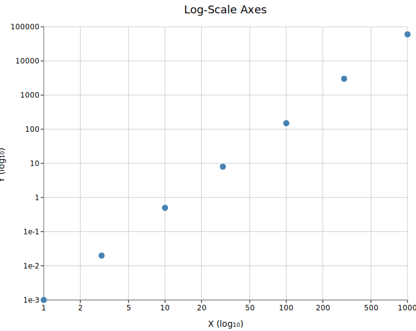

All data values must be positive when using a log axis. `auto_from_plots` uses the raw data range (before padding) to compute log-scale tick positions, so zero-inclusive ranges are handled safely.

---

## Grid

The grid is shown by default. Disable it with:

```rust,no_run
# use kuva::render::layout::Layout;
# use kuva::render::plots::Plot;
# let plots: Vec<Plot> = vec![];
let layout = Layout::auto_from_plots(&plots)
    .with_show_grid(false);
```

Some plot types (Manhattan, UpSet) suppress the grid automatically.

---

## Annotations

Three types of annotation are available, all added via the `Layout` builder. Any number of each can be chained.

### Text annotation

Places a text label at a data coordinate. Optionally draws an arrow pointing to a different coordinate.

```rust,no_run
use kuva::render::annotations::TextAnnotation;
# use kuva::render::layout::Layout;
# use kuva::render::plots::Plot;
# let plots: Vec<Plot> = vec![];

let layout = Layout::auto_from_plots(&plots)
    .with_annotation(
        TextAnnotation::new("Outlier", 5.0, 7.5)   // text at (5, 7.5)
            .with_arrow(6.0, 9.0)                   // arrow points to (6, 9)
            .with_color("crimson")
            .with_font_size(12),                    // optional, default 12
    );
```

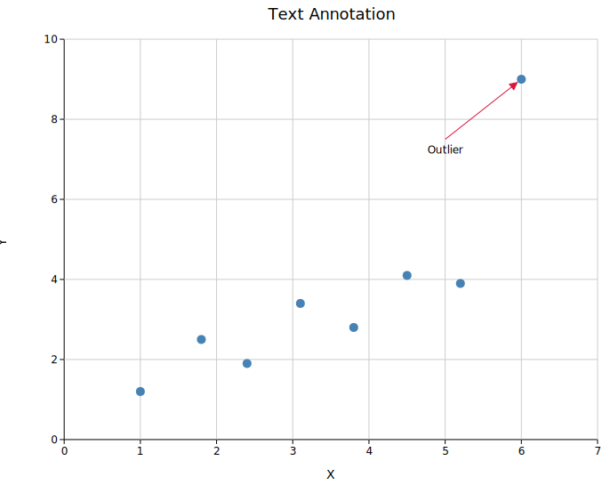

### Reference line

Draws a dashed line across the full plot area at a fixed x or y value.

```rust,no_run
use kuva::render::annotations::ReferenceLine;
# use kuva::render::layout::Layout;
# use kuva::render::plots::Plot;
# let plots: Vec<Plot> = vec![];

let layout = Layout::auto_from_plots(&plots)
    .with_reference_line(
        ReferenceLine::horizontal(0.05)     // y = 0.05
            .with_color("crimson")
            .with_label("p = 0.05"),        // optional label at right edge
    )
    .with_reference_line(
        ReferenceLine::vertical(3.5)        // x = 3.5
            .with_color("steelblue")
            .with_label("cutoff")
            .with_stroke_width(1.5)         // optional, default 1.0
            .with_dasharray("8 4"),         // optional, default "6 4"
    );
```

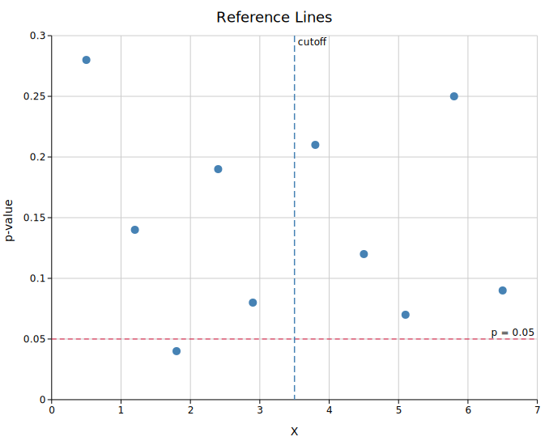

### Shaded region

Fills a horizontal or vertical band across the plot area.

```rust,no_run
use kuva::render::annotations::ShadedRegion;
# use kuva::render::layout::Layout;
# use kuva::render::plots::Plot;
# let plots: Vec<Plot> = vec![];

let layout = Layout::auto_from_plots(&plots)
    .with_shaded_region(
        ShadedRegion::horizontal(2.0, 4.0)  // y band from 2 to 4
            .with_color("gold")
            .with_opacity(0.2),
    )
    .with_shaded_region(
        ShadedRegion::vertical(10.0, 20.0)  // x band from 10 to 20
            .with_color("steelblue")
            .with_opacity(0.15),
    );
```

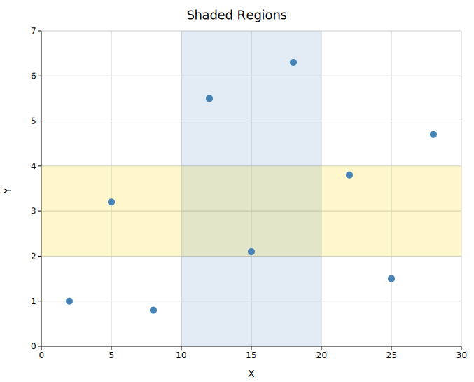

---

## Scale

`with_scale(f)` applies a single multiplier to every piece of plot chrome — font sizes, margins, tick mark lengths, stroke widths, legend padding and swatch geometry, and annotation arrow sizes. The default is `1.0` (no change). The canvas `width` and `height` are **not** affected.

```rust,no_run
# use kuva::render::layout::Layout;
# use kuva::render::plots::Plot;
# let plots: Vec<Plot> = vec![];
let layout = Layout::auto_from_plots(&plots)
    .with_title("Growth Rate")
    .with_x_label("Time (weeks)")
    .with_y_label("Count")
    .with_scale(2.0);  // everything twice as large
```

The four scale levels below all use the same default canvas size (`600 × 450` plot area). Notice how at `0.5×` the chrome feels cramped while at `2.0×` tick labels and the legend are clearly legible even when the SVG is scaled down in a browser:

<table>
<tr>
<td>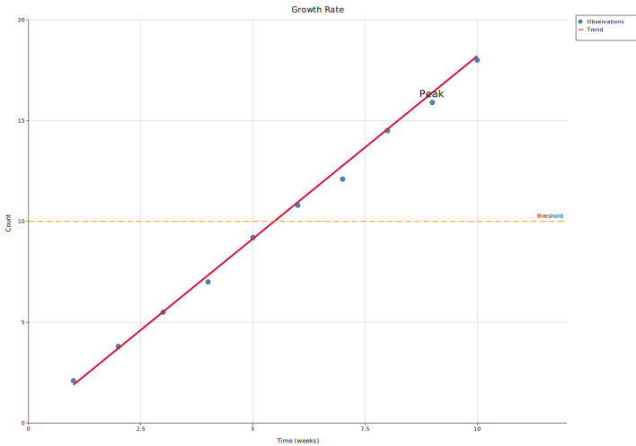</td>
<td>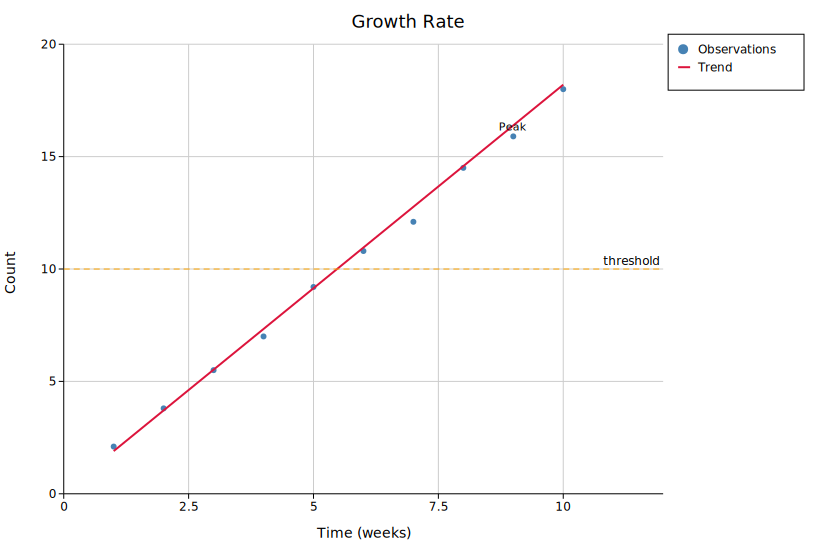</td>
</tr>
<tr>
<td align="center"><code>.with_scale(0.5)</code></td>
<td align="center"><code>.with_scale(1.0)</code> — default</td>
</tr>
<tr>
<td>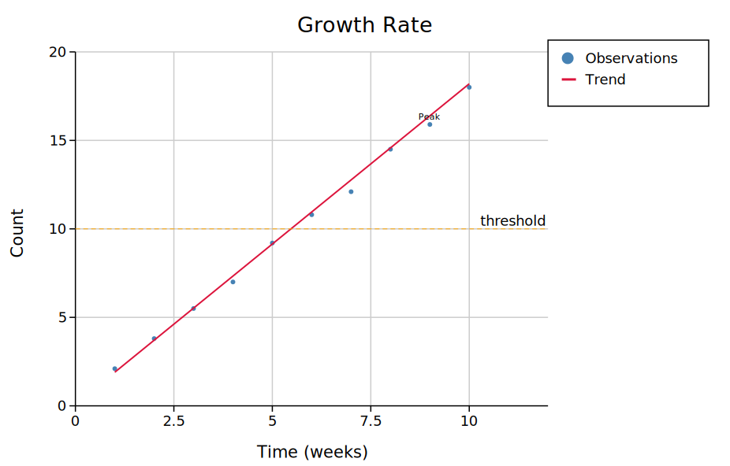</td>
<td>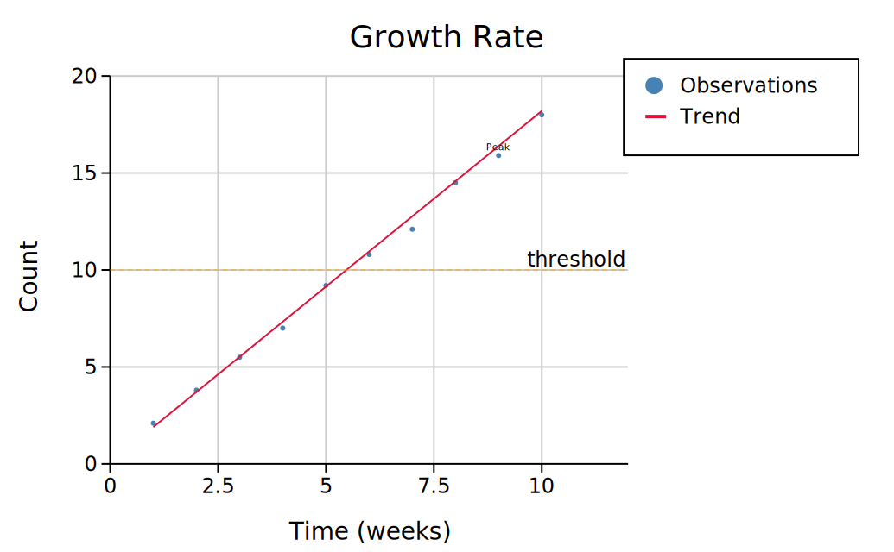</td>
</tr>
<tr>
<td align="center"><code>.with_scale(1.5)</code></td>
<td align="center"><code>.with_scale(2.0)</code></td>
</tr>
</table>

### Combining scale with canvas size

`with_scale` makes the chrome proportionally larger but keeps the plot area the same size. At `2.0×` the default canvas will feel tight because the margins (which scale) eat into the fixed-size plot area. To keep the same visual balance as the default, scale the canvas dimensions by the same factor:

```rust,no_run
# use kuva::render::layout::Layout;
# use kuva::render::plots::Plot;
# let plots: Vec<Plot> = vec![];
let scale = 2.0_f64;
let layout = Layout::auto_from_plots(&plots)
    .with_scale(scale)
    .with_width(1200.0)   // 600 * scale
    .with_height(900.0);  // 450 * scale
```

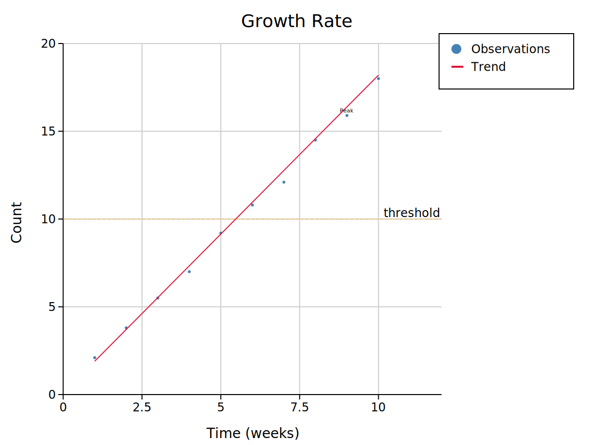

The result has the same data density as the default but every pixel measurement is doubled — useful for publication figures that will be embedded at a reduced size.

### Limitations — what you must adjust manually

Two categories of user-set values are **not** auto-scaled because they are specified explicitly when constructing the object, not derived from `Layout`:

#### 1. `TextAnnotation::font_size`

`TextAnnotation` has its own `font_size` field (default `12`). When you call `.with_scale(2.0)`, the annotation arrow and its stroke scale automatically, but the text does not. Scale it in the constructor:

```rust,no_run
# use kuva::render::layout::Layout;
# use kuva::render::plots::Plot;
# use kuva::render::annotations::TextAnnotation;
# let plots: Vec<Plot> = vec![];
let scale = 2.0_f64;
let layout = Layout::auto_from_plots(&plots)
    .with_annotation(
        TextAnnotation::new("Peak", 9.0, 16.0)
            .with_arrow(9.0, 16.0)
            .with_font_size((11.0 * scale).round() as u32),  // scale manually
    )
    .with_scale(scale);
```

The two SVGs below use `with_scale(2.0)`. In the left one the annotation font is the default `11px` regardless of scale; in the right one it has been multiplied by `2.0`:

<table>
<tr>
<td></td>
<td>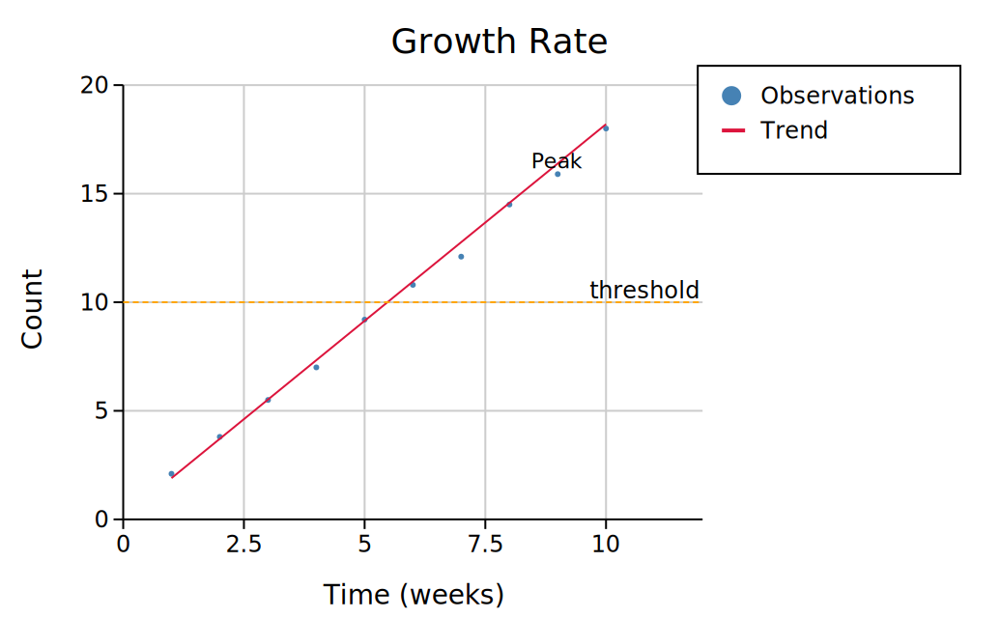</td>
</tr>
<tr>
<td align="center">annotation font unchanged (11 px)</td>
<td align="center">annotation font doubled (22 px)</td>
</tr>
</table>

#### 2. `ReferenceLine::stroke_width`

`ReferenceLine` stores its own `stroke_width` (default `1.0`). The line is drawn at exactly that pixel width regardless of `with_scale`. Multiply it manually:

```rust,no_run
# use kuva::render::layout::Layout;
# use kuva::render::plots::Plot;
# use kuva::render::annotations::ReferenceLine;
# let plots: Vec<Plot> = vec![];
let scale = 2.0_f64;
let layout = Layout::auto_from_plots(&plots)
    .with_reference_line(
        ReferenceLine::horizontal(10.0)
            .with_stroke_width(1.0 * scale),  // scale manually
    )
    .with_scale(scale);
```

#### 3. PNG raster output — use DPI scale instead

For raster output, `PngBackend` already has its own DPI multiplier:

```rust,no_run
# use kuva::render::layout::Layout;
# use kuva::render::plots::Plot;
# use kuva::render::render::render_multiple;
# let plots: Vec<Plot> = vec![];
# let layout = Layout::auto_from_plots(&plots);
#[cfg(feature = "raster")]
{
    use kuva::backend::png::PngBackend;
    let scene = render_multiple(plots, layout);
    // Render at 3× pixel density — no need for with_scale
    let png = PngBackend::new().with_scale(3.0).render_scene(&scene);
}
```

The two mechanisms are independent and can be combined, but doing so is rarely necessary. Use `Layout::with_scale` when you want a larger SVG; use `PngBackend::with_scale` when you want a higher-DPI PNG from an unchanged SVG layout.

---

## Typography

Font family and sizes for all text elements. Sizes are in pixels.

```rust,no_run
# use kuva::render::layout::Layout;
# use kuva::render::plots::Plot;
# let plots: Vec<Plot> = vec![];
let layout = Layout::auto_from_plots(&plots)
    .with_font_family("Arial, sans-serif")  // default: "DejaVu Sans, Liberation Sans, Arial, sans-serif"
    .with_title_size(20)                    // default: 18
    .with_label_size(14)                    // default: 14  (axis labels)
    .with_tick_size(11)                     // default: 12  (tick labels)
    .with_body_size(12);                    // default: 12  (legend, annotations)
```

These can also be set via a `Theme` — see the [Themes](./themes.md) reference.

---

## Quick reference

### Layout constructors

| Method | Description |
|--------|-------------|
| `Layout::new(x_range, y_range)` | Explicit axis ranges |
| `Layout::auto_from_plots(&plots)` | Auto-compute ranges and layout from data |

### Axes and labels

| Method | Description |
|--------|-------------|
| `.with_title(s)` | Plot title |
| `.with_x_label(s)` | X-axis label |
| `.with_y_label(s)` | Y-axis label |
| `.with_ticks(n)` | Approximate number of tick intervals |
| `.with_tick_format(fmt)` | Same `TickFormat` for both axes |
| `.with_x_tick_format(fmt)` | `TickFormat` for x-axis only |
| `.with_y_tick_format(fmt)` | `TickFormat` for y-axis only |
| `.with_x_tick_rotate(deg)` | Rotate x tick labels by `deg` degrees |
| `.with_log_x()` | Logarithmic x-axis |
| `.with_log_y()` | Logarithmic y-axis |
| `.with_log_scale()` | Logarithmic on both axes |
| `.with_show_grid(bool)` | Show or hide grid lines (default `true`) |

### Canvas and scale

| Method | Description |
|--------|-------------|
| `.with_width(px)` | Total SVG width in pixels |
| `.with_height(px)` | Total SVG height in pixels |
| `.with_scale(f)` | Uniform scale factor for all plot chrome (default `1.0`). Font sizes, margins, tick marks, legend geometry, and arrow sizes all multiply by `f`. Canvas size is unaffected. `TextAnnotation::font_size` and `ReferenceLine::stroke_width` must be scaled manually. |

### Annotations

| Method | Description |
|--------|-------------|
| `.with_annotation(TextAnnotation)` | Text label with optional arrow |
| `.with_reference_line(ReferenceLine)` | Horizontal or vertical dashed line |
| `.with_shaded_region(ShadedRegion)` | Horizontal or vertical filled band |

### Legend

| Method | Description |
|--------|-------------|
| `.with_legend_entries(Vec<LegendEntry>)` | Supply entries directly, bypassing auto-collection; auto-sizes `legend_width` |
| `.with_legend_at(x, y)` | Place legend at absolute SVG pixel coordinates (`Custom` variant); no margin reserved |
| `.with_legend_at_data(x, y)` | Place legend at data-space coordinates, mapped through axes at render time |
| `.with_legend_position(LegendPosition)` | Choose a preset legend placement |
| `.with_legend_box(bool)` | Show or hide the legend background and border box (default `true`) |
| `.with_legend_title(s)` | Render a bold title row above all legend entries |
| `.with_legend_group(title, entries)` | Add a labelled group of entries; multiple calls stack |
| `.with_legend_width(px)` | Override the auto-computed legend box width |
| `.with_legend_height(px)` | Override the auto-computed legend box height |

`LegendPosition` variants (grouped by placement zone):

**Inside the plot axes** — overlaid on the data area, 8 px inset from the axis edges:

| Variant | Corner |
|---------|--------|
| `InsideTopRight` | Upper-right |
| `InsideTopLeft` | Upper-left |
| `InsideBottomRight` | Lower-right |
| `InsideBottomLeft` | Lower-left |
| `InsideTopCenter` | Top edge, centred |
| `InsideBottomCenter` | Bottom edge, centred |

**Outside the plot axes** — placed in a margin; the canvas expands to accommodate:

| Variant | Placement |
|---------|-----------|
| `OutsideRightTop` *(default)* | Right margin, top-aligned |
| `OutsideRightMiddle` | Right margin, vertically centred |
| `OutsideRightBottom` | Right margin, bottom-aligned |
| `OutsideLeftTop` | Left margin, top-aligned |
| `OutsideLeftMiddle` | Left margin, vertically centred |
| `OutsideLeftBottom` | Left margin, bottom-aligned |
| `OutsideTopLeft` | Top margin, left-aligned |
| `OutsideTopCenter` | Top margin, centred |
| `OutsideTopRight` | Top margin, right-aligned |
| `OutsideBottomLeft` | Bottom margin, left-aligned |
| `OutsideBottomCenter` | Bottom margin, centred |
| `OutsideBottomRight` | Bottom margin, right-aligned |

**Freeform** — no margin change; you control the position:

| Variant | Placement |
|---------|-----------|
| `Custom(x, y)` | Absolute SVG canvas pixel coordinates |
| `DataCoords(x, y)` | Data-space coordinates mapped through `map_x`/`map_y` at render time |

### Legend sizing overrides

The legend box dimensions are computed automatically — width from the longest label (at ~8.5 px per character), height from the number of entries and groups. If the auto-sizing is off for your data, override either dimension explicitly:

```rust,no_run
# use kuva::render::layout::Layout;
# use kuva::render::plots::Plot;
# let plots: Vec<Plot> = vec![];
let layout = Layout::auto_from_plots(&plots)
    .with_legend_width(180.0)   // wider box for long labels
    .with_legend_height(120.0); // taller box for manual height control
```

### Typography

| Method | Default | Description |
|--------|---------|-------------|
| `.with_font_family(s)` | `"DejaVu Sans, Liberation Sans, Arial, sans-serif"` | CSS font-family string |
| `.with_title_size(n)` | `18` | Title font size (px) |
| `.with_label_size(n)` | `14` | Axis label font size (px) |
| `.with_tick_size(n)` | `12` | Tick label font size (px) |
| `.with_body_size(n)` | `12` | Body text font size (px) |

### `TickFormat` variants

| Variant | Output example |
|---------|----------------|
| `Auto` | `5`, `3.14`, `1.2e5` |
| `Fixed(n)` | `3.14` |
| `Integer` | `5` |
| `Sci` | `1.23e4` |
| `Percent` | `45.0%` |
| `Custom(Arc<dyn Fn(f64) -> String>)` | user-defined |
