# Legends

Legends are assembled automatically from the plot data and attached to the canvas via the `Layout`. Every aspect — position, appearance, content, and sizing — can be overridden with builder methods.

**Import paths:**
- `kuva::render::layout::Layout` — position and appearance builders
- `kuva::plot::legend::{LegendEntry, LegendShape, LegendPosition, LegendGroup}` — entry types

---

## Auto-collected legends

When you call `.with_legend("label")` on a plot, kuva records the entry automatically. A single `Layout::auto_from_plots()` call collects all entries and the legend is rendered alongside the canvas.

```rust,no_run
use kuva::prelude::*;

let plots: Vec<Plot> = vec![
    ScatterPlot::new()
        .with_data([(1.1, 2.3), (1.9, 3.1), (2.4, 2.7), (3.0, 3.8), (3.6, 3.2)])
        .with_color("steelblue").with_legend("Cluster A").with_size(6.0)
        .into(),
    ScatterPlot::new()
        .with_data([(4.0, 1.2), (4.8, 1.8), (5.3, 1.4), (6.0, 2.0), (6.5, 1.6)])
        .with_color("orange").with_legend("Cluster B").with_size(6.0)
        .into(),
    ScatterPlot::new()
        .with_data([(2.0, 5.5), (2.8, 6.1), (3.5, 5.8), (4.3, 6.5), (5.0, 6.0)])
        .with_color("mediumseagreen").with_legend("Cluster C").with_size(6.0)
        .into(),
];

let layout = Layout::auto_from_plots(&plots)
    .with_title("Auto-Collected Legend")
    .with_x_label("X")
    .with_y_label("Y");

let svg = SvgBackend.render_scene(&render_multiple(plots, layout));
```

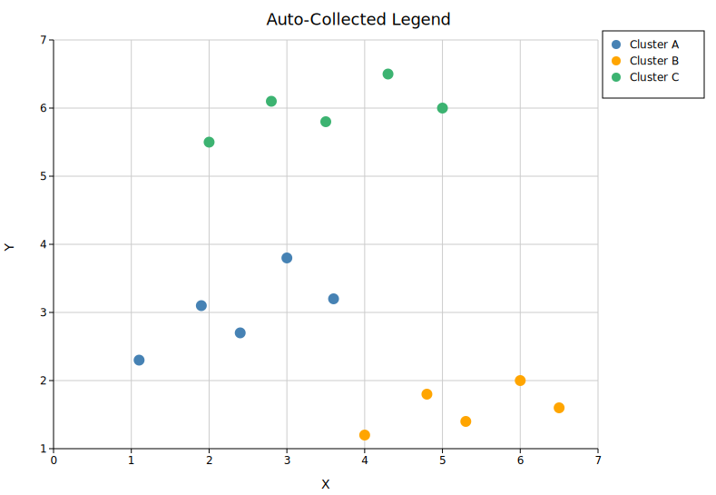

The legend appears to the right of the plot area by default (`OutsideRightTop`). The canvas widens automatically to fit it — no manual sizing needed.

---

## Legend position

### Default — `OutsideRightTop`

The default position places the legend in the right margin, top-aligned. Call `.with_legend_position()` on the `Layout` to change it.

```rust,no_run
use kuva::prelude::*;
use kuva::plot::legend::LegendPosition;

let layout = Layout::auto_from_plots(&plots)
    .with_legend_position(LegendPosition::OutsideRightTop); // default — no call needed
```

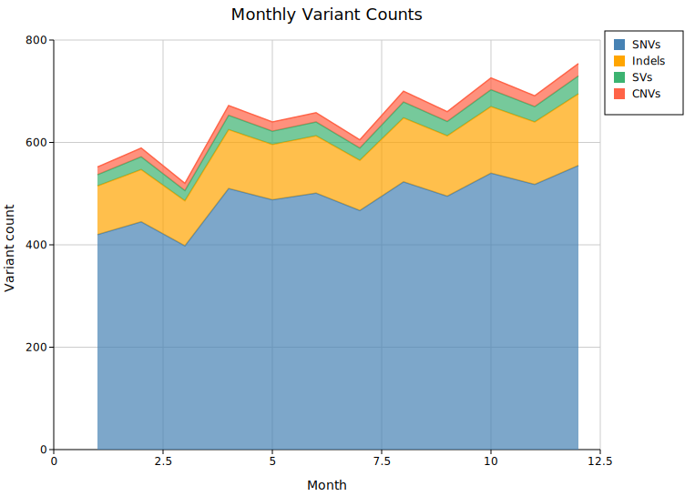

---

### Inside positions

`Inside*` variants overlay the legend on top of the data area with an 8 px inset from the axes. No extra canvas margin is added. Use these when the data has a corner with enough whitespace to accommodate the legend.

```rust,no_run
use kuva::prelude::*;
use kuva::plot::legend::LegendPosition;

// Upper-right of the data area
let layout = Layout::auto_from_plots(&plots)
    .with_legend_position(LegendPosition::InsideTopRight);
```

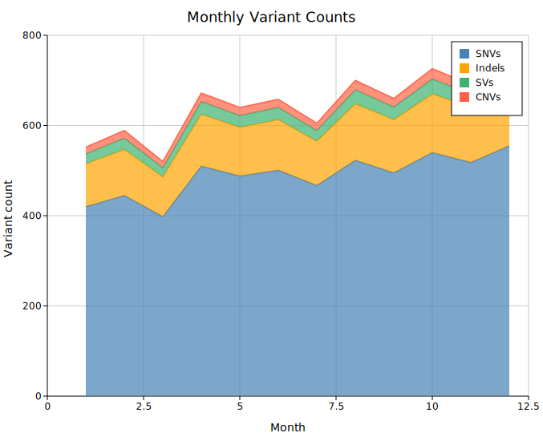

```rust,no_run
// Lower-left of the data area
let layout = Layout::auto_from_plots(&plots)
    .with_legend_position(LegendPosition::InsideBottomLeft);
```

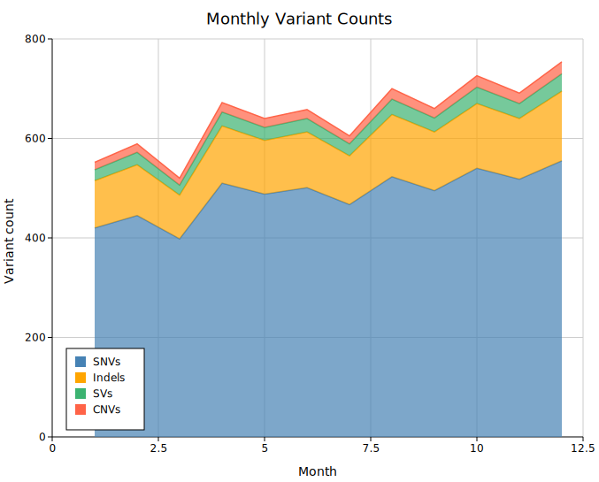

All six `Inside*` variants:

| Variant | Corner |
|---------|--------|
| `InsideTopRight` | Upper-right |
| `InsideTopLeft` | Upper-left |
| `InsideBottomRight` | Lower-right |
| `InsideBottomLeft` | Lower-left |
| `InsideTopCenter` | Top edge, centred |
| `InsideBottomCenter` | Bottom edge, centred |

---

### Outside positions

`Outside*` variants place the legend in a margin outside the plot axes. The canvas expands automatically to fit; each group of variants expands the corresponding edge.

**Left margin:**

```rust,no_run
use kuva::prelude::*;
use kuva::plot::legend::LegendPosition;

let layout = Layout::auto_from_plots(&plots)
    .with_legend_position(LegendPosition::OutsideLeftTop);
```

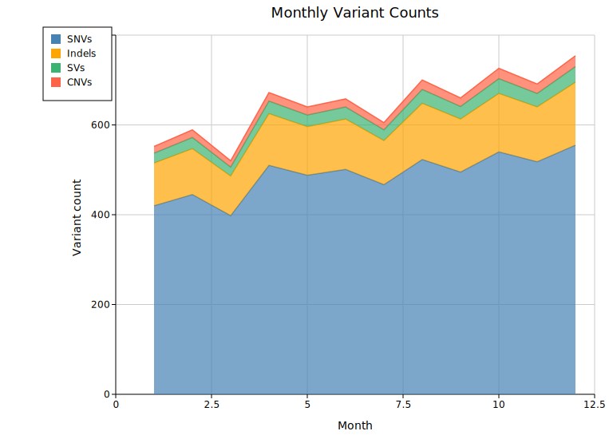

**Bottom margin:**

```rust,no_run
let layout = Layout::auto_from_plots(&plots)
    .with_legend_position(LegendPosition::OutsideBottomCenter);
```

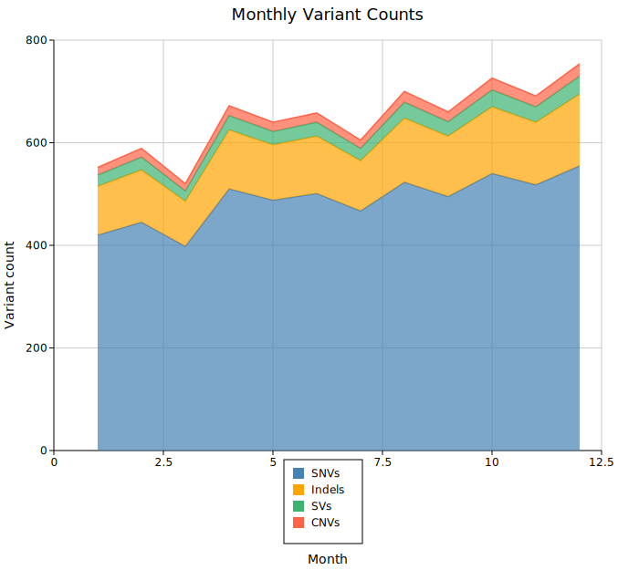

Full set of outside variants:

| Variant | Placement |
|---------|-----------|
| `OutsideRightTop` *(default)* | Right margin, top-aligned |
| `OutsideRightMiddle` | Right margin, vertically centred |
| `OutsideRightBottom` | Right margin, bottom-aligned |
| `OutsideLeftTop` | Left margin, top-aligned |
| `OutsideLeftMiddle` | Left margin, vertically centred |
| `OutsideLeftBottom` | Left margin, bottom-aligned |
| `OutsideTopLeft` | Top margin, left-aligned |
| `OutsideTopCenter` | Top margin, centred |
| `OutsideTopRight` | Top margin, right-aligned |
| `OutsideBottomLeft` | Bottom margin, left-aligned |
| `OutsideBottomCenter` | Bottom margin, centred |
| `OutsideBottomRight` | Bottom margin, right-aligned |
| `OutsideBottomColumns` | Bottom margin, auto-packed multi-column grid; canvas height extends to fit all entries |

---

### Freeform positions

#### `with_legend_at(x, y)` — absolute pixel coordinates

Places the legend at a fixed SVG canvas pixel coordinate. No extra margin is reserved; the legend can land anywhere on the canvas, including inside the data area.

```rust,no_run
use kuva::prelude::*;

// Top-left corner of the SVG canvas
let layout = Layout::auto_from_plots(&plots)
    .with_legend_at(30.0, 30.0);
```

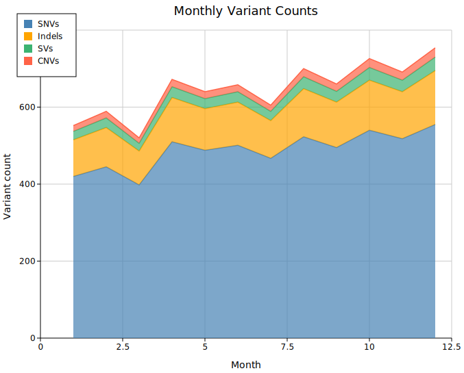

#### `with_legend_at_data(x, y)` — data-space coordinates

Places the legend at a position specified in data coordinates. The coordinates are mapped through the axis transforms at render time — the legend tracks the data regardless of the axis range or scale.

```rust,no_run
use kuva::prelude::*;

// At month=7, count=450 in data space
let layout = Layout::auto_from_plots(&plots)
    .with_legend_at_data(7.0, 450.0);
```

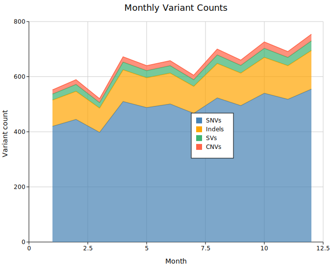

`DataCoords` is best suited for axis-space plots (scatter, line, bar, etc.). For pixel-space plots such as chord diagrams, Sankey, or phylogenetic trees, use `Custom` instead.

---

## Appearance

### Suppress the box

By default the legend has a filled background and a thin border. `.with_legend_box(false)` hides both rects while keeping the swatches and labels. This works well with `Inside*` positions where a box can feel heavy over busy data.

```rust,no_run
use kuva::prelude::*;
use kuva::plot::legend::LegendPosition;

let layout = Layout::auto_from_plots(&plots)
    .with_legend_position(LegendPosition::InsideTopRight)
    .with_legend_box(false);
```

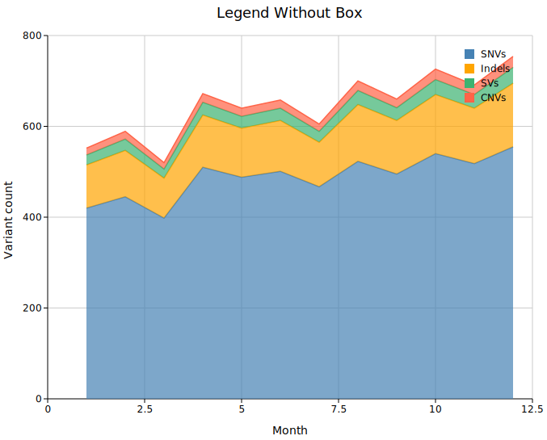

---

### Legend title

`.with_legend_title(s)` renders a bold header row above all entries.

```rust,no_run
use kuva::prelude::*;

let layout = Layout::auto_from_plots(&plots)
    .with_legend_title("Variant type");
```

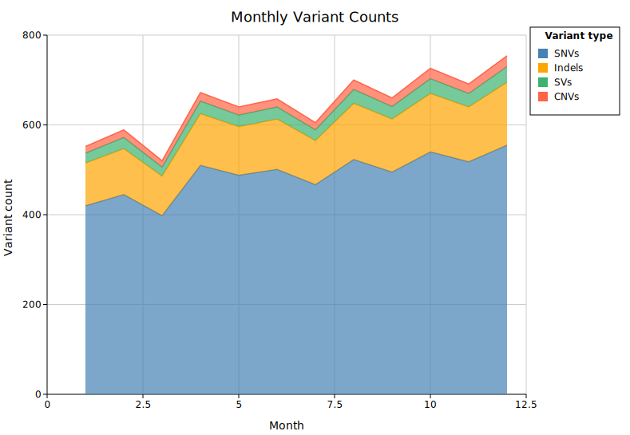

---

## Content

### Grouped entries

`.with_legend_group(title, entries)` divides the legend into named sections. Each call appends a group; multiple calls stack in order. Groups take priority over auto-collected entries and `.with_legend_entries()`.

```rust,no_run
use kuva::prelude::*;
use kuva::plot::legend::{LegendEntry, LegendShape, LegendGroup};

let ctrl_entries = vec![
    LegendEntry { label: "Control-A".into(),   color: "steelblue".into(), shape: LegendShape::Circle, dasharray: None },
    LegendEntry { label: "Control-B".into(),   color: "#4e9fd4".into(),   shape: LegendShape::Circle, dasharray: None },
];
let trt_entries = vec![
    LegendEntry { label: "Treatment-A".into(), color: "tomato".into(),    shape: LegendShape::Circle, dasharray: None },
    LegendEntry { label: "Treatment-B".into(), color: "#e06060".into(),   shape: LegendShape::Circle, dasharray: None },
];

let layout = Layout::auto_from_plots(&plots)
    .with_legend_group("Controls", ctrl_entries)
    .with_legend_group("Treatments", trt_entries);
```

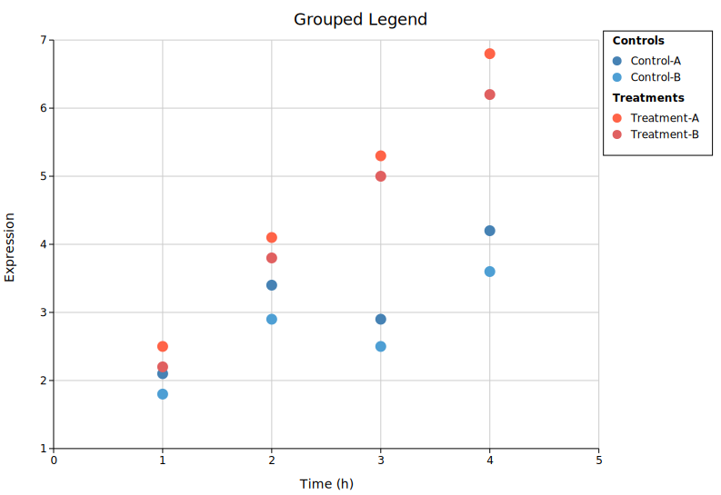

Group titles are rendered in bold. A half-line gap separates consecutive groups.

---

### Manual entries

`.with_legend_entries(entries)` replaces auto-collected entries with a list you supply directly. Use this when the auto-collected legend is wrong or incomplete — for example, when you want to show a line swatch for a scatter series.

`LegendShape` controls the swatch drawn next to each label:

| Shape | Appearance |
|-------|------------|
| `Rect` | Filled rectangle (default for bar/area plots) |
| `Circle` | Filled circle |
| `Line` | Short horizontal line |
| `Marker(MarkerShape)` | Point marker (`Square`, `Triangle`, `Diamond`, `Cross`) |
| `CircleSize(f64)` | Sized circle (used by dot-plot size legend) |

```rust,no_run
use kuva::prelude::*;
use kuva::plot::legend::{LegendEntry, LegendShape};

let entries = vec![
    LegendEntry { label: "Healthy".into(),  color: "steelblue".into(), shape: LegendShape::Circle, dasharray: None },
    LegendEntry { label: "At risk".into(),  color: "orange".into(),    shape: LegendShape::Rect,   dasharray: None },
    LegendEntry { label: "Diseased".into(), color: "crimson".into(),   shape: LegendShape::Line,   dasharray: None },
];

let layout = Layout::auto_from_plots(&plots)
    .with_legend_entries(entries);
```

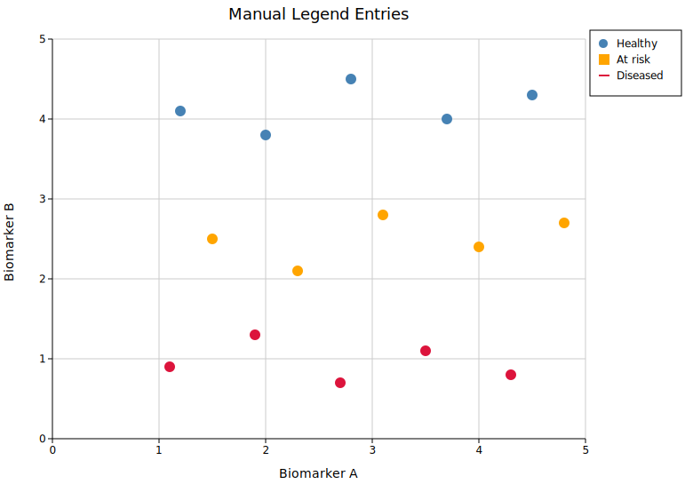

---

## Sizing

Legend dimensions are auto-computed: width from the longest label (~8.5 px per character) and height from the entry count. Override either when the defaults are off for your data.

### Width override — long labels

```rust,no_run
use kuva::prelude::*;

let layout = Layout::auto_from_plots(&plots)
    .with_legend_width(230.0);
```

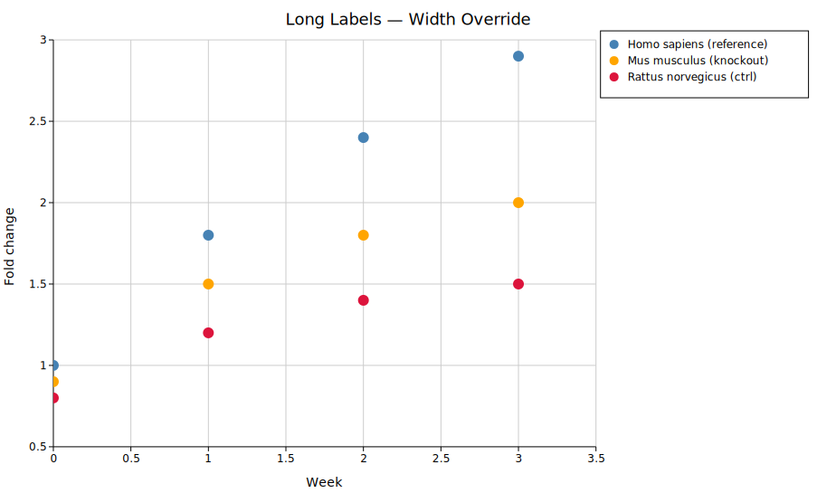

`.with_legend_height(px)` is the corresponding height override. Both are escape hatches — you rarely need them with ordinary label lengths.

---

## Shared legend in a Figure

When a `Figure` contains multiple panels with the same series, use `.with_shared_legend()` to collect all entries into a single figure-level legend. Per-panel legends are suppressed automatically.

```rust,no_run
use kuva::prelude::*;

let scene = Figure::new(1, 2)
    .with_plots(vec![panel_a, panel_b])
    .with_layouts(vec![layout_a, layout_b])
    .with_shared_legend()   // collects entries from all panels; legend to the right
    .render();
```

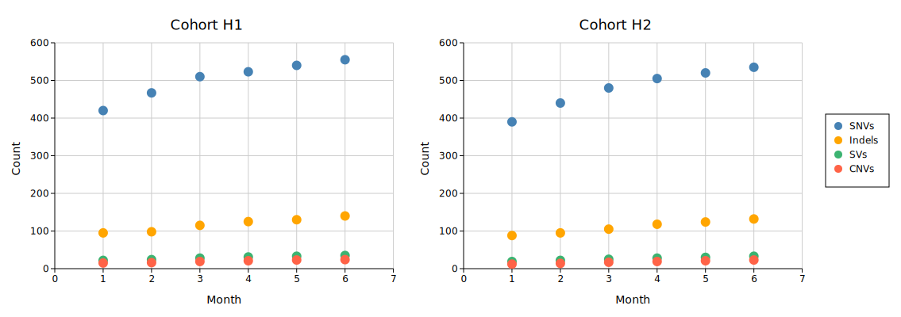

`.with_shared_legend_bottom()` places the legend below the grid instead. To supply manual entries for the shared legend:

```rust,no_run
use kuva::plot::legend::{LegendEntry, LegendShape};

figure.with_shared_legend_entries(vec![
    LegendEntry { label: "SNVs".into(),   color: "steelblue".into(),      shape: LegendShape::Circle, dasharray: None },
    LegendEntry { label: "Indels".into(), color: "orange".into(),         shape: LegendShape::Circle, dasharray: None },
    LegendEntry { label: "SVs".into(),    color: "mediumseagreen".into(), shape: LegendShape::Circle, dasharray: None },
    LegendEntry { label: "CNVs".into(),   color: "tomato".into(),         shape: LegendShape::Circle, dasharray: None },
])
```

---

## API quick reference

### Position builders on `Layout`

| Method | Description |
|--------|-------------|
| `.with_legend_position(LegendPosition)` | Choose any preset position variant |
| `.with_legend_at(x, y)` | Absolute SVG canvas pixel coordinates (`Custom` variant) |
| `.with_legend_at_data(x, y)` | Data-space coordinates mapped through axes at render time |

### Appearance builders on `Layout`

| Method | Default | Description |
|--------|---------|-------------|
| `.with_legend_box(bool)` | `true` | Show or hide the background and border rects |
| `.with_legend_title(s)` | — | Bold header row above all entries |
| `.with_legend_width(px)` | auto | Override the auto-computed legend box width |
| `.with_legend_height(px)` | auto | Override the auto-computed legend box height |

### Content builders on `Layout`

| Method | Priority | Description |
|--------|----------|-------------|
| `.with_legend_group(title, entries)` | Highest | Add a named group; multiple calls stack |
| `.with_legend_entries(Vec<LegendEntry>)` | Medium | Replace auto-collection with a flat list |
| *(auto-collection from plot data)* | Lowest | Default; uses `.with_legend("label")` calls on plots |

### `LegendPosition` variants

**Inside** (overlay, 8 px inset from axes — no margin added):
`InsideTopRight`, `InsideTopLeft`, `InsideBottomRight`, `InsideBottomLeft`, `InsideTopCenter`, `InsideBottomCenter`

**Outside** (canvas expands to fit):
`OutsideRightTop` *(default)*, `OutsideRightMiddle`, `OutsideRightBottom`,
`OutsideLeftTop`, `OutsideLeftMiddle`, `OutsideLeftBottom`,
`OutsideTopLeft`, `OutsideTopCenter`, `OutsideTopRight`,
`OutsideBottomLeft`, `OutsideBottomCenter`, `OutsideBottomRight`,
`OutsideBottomColumns`

**Freeform** (no margin change):
`Custom(f64, f64)` — pixel coordinates; `DataCoords(f64, f64)` — data coordinates
